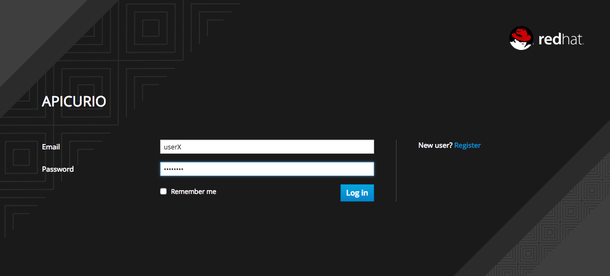
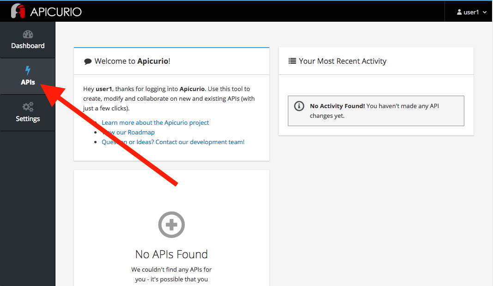
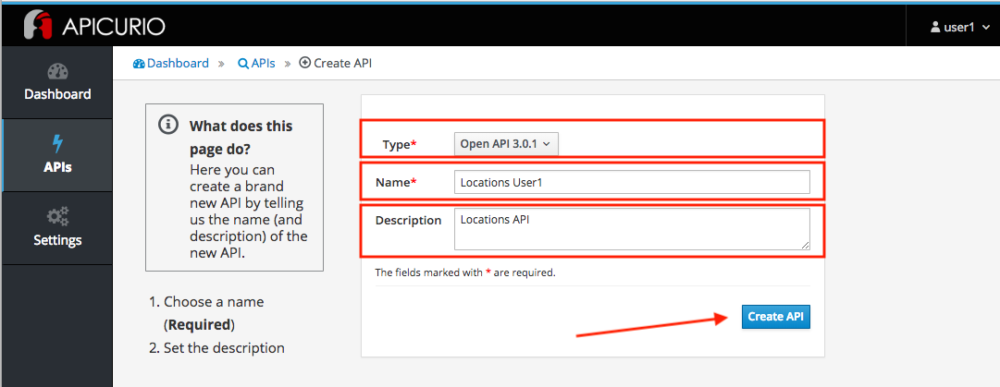
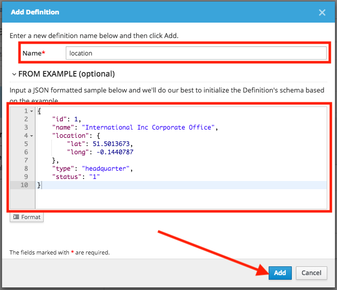
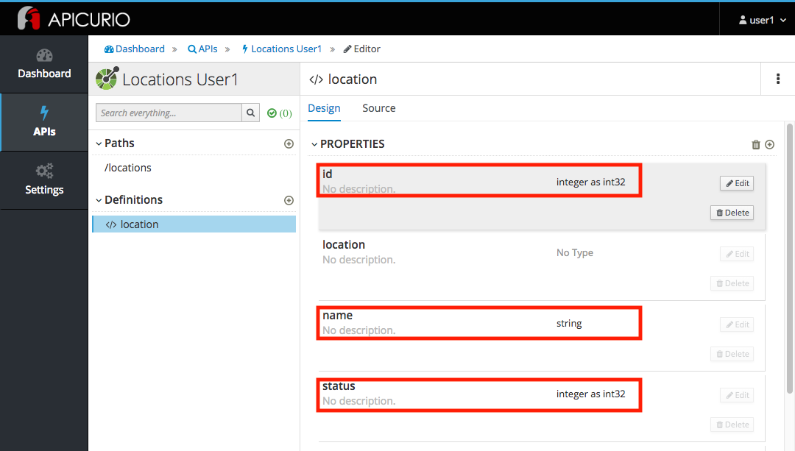
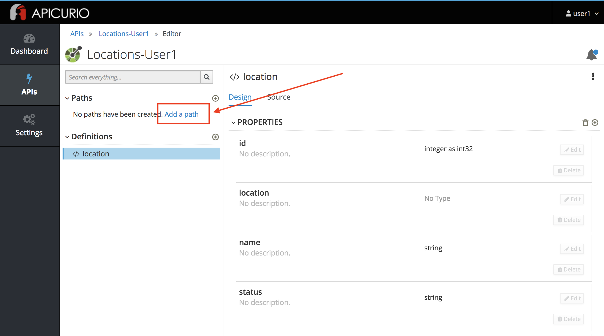
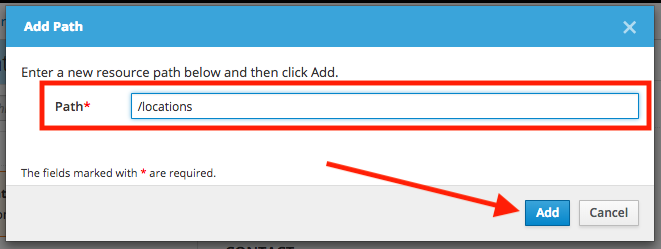
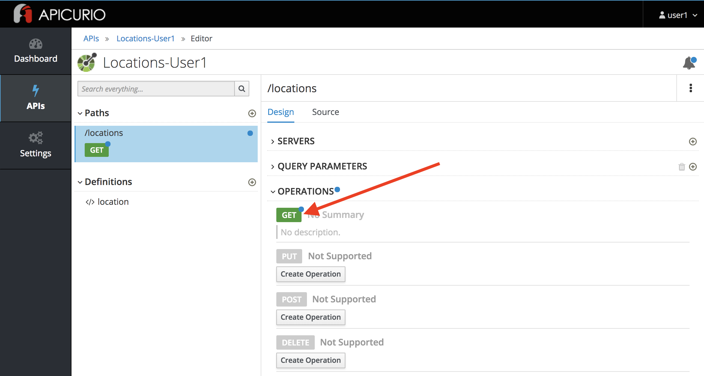
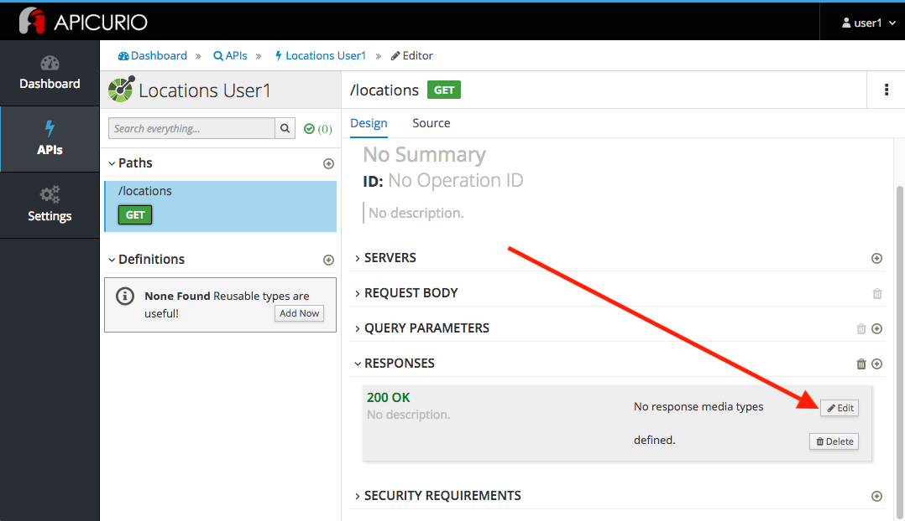
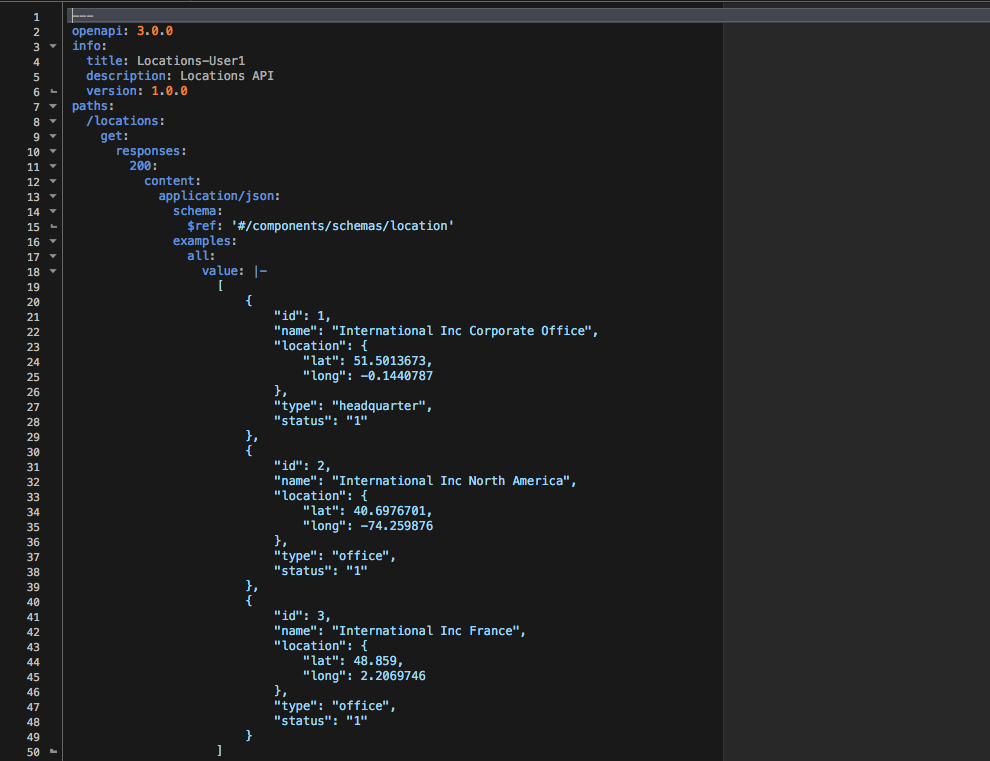

= Lab 1

== API Design

=== Create an OpenAPI Specification using Apicurio Studio

* Duration: 10 mins
* Audience: API Owner, Product Manager, Developers, Architects

== Overview

As APIs become more widespread in the enterprise, consistent design and usage is critically important to improve reusability. The more reusable APIs are, the less friction there is for other internal or external teams to make progress. Having design standards and tools baked into the API development and maintenance process is a very powerful way to enable this consistency.

=== Why Red Hat?

Red Hat is one of the founding members of the Linux Foundation OpenAPI Initiative (OAI) which produces the leading standard for REST API specifications. Red Hat consistently uses this standard throughout its tooling, starting with the Apicurio Studio API Designer editor.

=== Skipping The Lab

If you are planning to skip this lab and follow the next one, here is a https://github.com/RedHatWorkshops/dayinthelife-integration/tree/master/docs/labs/citizen-integrator-track/resources[link] to the specification generated in this lab.

=== Environment

*Credentials:*

Your username is your assigned user number. For example, if you are assigned user number *1*, your username is:

[source,bash]
----
user1
----

Please ask your instructor for your password.

*URLs:*

If you haven't done so already, you need to login to the *Red Hat Solution Explorer* webpage so that a unique lab environment can be provisioned on-demand for your exclusive use.  You should open a web browser and navigate to:

[source,bash]
----
https://tutorial-web-app-webapp.dil.opentry.me
----

You will be presented with a login page where you can enter your unique credentials:

image::images/design-50.png[design-login]

Enter your credentials and click *Log in*.  You'll notice a web-page appear which explains that a _unique environment_ is being provisioned.

image::images/design-51.png[design-login]

Once the environment is provisioned, you will be presented with a page that presents all the available applications which you'll need in order to complete the labs:

image::images/design-52.png[design-login]

== Lab Instructions

=== Step 1: Creating APIs with Apicurio Studio

. Open a browser window and navigate to:
+
[source,bash]
----
 http://apicurio-studio.dil.opentry.me
----

. Log in using your designated <<environment,user and password>>.
+

. Click on *APIs* in the left side navigation menu from the Dashboard page.
+

. Click on *Create New API*.
+
image::images/design-03.png[design-new-api]

. Create a brand new API by completing the following information:
 ** Type: *Open API 3.0.2*
 ** Name: *Locations-UserX* (Replace _X_ with your user number)
 ** Description: *Locations API*

+

. Click on *Create API*.
. Finally, click on *Edit API* to start editing your newly created API.
+
image::images/design-05.png[design-edit-api]

=== Step 2: Editing APIs

You are now in the main screen to edit your APIs. Apicurio is a graphical, form-based API editor. With Apicurio you don't need master in and out all the details of the *OpenAPI Specification*. It allows you to design beautiful, functionals APIs with zero coding.

Let's start crafting your API.

. Time to prepare our data definitions for the API. Click on the *Add a datatype* link under the _Data Types_.
+
image::images/design-15.png[design-add-datatype]

. Fill in the _Name_ field with the value *location*. Expand the _Enter the JSON Example (optional)_ to paste the following example, then click *Save*:
 ** Name: *location*
 ** JSON Example:
+
[source,bash]
----
  {
      "id": 1,
      "name": "International Inc Corporate Office",
      "location": {
          "lat": 51.5013673,
          "lng": -0.1440787
      },
      "type": "headquarter",
      "status": "1"
  }
----

 ** Choose to create a REST Resource with the Data Type: *No Resource*

+

. Apicurio automatically tries to detect the data types from the provided example.
+

+
_Time to start creating some paths_.

=== Step 3: Adding Paths

==== 3a: Add `/locations` path with GET method

The `/locations` path with an HTTP GET method will return a complete set of all location records in the database.

. Click on the *Add a path* link under the _Paths_ section. APIs need at least one path.
+

. Fill in the new resource path with the following information:
 ** Path: */locations*

+

. Click *Add*.
+
_By default, Apicurio suggest a series of available operations for your new path_.

. Click *Create Operation* under the _GET_ operation.
+
image::images/design-08.png[design-create-operation]

. Click on the green *GET* operation button to edit the operation information.
+

+
_As you can notice, Apicurio Editor guides you with warning for the elements missing in your design_.

. Click on the *Add a response* link under _Responses_ to edit the response for this operation.
+
image::images/design-10.png[design-add-response]

. Leave the *200* option selected in the  _Response Status Code_ combo box and click on *Add*.
+
image::images/design-11.png[design-add-response-code]

. Scroll down to the bottom of the page. Move your mouse over the *200 OK* response to enable the options. Click the _No response media types defined_ drop-down. Now click on the *Add Media Type* button.
+

. Click on the _Add_ button to accept *application/json* as the Media Type.
+
image::images/design-18.png[design-location-type]

. Click on the _Type_ dropdown and select *Array* and *location*.
+
image::images/design-18a.png[design-location-type]

. Click the *Add an example* link to add a Response Example.
+
_This will be useful to mock your API in the next lab_.
+
image::images/design-19.png[design-add-example]

. Fill in the information for your response example:
 ** Name: *all*
 ** Example:
+
[source,bash]
----
  [
      {
          "id": 1,
          "name": "International Inc Corporate Office",
          "location": {
              "lat": 51.5013673,
              "lng": -0.1440787
          },
          "type": "headquarter",
          "status": "1"
      },
      {
          "id": 2,
          "name": "International Inc North America",
          "location": {
              "lat": 40.6976701,
              "lng": -74.259876
          },
          "type": "office",
          "status": "1"
      },
      {
          "id": 3,
          "name": "International Inc France",
          "location": {
              "lat": 48.859,
              "lng": 2.2069746
          },
          "type": "office",
          "status": "1"
      }
  ]
----

+
image::images/design-20.png[design-response-example]
. Click on the drop-down next to the `No description` message, and enter `Returns an array of location records` as the description.  Click the check-mark button to accept the description.
+
image::images/design-54.png[design-response-example]

. Click on the green *GET* operation button to highlight the list of operations.
+
image::images/design-31.png[design-get-operation]

==== 3b: Update `/locations` path with POST method

The HTTP POST method will allow us to insert a new locations record into the database.

. Click on the *Create Operation* link under _POST_ to create a new POST operation.
+
image::images/design-32.png[design-add-response]

. Click the orange *POST* button to edit the operation.
+
image::images/design-33.png[design-add-response-code]

. Click the *Add a response* link.
+
image::images/design-34.png[design-add-response-code]

. Set the *Response Status Code* value to `201`.  Click Add.
+
image::images/design-35.png[design-add-response-code]

. Click on the drop-down next to the `No description` message, and enter `Creates a new location record` as the description.  Click the check-mark button to accept the description.
+
image::images/design-55.png[design-response-example]

. Scroll down to the bottom of the page. Move your mouse over the *201 Created* response to enable the options. Click the _No response media types defined_ drop-down. Now click on the *Add Media Type* button.
+

. Click on the _Add_ button to accept *application/json* as the Media Type.
+
image::images/design-18.png[design-location-type]

. Click on the _Type_ dropdown and select *location*.
+
image::images/design-36.png[design-location-type]

==== 3c: Add `+/locations/{id}+` path with GET method

The `+/locations/{id}+` path will return a single location record based on a single `id` parameter, passed via the URL.

. Now we need to create another path.  Click on the `+` symbol to add a new path, then enter `+/locations/{id}+` for the *Path* property.  Click *Add*.
+
image::images/design-37.png[design-location-type]

. Scroll over the `id` _Path Parameter_ value, then click the *Create* button.
+
image::images/design-37a.png[design-location-type]

. Click the drop-down arrow, then update the `id` Path Parameter by selecting `Integer` as the *Type* and `32-Bit Integer` as the sub-type.
+
image::images/design-38.png[design-location-type]

. Click on the `Create Operation` button underneath *GET*, then click the green *GET* button.
+
image::images/design-39.png[design-location-type]

. Click on the *Add a response* link under _Responses_ to edit the response for this operation.
+
image::images/design-10.png[design-add-response]

. Leave the *200* option selected in the  _Response Status Code_ combo box and click on *Add*.
+
image::images/design-11.png[design-add-response-code]

. Scroll down to the bottom of the page. Move your mouse over the *200 OK* response to enable the options. Click the _No response media types defined_ drop-down. Now click on the *Add Media Type* button.
+

. Click on the _Add_ button to accept *application/json* as the Media Type.
+
image::images/design-18.png[design-location-type]

. Click on the _Type_ dropdown and select *location*.
+
image::images/design-40.png[design-location-type]

. Click on the drop-down next to the `No description` message, and enter `Returns a single location record` as the description.  Click the check-mark button to accept the description.
+
image::images/design-56.png[design-response-example]

==== 3d: Add `+/locations/phone/{id}+` path with GET method

The `+/locations/phone/{id}+` path will return a single location record based on a single phone number parameter, passed via the URL.

. Now we need to create another path.  Click on the `+` symbol to add a new path, then enter `+/locations/phone/{id}+` for the *Path* property.  Click *Add*.
+
image::images/design-41.png[design-location-type]

. Click on the `Create Operation` button underneath *Get*, then click the green *Get* button.
+
image::images/design-42.png[design-location-type]

. Scroll down to the `id` path parameter to highlight the row, and click the `Create` button that appears.
+
image::images/design-53.png[design-location-type]

. Click the drop-down arrow next to `No Type`, then update the `id` Path Parameter by selecting `Integer` as the *Type* and `32-Bit Integer` as the sub-type.
+
image::images/design-38.png[design-location-type]

. Click on the *Add a response* link under _Responses_ to edit the response for this operation.
+
image::images/design-10.png[design-add-response]

. Leave the *200* option selected in the  _Response Status Code_ combo box and click on *Add*.
+
image::images/design-11.png[design-add-response-code]

. Scroll down to the bottom of the page. Move your mouse over the *200 OK* response to enable the options. Click the _No response media types defined_ drop-down. Now click on the *Add Media Type* button.
+

. Click on the _Add_ button to accept *application/json* as the Media Type.
+
image::images/design-18.png[design-location-type]

. Click on the _Type_ dropdown and select *location*.
+
image::images/design-40.png[design-location-type]

. Click on the drop-down next to the `No description` message, and enter `Returns a location record` as the description.  Click the check-mark button to accept the description.
+
image::images/design-57.png[design-response-example]

=== Step 4: Download the API definition

. Click the *Locations-UserX* link to return to the API admin page.
+
image::images/design-22.png[design-locations-api]

. To start using your new API definition, display the API menu from the kebab link. Click the *Download (YAML)* option from the menu.
+
image::images/design-23.png[design-download-yaml]

. This will start the download of your API definition file. It could take a few seconds to start the download. *Save* it to your local disk drive.
. You can open the file with any text editor. Take a look at the source file. Everything is there.
+

_Congratulations!_ You have created your first API definition based on the OpenAPI Specification  using Red Hat's Apicurio. Don't lose track of the file, you will use this definition for your next lab.

== Steps Beyond

So, you want more? Did you notice the link *source* when editing the _Paths_ or the _Definitions_? Get back to the API editor and follow the link. What do you see? Apicurio lets you follow the form-based editor or go one step beyond and also lets you direct edit the source of your API definition.

== Summary

In this lab you used Apicurio Studio to create a simple API definition using the OpenAPI Specification. You learned how to author and download a standards compliant API Specification using Red Hat's APICurio.

You can now proceed to link:../lab02/#lab-2[Lab 2]

== Notes and Further Reading

* Apicurio
 ** https://www.apicur.io[Webpage]
 ** https://www.apicur.io/roadmap/[Roadmap]
* OpenAPI
 ** https://www.openapis.org/[OpenAPI Initiative]
 ** https://github.com/OAI/OpenAPI-Specification/blob/master/versions/3.0.2.md[OpenAPI Specification 3.0.2]
