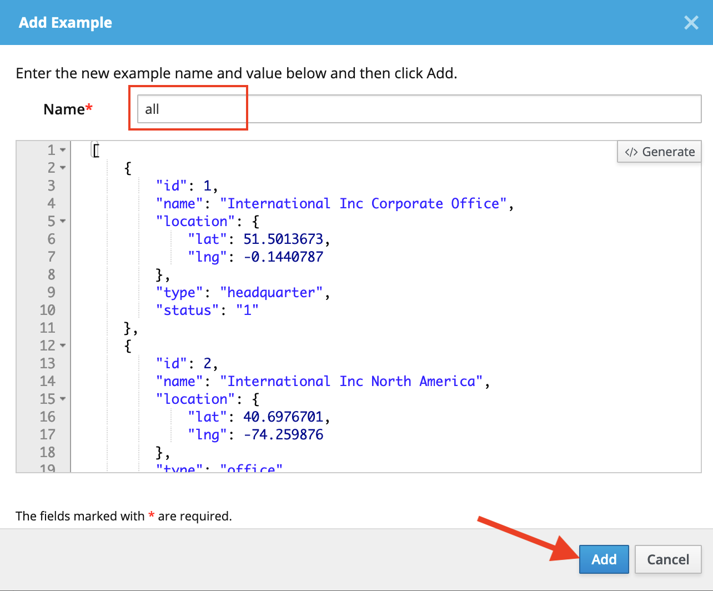
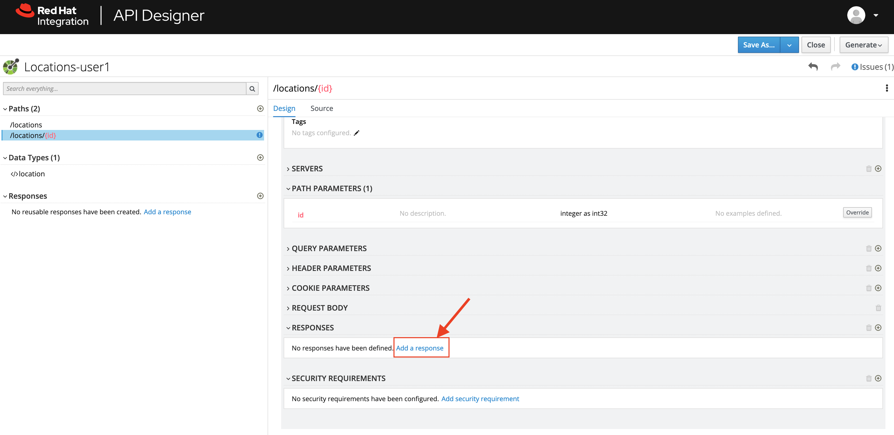

:walkthrough: Create an OpenAPI Specification using Apicurio Studio
:apicurio-studio-url: https://apicurito-ui-apicurito.{openshift-app-host}
:next-lab-url: https://tutorial-web-app-webapp.{openshift-app-host}/tutorial/dayinthelife-integration.git-citizen-integrator-track-lab02/
:user-password: openshift

ifdef::env-github[]
:next-lab-url: ../lab02/walkthrough.adoc
endif::[]

[id='api-design']
= Integrator Lab 1 - API Design

In this lab you will use API Designer to create a simple API definition using the OpenAPI Specification. You will learn how to author and download a standards compliant API Specification using Red Hat's API Designer.

Audience: API Owner, Product Manager, Developers, Architects

*Overview*

As APIs become more widespread in the enterprise, consistent design and usage is critically important to improve reusability. The more reusable APIs are, the less friction there is for other internal or external teams to make progress. Having design standards and tools baked into the API development and maintenance process is a very powerful way to enable this consistency.

*Why Red Hat?*

Red Hat is one of the founding members of the Linux Foundation OpenAPI Initiative (OAI) which produces the leading standard for REST API specifications. Red Hat consistently uses this standard throughout its tooling, starting with the Red Hat API Designer editor.

*Skipping The Lab*

If you are planning to skip this lab and follow the next one, here is a https://github.com/RedHatWorkshops/dayinthelife-integration/tree/master/docs/labs/citizen-integrator-track/resources[link] to the specification generated in this lab.

*Credentials:*

Your username is: `{user-username}` +
Your password is: `{user-password}`

[type=walkthroughResource]
.API Designer
****
* link:{apicurio-studio-url}[API Designer, window="_blank"]
****

[time=2]
[id="creating-apis-with-apicurio-studio"]
== Creating APIs with API Designer

. Launch a new tab on your web browser.
. Navigate to the Solution Explorer on that tab.
. Click on the *API Designer* link.

. Click on *New API*, and select *New (OpenAPI 3)*
+

[type=verification]
Did the API successfully get created?

[type=verificationFail]
Have your instructor check the Kubernetes pod that contains the API Designer application.

[time=2]
[id="editing-apis"]
== Creating API

You are now in the main screen to edit your APIs. Red Hat API Designer is a graphical, form-based API editor. With API Designr, you don't need master in and out all the details of the *OpenAPI Specification*. It allows you to design beautiful, functionals APIs with zero coding.

Let's start crafting your API.

. Create a brand new API by completing the following information:
 ** Name: *`Locations-{user-username}`*
 ** Description: *`Locations API`*
+

. Time to prepare our data definitions for the API. Click on the *Add a data type* link under the _Data Types_.
+

. Fill in the _Name_ field with the value *location*.Scroll down to _Enter the JSON Example (optional)_ to paste the following example, then click *Save*:
 ** Name: *`location`*
 ** JSON Example:
+
[source,bash]
----
  {
      "id": 1,
      "name": "International Inc Corporate Office",
      "location": {
          "lat": 51.5013673,
          "lng": -0.1440787
      },
      "type": "headquarter",
      "status": "1"
  }
----

 ** Choose to create a REST Resource with the Data Type: *No Resource*

+

. API Designer automatically tries to detect the data types from the provided example.
+

+
_Time to start creating some paths_.

[type=verification]
Were the data types successfully detected?

[type=verificationFail]
Have your instructor check the Kubernetes pod that contains the API Designer application.

[time=2]
[id="adding-paths"]
== Adding Paths

=== 3a: Add /locations path with GET method

The `/locations` path with an HTTP GET method will return a complete set of all location records in the database.

. Click on the *Add a path* link under the _Paths_ section. APIs need at least one path.
+

. Fill in the new resource path with the following information:
 ** Path: */locations*

+

. Click *Add*.
+
_By default, API Designer suggest a series of available operations for your new path_.

. Click *Add Operation* under the _GET_ operation.
+

+
_As you can notice, API Designer Editor guides you with warning for the elements missing in your design_.

. Click on the *Add a response* link under _Responses_ to edit the response for this operation.
+

. Leave the *200* option selected in the  _Response Status Code_ combo box and click on *Add*.
+

. Click the *Add Media Type* button.
+

. Click on the _Add_ button to accept *application/json* as the Media Type.
+

. Click on the _Type_ dropdown and select *Array* and *location*.
+

. Click on the *No Examples defined* tab and click on *Add an example* link to add a Response Example.
+
_This will be useful to mock your API in the next lab_.
+

. Fill in the information for your response example:
 ** Name: *`all`*
 ** Example:
+
[source,bash]
----
  [
      {
          "id": 1,
          "name": "International Inc Corporate Office",
          "location": {
              "lat": 51.5013673,
              "lng": -0.1440787
          },
          "type": "headquarter",
          "status": "1"
      },
      {
          "id": 2,
          "name": "International Inc North America",
          "location": {
              "lat": 40.6976701,
              "lng": -74.259876
          },
          "type": "office",
          "status": "1"
      },
      {
          "id": 3,
          "name": "International Inc France",
          "location": {
              "lat": 48.859,
              "lng": 2.2069746
          },
          "type": "office",
          "status": "1"
      }
  ]
----

+

. Click on edit button for _Description_ message, and enter `Returns an array of location records` as the description.  Click the check-mark button to accept the description.
+

[type=verification]
Were the HTTP Response, `path` parameter and `GET` operation created successfully?

[type=verificationFail]
Have your instructor check the Kubernetes pod that contains the API Designer application.

=== 3b: Add /locations/{id} path with GET method

The `+/locations/{id}+` path will return a single location record based on a single `id` parameter, passed via the URL.

. Now we need to create another path.  Click on the `+` symbol to add a new path, then enter `+/locations/{id}+` for the *Path* property.  Click *Add*.
+

. Scroll over the `id` _Path Parameter_ value, then click the *Create* button.
+

. Click the drop-down arrow, then update the `id` Path Parameter by selecting `Integer` as the *Type* and `32-Bit Integer` as the sub-type.
+

. Click on the `Create Operation` button underneath *GET*, then click the green *GET* button.
+

. Click on the *Add a response* link under _Responses_ to edit the response for this operation.
+

. Leave the *200* option selected in the  _Response Status Code_ combo box and click on *Add*.
+

. Click the *Add Media Type* button.
+

. Click on the _Add_ button to accept *application/json* as the Media Type.
+

. Click on the _Type_ dropdown and select *location*.
+

. Click on edit next to _No description_ message, and enter `Returns a single location record` as the description.  Click the check-mark button to accept the description.
+

[type=verification]
Was the path created successfully?

[type=verificationFail]
Try to redo this section, if any problem persists have your instructor check the Kubernetes pod that contains the API Designer application.

[time=2]
[id="download-api-definition"]
== Download the API definition

. Click the *Locations-{user-username}* *Save As YAML* link to download the API spcification.
+
image::images/new-design-26.png[design-download-yaml, role="integr8ly-img-responsive"]

. This will start the download of your API definition file. _It could take a few seconds to start the download_. *Save* it to your local disk drive.
. You can open the file with any text editor. Take a look at the source file. Everything is there.
+

[type=verification]
Was the source file created successfully?

[type=verificationFail]
Try to redo this section, if any problem persists have your instructor check the Kubernetes pod that contains the API Designer application.

_Congratulations!_ You have created your first API definition based on the OpenAPI Specification  using Red Hat's API Designer. Don't lose track of the file, you will use this definition for your next lab.

[time=1]
[id="step-beyond"]
== Steps Beyond

So, you want more? Did you notice the link *source* when editing the _Paths_ or the _Definitions_? Get back to the API editor and follow the link. What do you see? API Designer lets you follow the form-based editor or go one step beyond and also lets you direct edit the source of your API definition.

[time=1]
[id="summary"]
== Summary

In this lab you used API Designer to create a simple API definition using the OpenAPI Specification. You learned how to author and download a standards compliant API Specification using Red Hat's API Designer.

You can now proceed to link:{next-lab-url}[Lab 2].

[time=5]
[id="further-reading"]
== Notes and Further Reading

* API Designer
** https://access.redhat.com/documentation/en-us/red_hat_integration/2020-q2/html/getting_started_with_apis_in_red_hat_integration/index[API Designer]
* Apicurio
 ** https://www.apicur.io[Webpage]
 ** https://www.apicur.io/roadmap/[Roadmap]
* OpenAPI
 ** https://www.openapis.org/[OpenAPI Initiative]
 ** https://github.com/OAI/OpenAPI-Specification/blob/master/versions/3.0.2.md[OpenAPI Specification 3.0.2]
