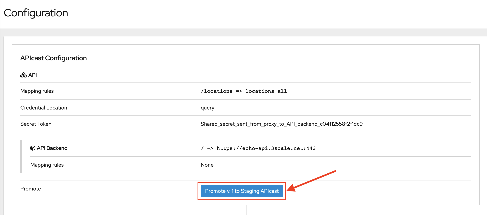
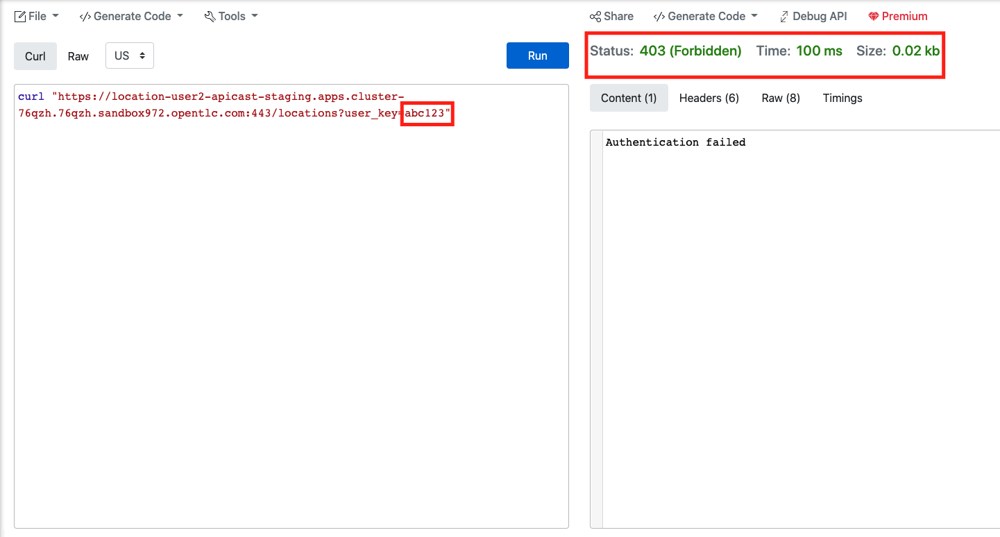

:walkthrough: Managing API Endpoints
:next-lab-url: https://tutorial-web-app-webapp.{openshift-app-host}/tutorial/dayinthelife-integration.git-citizen-integrator-track-lab04/
:3scale-url: https://www.3scale.net/
:3scale-admin-url: https://{user-username}-admin.{openshift-app-host}/p/login
:user-password: openshift

ifdef::env-github[]
:next-lab-url: ../lab04/walkthrough.adoc
endif::[]

[id='api-managing']
= Integrator Lab 3 - Managing API Endpoints

In this lab you will be adding management capabilities to your API to give you control and visibility of it's usage.

Audience: Developers, Architects, Testers, Quality Engineers

*Overview*

Once you have APIs deployed in your environment, it becomes critically important to manage who may use them, and for what purpose. You also need to begin to track usage of these different users to know who is or is not succeeding in their usage.

*Why Red Hat?*

Red Hat provides one the leading API Management tools that provides API management services. The link:{3scale-url}[3scale API Management] solution enables you to quickly and easily protect and manage your APIs.

*Credentials:*

Your username is: `{user-username}` +
Your password is: `{user-password}`

[type=walkthroughResource]
.3scale Admin Console
****
* link:{3scale-admin-url}[Console, window="_blank"]
****

[time=3]
[id="define-api-proxy"]
== Define your API Proxy

. Log in to link:{3scale-admin-url}[3scale Admin, window="_blank"] web console using `{user-username}` and password: `{user-password}`.
+

. The first page you will land is the *API Management Dashboard*. Click on the **Create Product**  link.
+
image::images/create-product-button.png[create-product-button, role="integr8ly-img-responsive"]

. Enter the following values:
** Name: *`Location`*
** System name: *`location`*
** Description: *`Location API`*
+

. Click on **Create Product**.

. On the **Product: Location** overview page, Click on the **Integration** menu on the left to expand it.

. Click on **Settings** to edit the API settings for the gateway.
+

. Keep the **APIcast** deployment option in the Gateway section.
+

. Scroll down and keep the **API Key (user_key)** Authentication and other settings.
+

. Click on **Update Product**.

[type=verification]
Was the service updated successfully?

[type=verificationFail]
Try to redo this section, if any problem persists have your instructor check the Kubernetes pod that contains the 3scale API Management application.

[time=4]
[id="update-application-plans"]
== Create Application Plan

. Click on **Applications** and on the link **Application Plans**.
+

. Click on **Create Application Plan** button.
+

. In the **Create Application Plan** form, enter the following values:
** Name: *`Location Basic Plan`*
** System name: *`locations_basic_plan`*

. Leave the other values unchanged and click on **Create Application Plan**.
+

. Click on Kebab menu and select **Publish** for the _Location Basic Plan_.
+

. Click on **Product** drop down and select **Audience**.
+

. There will be one default Account **Developer**. Click on the **1** link under **Apps**
+

. In the next page, click on **Create Application**.
+

. In the **Create Application** form, enter following values:
** Product: *`Location`*
** Application Plan: *`Location Basic Plan`*
** Name: *`dev_location_app`*
** Description: *`Developer Location Basic App`*

. Click on **Create Application** button.
+

[type=verification]
Was the applcation plan and application created successfully?

[type=verificationFail]
Try to redo this section, if any problem persists have your instructor check the Kubernetes pod that contains the 3scale API Management application.

[time=4]
[id="update-integration-settings"]
== Update Methods, Metrics & Mapping Rules

. Click on **Audience** drop down and select **Product**.
+

. Click on **Location** product.
+

. Click on the **Metric or Method** link.
+

. Click on the **New Method** link in the *Methods* section.
+

. Fill in the information for your Fuse Method.
** Friendly name: *`Get Locations`*
** System name: *`locations_all`*
** Description: *`Method to return all locations`*

+

. Click on **Create Method**.

. Click on the **Mapping Rules** section to define the Mapping Rules for the API.
+

. Click on the *Edit* button to edit the default mapping rule.
+
_The default mapping is the root ("/") of our API resources, and this example application will not use that mapping. The following actions will redefine that default root ("/") mapping_.

. Click on the edit icon next to the `GET` mapping rule.

. Type in the *Pattern* text box the following:
+
[source,bash,subs="attributes+"]
----
/locations
----

. Select **Get Locations** as Metric or Method to increment from the combo box, then click on **Update Mapping Rule**.
+

[type=verification]
Was the setup of the settings successful?

[type=verificationFail]
Try to redo this section, if any problem persists have your instructor check the Kubernetes pod that contains the 3scale API Management application.

[time=3]
[id="define-api-policies"]
== Define your API Policies

Red Hat 3scale API Management provides units of functionality that modify the behavior of the API Gateway without the need to implement code. These management components are know in 3scale as policies.

The order in which the policies are executed, known as the “policy chain”, can be configured to introduce differing behavior based on the position of the policy in the chain. Adding custom headers, perform URL rewriting, enable CORS, and configurable caching are some of the most common API gateway capabilities implemented as policies.

. Scroll down click on **Policies** link to define the allowed methods on our exposed API.
+

+
_The default policy in the Policy Chain is APIcast. This is the main policy and most of the times you want to keep it._

. Click the **Add Policy** link to add a new policy to the chain.
+

+
_Out-of-the-box 3scale includes a set of policies you can use to modify the way your API gateway behaves. For this lab, we will focus on the **Cross Origin Resource Sharing (CORS)** one as we will use it in the consumption lab._

. Click in the **CORS Request Handling** link to add the policy.
+

. Put your mouse over the right side of the policy name to enable the reorder of the chain. Drag and drop the CORS Request Handling policy to the top of the chain.
+

. Now **CORS Request Handling** policy will be executed before the **APIcast**. Click the **CORS Request Handling** link to edit the policy.
+

. In the *Edit Policy* section, click the green **+** button under **ALLOW_HEADERS** to add the allowed headers.
. Type **`Authorization`** in the *Allowed headers* field.
. Tick the **allow_credentials** checkbox and fill in with a star `*` in the **allow_origin** text box.
+

. Click the green **+** button under *ALLOW_METHODS* twice to enable two combo boxes for the CORS allowed methods.

. Select **GET** from the first box and **OPTIONS** from the second box.
+

. Click the **Update Policy** button to save the policy configuration.

. Click on **Update Policy Chain** button to save the policy order & configurations.
+

[type=verification]
Was the setup of the API Policy successful?

[type=verificationFail]
Try to redo this section, if any problem persists have your instructor check the Kubernetes pod that contains the 3scale API Management application.

[time=2]
[id="configure-upstream-endpoint"]
== Configure the Backend

. Click on the **Backends** link. Then click on **Add Backend** link.
+

. Click on **Create a new Backend** link.
+

. In the **New Backend** form, fill in the information for the API backend:

** Name: *`Location Backend`*
** System Name: *`location_backend`*
** Description: *`Location API Backend`*
** Private Base URL: *`http://location-service.international.svc:8080`*
+
_We are using the internal API service, as we are deploying our services inside the same OpenShift cluster._
+

. Click on **Create Backend**.

. Click on **Add to product**.
+

. Click on **Settings** link and observe the staging and production URLs of the API.
+
_As we are using APIcast 3scale Managed the Routes will be created and managed by 3scale in the same namespace where 3scale is deployed on OpenShift._
+

. Click on the **Configuration** link to enter the **Configuration** section.

. Click on the **Promote v. 1 to Staging APIcast** button to save the changes and check the connection between client, gateway and API.
+

. Click on the **Promote v.1 to Production APIcast** button to promote your configuration from staging to production.
+

[type=verification]
Was the API promotion successful?

[type=verificationFail]
Try to redo this section, if any problem persists have your instructor check the Kubernetes pod that contains the 3scale API Management application.

[time=2]
[id="test-api"]
== Test the API

In this section, you can test the API staging and production URLs and ensure the API Gateway is routing requests to the backend API correctly, and is authenticating the user.

. In a new browser window, navigate to **link:https://reqbin.com/curl[Reqbin]** link.

. Copy the Staging curl Url and paste it in the reqbin text box as shown below and click on **Run**.
+

+

. Check that you get a **Status: 200(OK)** response and get a valid response message body.
+

. Change the **user_key** in the request to a random string and try again. This time you should get a **Status: 403 (Forbidden)** message.
+

. Try the same for the **Production** URLs with a valid user key & an invalid user key.

_Congratulations! You have configured 3scale access control layer as a proxy to only allow authenticated calls to your backend API._

* 3scale is also now:
** Authenticating (If you test with an incorrect API key it will fail)
** Recording calls (Visit the Analytics tab to check who is calling your API).

[time=2]
[id="summary"]
== Summary

In this lab we just covered the basics of creating a proxy for our API service. Red Hat 3scale API Management also allows us to keep track of security (as you will see in the next lab) as well as the usage of our API. If getting money from your API's is also important to you, 3scale allows you to monetize your API's with its embedded billing system.

Try to navigate through the rest of the tabs of your Administration Portal. Did you notice that there are application plans associated to your API? Application Plans allow you to take actions based on the usage of your API, like doing rate limiting or charging by hit (API call) or monthly usage.

You set up an API management service and API proxies to control traffic into your API. From now on you will be able to issue keys and rights to users wishing to access the API.

You can now proceed to link:{next-lab-url}[Lab 4].

[time=1]
[id="further-reading"]
== Notes and Further Reading

* API Management
 ** https://www.3scale.net/[Red Hat 3scale API Management]
 ** https://access.redhat.com/documentation/en-us/red_hat_3scale_api_management/2.9/html-single/installing_3scale/index[Developers All-in-one 3scale install]
 ** https://www.thoughtworks.com/radar/platforms/overambitious-api-gateways[ThoughtWorks Technology Radar - Overambitious API gateways]
