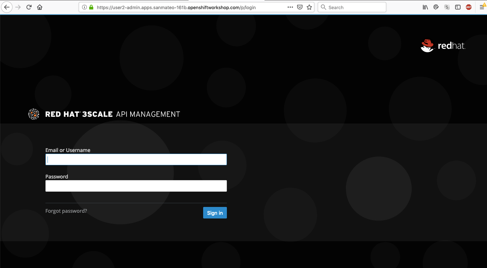
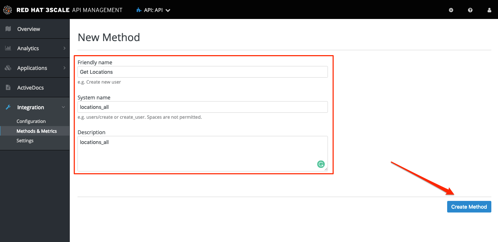
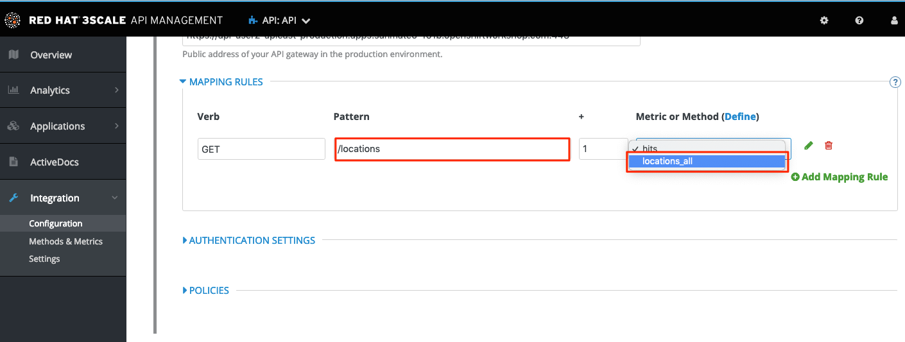
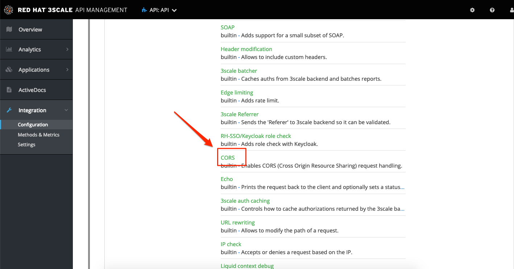
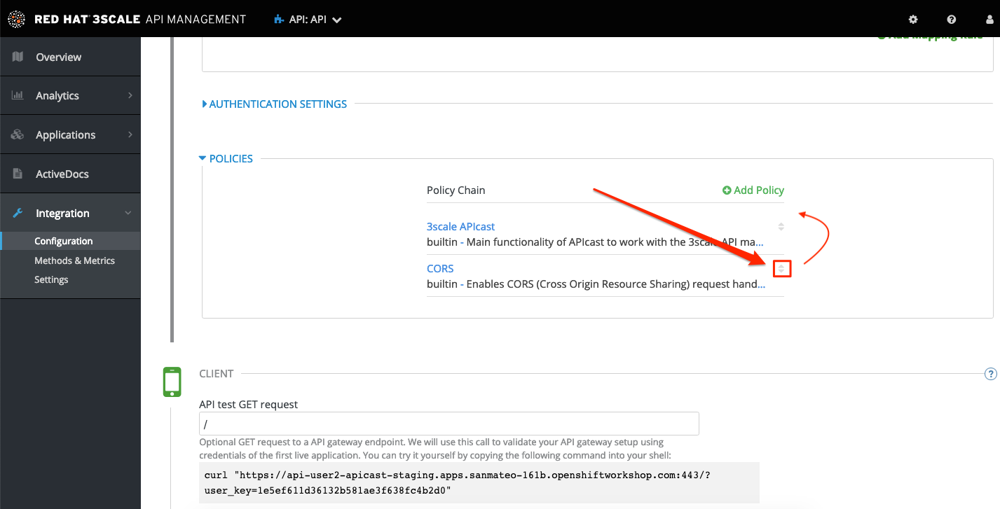
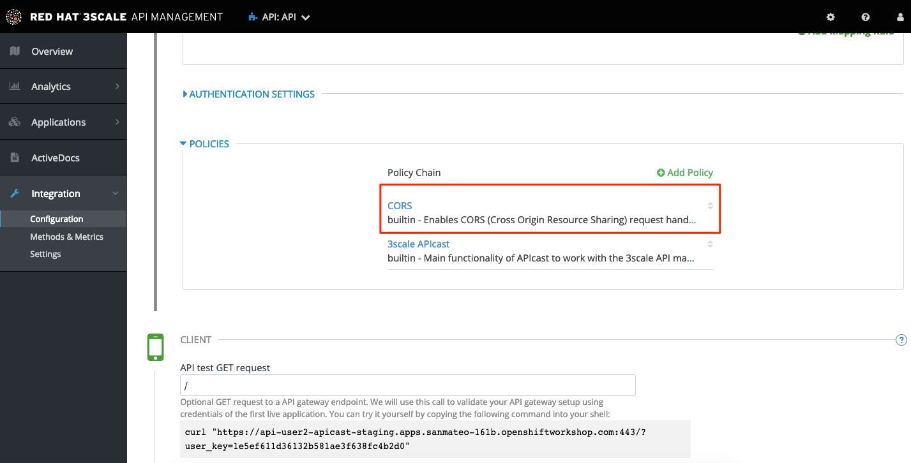
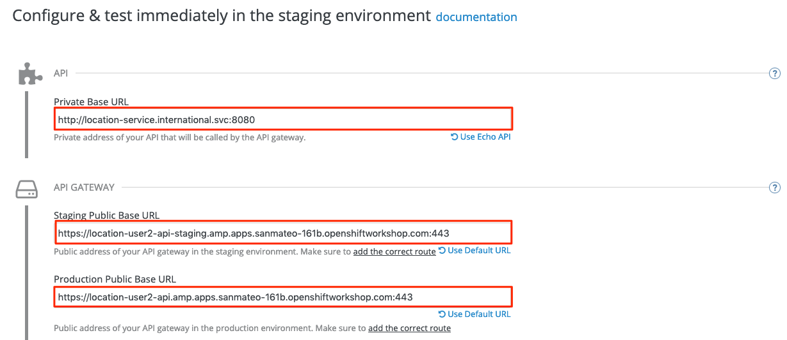
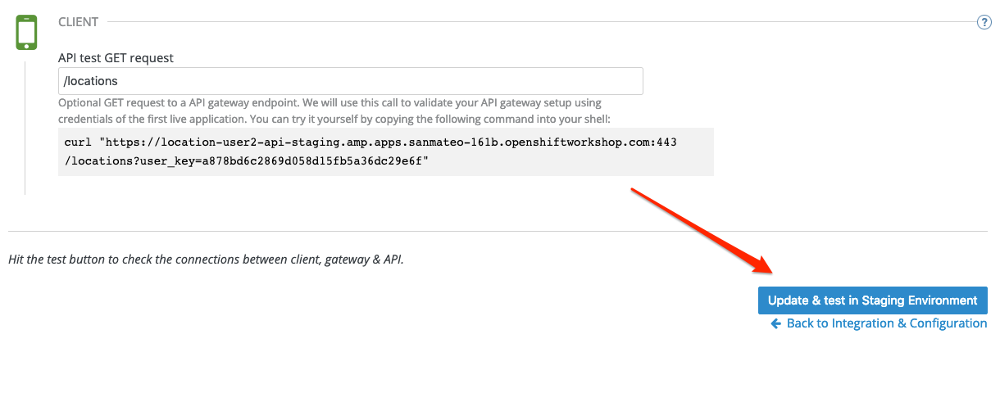

:walkthrough: Managing API Endpoints
:next-lab-url: https://tutorial-web-app-webapp.{openshift-app-host}/tutorial/dayinthelife-integration.git-citizen-integrator-track-lab04/
:3scale-url: https://www.3scale.net/
:3scale-admin-url: https://{user-username}-admin.{openshift-app-host}/p/login
:user-password: openshift

ifdef::env-github[]
:next-lab-url: ../lab04/walkthrough.adoc
endif::[]

[id='api-managing']
= Integrator Lab 3 - Managing API Endpoints

In this lab you will be adding management capabilities to your API to give you control and visibility of it's usage.

Audience: Developers, Architects, Testers, Quality Engineers

*Overview*

Once you have APIs deployed in your environment, it becomes critically important to manage who may use them, and for what purpose. You also need to begin to track usage of these different users to know who is or is not succeeding in their usage.

*Why Red Hat?*

Red Hat provides one the leading API Management tools that provides API management services. The link:{3scale-url}[3scale API Management] solution enables you to quickly and easily protect and manage your APIs.

*Credentials:*

Your username is: `{user-username}` +
Your password is: `{user-password}`

[type=walkthroughResource]
.3scale Admin Console
****
* link:{3scale-admin-url}[Console, window="_blank"]
****

[time=3]
[id="define-api-backend"]
== Define your API Backend Services

. Log in to link:{3scale-admin-url}[3scale Admin, window="_blank"] web console using `{user-username}` and password: `{user-password}`.
+

. The first page you will land is the *API Management Dashboard*. Click on the **BACKENDS** tab.
+
image::images/01a-dashboard.png[integrate-api-link, role="integr8ly-img-responsive"]

. Click in the **API Backend** link to edit the backend service information.
+
image::images/01b-dashboard.png[integrate-api-link, role="integr8ly-img-responsive"]

. Click in the **edit** link in the right side of the Backend Overview to edit the backend service private endpoint.
+
image::images/03-edit-backends.png[edit-backends-settings, role="integr8ly-img-responsive"]

. Scroll down to the `API` section and edit the **Private endpoint** with the following value:
** Private endpoint: *`http://location-service.international.svc:8080`*
+
_We are using the internal API service, as we are deploying our services inside the same OpenShift cluster._
+
image::images/04-backend-url.png[backend-api-endpoint, role="integr8ly-img-responsive"]

. Click on **Update Backend** button to save the configuration.

[type=verification]
Was the service updated successfully?

[type=verificationFail]
Try to redo this section, if any problem persists have your instructor check the Kubernetes pod that contains the 3scale API Management application.

[time=4]
[id="manage-access-control"]
== Manage API access control settings

. From the current `Backend Overview` page, click the **API** link under the **Products Using this Backend** section.
+
image::images/07a-api-product.png[api-product-link, role="integr8ly-img-responsive"]

. Expand the **Integration** menu and click in the **Methods and Metrics** option to get data on the individual method usage on our exposed API.
+
image::images/07b-methods-metrics.png[mapping-rules, role="integr8ly-img-responsive"]

. Click on the **New Method** link in the *Methods* section.
+
image::images/07b-new-method.png[new-method, role="integr8ly-img-responsive"]

. Fill in the information for your Fuse Method.
** Friendly name: *`Get Locations`*
** System name: *`locations_all`*
** Description: *`Method to return all locations`*
+

. Click on **Create Method**.

. In the right side menu bar, click on the **Mapping Rules** link under the **Integration** menu.
+
image::images/07b-mapping-rules.png[mapping-rules, role="integr8ly-img-responsive"]
+
_The default mapping is the root ("/") of our API resources, and this example application will not use that mapping. The following actions will redefine that default root ("/") mapping_.

. Click on the edit icon next to the `GET` mapping rule.
+
image::images/07b-edit-mapping-rule.png[edit-mapping-rule, role="integr8ly-img-responsive"]

. Type in the *Pattern* text box the following:
+
[source,bash,subs="attributes+"]
----
/locations
----

. Select **locations_all** as Method from the combo box.
+

. Click on **Update Mapping Rule** button to save your changes.

[type=verification]
Was the setup of the settings successful?

[type=verificationFail]
Try to redo this section, if any problem persists have your instructor check the Kubernetes pod that contains the 3scale API Management application.

[time=3]
[id="define-api-policies"]
== Define your API Policies

Red Hat 3scale API Management provides units of functionality that modify the behavior of the API Gateway without the need to implement code. These management components are know in 3scale as policies.

The order in which the policies are executed, known as the “policy chain”, can be configured to introduce differing behavior based on the position of the policy in the chain. Adding custom headers, perform URL rewriting, enable CORS, and configurable caching are some of the most common API gateway capabilities implemented as policies.

. In the right side menu bar, click on the **Policies** link under the **Integration**.
+
image::images/policies-01.png[policies, role="integr8ly-img-responsive"]
+
_The default policy in the Policy Chain is APIcast. This is the main policy and most of the times you want to keep it._

. Click the **Add Policy** link to add a new policy to the chain.
+
image::images/policies-02.png[policies-02, role="integr8ly-img-responsive"]
+
_Out-of-the-box 3scale includes a set of policies you can use to modify the way your API gateway behaves. For this lab, we will focus on the **Cross Origin Resource Sharing (CORS)** one as we will use it in the consumption lab._

. Click in the **CORS** link to add the policy.
+

. Put your mouse over the right side of the policy name to enable the reorder of the chain. Drag and drop the CORS policy to the top of the chain.
+

. Now **CORS** policy will be executed before the **APIcast**. Click the **CORS** link to edit the policy.
+

. In the *Edit Policy* section, click the green **+** button to add the allowed headers.
+
image::images/policies-06.png[policies-06, role="integr8ly-img-responsive"]

. Type **`Authorization`** in the *Allowed headers* field.
+
image::images/policies-07.png[policies-07, role="integr8ly-img-responsive"]

. Tick the **allow_credentials** checkbox and fill in with a star `*` in the _allow_origin_ text box.
+
image::images/policies-08.png[policies-08, role="integr8ly-img-responsive"]

. Click twice the green **+** button under *ALLOW_METHODS* to enable two combo boxes for the CORS allowed methods.

. Select **GET** from the first box and **OPTIONS** from the second box. Click the **Update Policy** button to save the policy configuration.
+
image::images/policies-09.png[policies-09, role="integr8ly-img-responsive"]

. Save the changes to the policy chain by clicking the **Update Policy Chain** button.
+
image::images/policies-10-policy-chain.png[policies-09, role="integr8ly-img-responsive"]

[type=verification]
Was the setup of the API successful?

[type=verificationFail]
Try to redo this section, if any problem persists have your instructor check the Kubernetes pod that contains the 3scale API Management application.

[time=2]
[id="configure-public-endpoint"]
== Configure the Public Endpoint

. In the right side menu bar, click on the **Settings** link under the **Integration** menu.
+
image::images/03-edit-settings.png[edit-settings, role="integr8ly-img-responsive"]

. Keep the **APIcast 3scale managed** option in the `DEPLOYMENT` section.

. In the `API GATEWAY` subsection, fill in the information for accessing your API:
** Staging Public Base URL: *`https://location-{user-username}-api-staging.{openshift-app-host}:443`*
** Production Public Base URL: *`https://location-{user-username}-api.{openshift-app-host}:443`*
+

. Scroll down to the `AUTHENTICATION` section. Leave the **API Key (user_key)** option selected and same with the **As query parameters (GET)** from the `CREDENTIALS LOCATION` section.
+
image::images/08-authentication.png[authentication-settings, role="integr8ly-img-responsive"]

. Scroll down to the end of the page and click the **Update Product** button to save the configurations.
+
image::images/09-update-product.png[update-product, role="integr8ly-img-responsive"]

[type=verification]
Was the setup of the API Product successful?

[type=verificationFail]
Try to redo this section, if any problem persists have your instructor check the Kubernetes pod that contains the 3scale API Management application.

[time=2]
[id="promot-configuration-production"]
== Promote Configuration to Production

. In the right side menu bar, click on the **Configuration** link under the **Integration** menu.
+
image::images/10-product-configuration.png[product-configuration, role="integr8ly-img-responsive"]

. Click on the **Promote v. 1 to Staging** button to promote your configuration to staging.
+

. Click on the **Promote v.1 to Production** button to promote your configuration from staging to production.
+
image::images/08a-promote-production.png[promote-to-production, role="integr8ly-img-responsive"]

. Test your API by opening a new browser tab and navigating to the following url:
+
[source,bash,subs="attributes+"]
----
https://location-{user-username}-api-staging.{openshift-app-host}/locations
----
+
_You should see an error message telling you `Authentication parameters missing`. This is because we are not sending any user_key to authenticate our API call._

. Go back to the 3scale console and copy the full url with the `user_key` from the **Example curl for testing** in the integration configuration page for your API product.
+
image::images/11-test-api.png[test-api, role="integr8ly-img-responsive"]
+
_DO NOT copy the `curl` word neither the quotation marks `"`._

. Test back your API navigating to the url you just copied.

[type=verification]
Are you able to see the json payload with the branch locations?

[type=verificationFail]
Try to redo this section, if any problem persists have your instructor check the Kubernetes pod that contains the 3scale API Management application.

_Congratulations! You have configured 3scale access control layer as a proxy to only allow authenticated calls to your backend API._

* 3scale is also now:
** Authenticating (If you test with an incorrect API key it will fail)
** Recording calls (Visit the Analytics tab to check who is calling your API).

[time=2]
[id="summary"]
== Summary

In this lab we just covered the basics of creating a proxy for our API service. Red Hat 3scale API Management also allows us to keep track of security (as you will see in the next lab) as well as the usage of our API. If getting money from your API's is also important to you, 3scale allows you to monetize your API's with its embedded billing system.

Try to navigate through the rest of the tabs of your Administration Portal. Did you notice that there are application plans associated to your API? Application Plans allow you to take actions based on the usage of your API, like doing rate limiting or charging by hit (API call) or monthly usage.

You set up an API management service and API proxies to control traffic into your API. From now on you will be able to issue keys and rights to users wishing to access the API.

You can now proceed to link:{next-lab-url}[Lab 4].

[time=1]
[id="further-reading"]
== Notes and Further Reading

* API Management
 ** https://www.3scale.net/[Red Hat 3scale API Management]
 ** https://developers.redhat.com/blog/2017/05/22/how-to-setup-a-3scale-amp-on-premise-all-in-one-install/[Developers All-in-one 3scale install]
 ** https://www.thoughtworks.com/radar/platforms/overambitious-api-gateways[ThoughtWorks Technology Radar - Overambitious API gateways]
