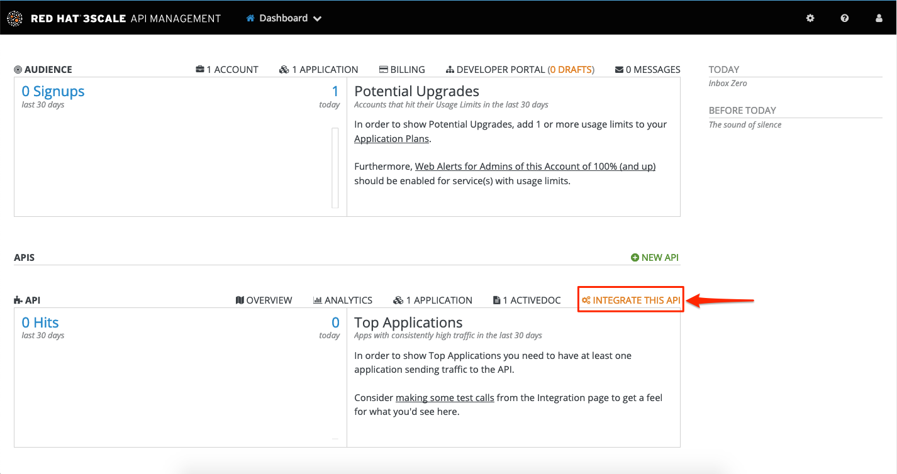
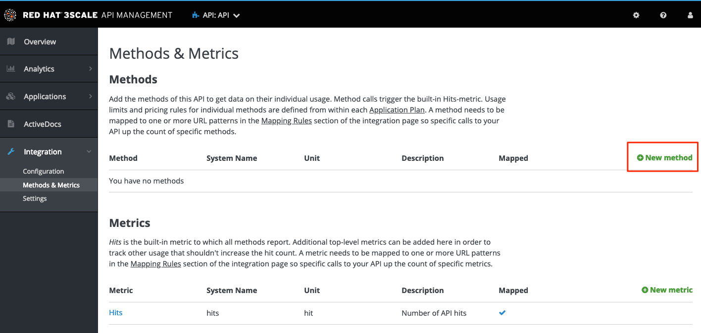
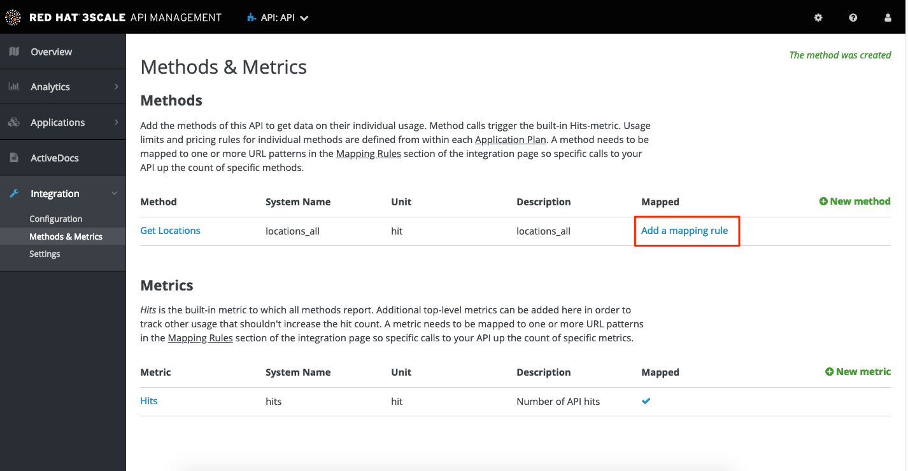
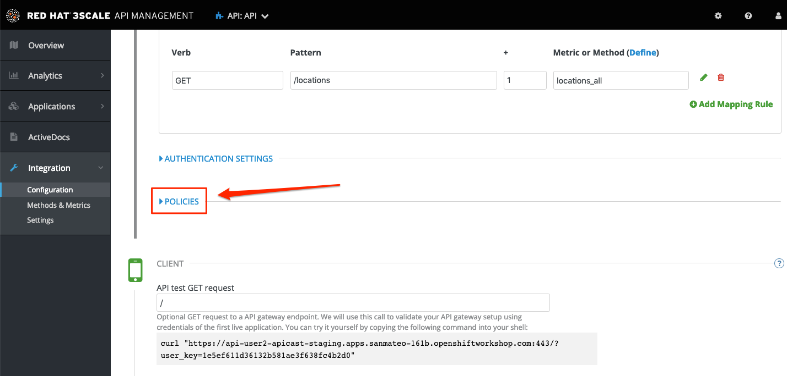
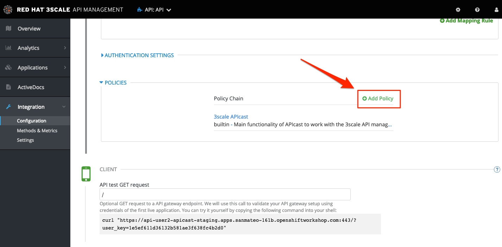
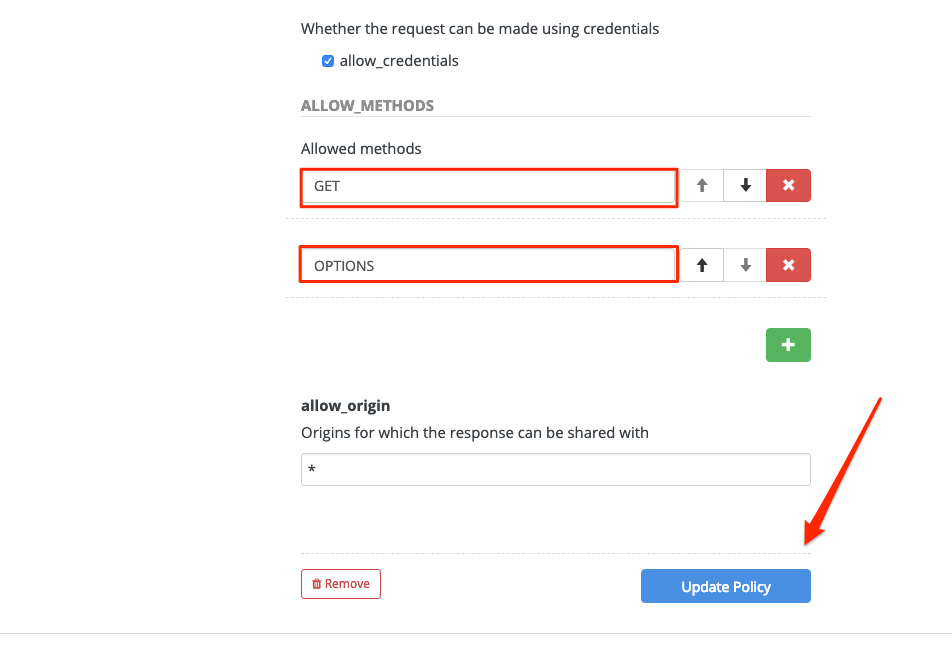

:walkthrough: Managing API Endpoints
:next-lab-url: https://tutorial-web-app-webapp.{openshift-app-host}/tutorial/dayinthelife-integration.git-citizen-integrator-track-lab04/
:3scale-url: https://www.3scale.net/
:3scale-admin-url: https://{user-username}-admin.{openshift-app-host}/p/login
:user-password: openshift

[id='api-managing']
= Integrator Lab 3 - Managing API Endpoints

In this lab you will be adding management capabilities to your API to give you control and visibility of it's usage.

Audience: Developers, Architects, Testers, Quality Engineers

*Overview*

Once you have APIs deployed in your environment, it becomes critically important to manage who may use them, and for what purpose. You also need to begin to track usage of these different users to know who is or is not succeeding in their usage.

*Why Red Hat?*

Red Hat provides one the leading API Management tools that provides API management services. The link:{3scale-url}[3scale API Management] solution enables you to quickly and easily protect and manage your APIs.

*Credentials:*

Your username is: `{user-username}` +
Your password is: `{user-password}`

[type=walkthroughResource]
.3scale Admin Console
****
* link:{3scale-admin-url}[Console, window="_blank"]
****

[time=5]
[id="define-api-proxy"]
== Define your API Proxy

. Log in to link:{3scale-admin-url}[3scale Admin, window="_blank"] web console using `{user-username}` and password: `{user-password}`.
+
image::images/01-login.png[3scale-admin-login, role="integr8ly-img-responsive"]

. The first page you will land is the *API Management Dashboard*. Click on the **INTEGRATE THIS API** menu link.
+

. Click on the **edit integration settings** to edit the API settings for the gateway.
+
image::images/03-edit-settings.png[edit-integration-settings, role="integr8ly-img-responsive"]

. Keep the **APIcast** deployment option in the Gateway section.
+
image::images/04-apicast.png[apicast-selection, role="integr8ly-img-responsive"]

. Scroll down and keep the **API Key (user_key)** Authentication.
+
image::images/05-authentication.png[user-key-autentication, role="integr8ly-img-responsive"]

. Click on **Update Service**.

. Click on the **add the Base URL of your API and save the configuration** button.
+

[time=10]
[id="update-integration-settings"]
== Update Integration settings

Leave the settings for `Private Base URL`, `Staging Public Base URL`, and `Production Public Base URL` as it is. We will come back to the screen to update the correct values in later step.

. Scroll down and expand the **MAPPING RULES** section to define the allowed methods on our exposed API.
+
_The default mapping is the root ("/") of our API resources, and this example application will not use that mapping. The following actions will redefine that default root ("/") mapping_.
+
image::images/07b-mapping-rules.png[mapping-rules, role="integr8ly-img-responsive"]

. Click on the **Metric or Method (Define)** link.
+
image::images/07b-mapping-rules-define.png[mapping-rules-define, role="integr8ly-img-responsive"]

. Click on the **New Method** link in the *Methods* section.
+

. Fill in the information for your Fuse Method.
** Friendly name: *Get Locations*
** System name: *locations_all*
** Description: *Method to return all locations*

+
image::images/07b-new-method-data.png[new-method-data, role="integr8ly-img-responsive"]

. Click on **Create Method**.

. Click on the **Add mapping rule** link.
+

. Click on the edit icon next to the `GET` mapping rule.
+
image::images/07b-edit-mapping-rule.png[edit-mapping-rule, role="integr8ly-img-responsive"]

. Type in the *Pattern* text box the following:
+
[source,bash,subs="attributes+"]
----
/locations
----

. Select **locations_all** as Method from the combo box.
+
image::images/07b-getall-rule.png[getall-rule, role="integr8ly-img-responsive"]

[time=10]
[id="define-api-policies"]
== Define your API Policies

Red Hat 3scale API Management provides units of functionality that modify the behavior of the API Gateway without the need to implement code. These management components are know in 3scale as policies.

The order in which the policies are executed, known as the “policy chain”, can be configured to introduce differing behavior based on the position of the policy in the chain. Adding custom headers, perform URL rewriting, enable CORS, and configurable caching are some of the most common API gateway capabilities implemented as policies.

. Scroll down and expand the **POLICIES** section to define the allowed methods on our exposed API.
+

+
_The default policy in the Policy Chain is APIcast. This is the main policy and most of the times you want to keep it._

. Click the **Add Policy** link to add a new policy to the chain.
+

+
_Out-of-the-box 3scale includes a set of policies you can use to modify the way your API gateway behaves. For this lab, we will focus on the **Cross Origin Resource Sharing (CORS)** one as we will use it in the consumption lab._

. Click in the **CORS** link to add the policy.
+
image::images/policies-03.png[policies-03, role="integr8ly-img-responsive"]

. Put your mouse over the right side of the policy name to enable the reorder of the chain. Drag and drop the CORS policy to the top of the chain.
+
image::images/policies-04.png[policies-04, role="integr8ly-img-responsive"]

. Now **CORS** policy will be executed before the **APIcast**. Click the **CORS** link to edit the policy.
+
image::images/policies-05.png[policies-05, role="integr8ly-img-responsive"]

. In the *Edit Policy* section, click the green **+** button to add the allowed headers.
+

. Type **Authorization** in the *Allowed headers* field.
+

. Tick the **allow_credentials** checkbox and fill in with a star (*) the *allow_origin* text box.
+

. Click twice the green **+** button under *ALLOW_METHODS* to enable two combo boxes for the CORS allowed methods.

. Select **GET** from the first box and **OPTIONS** from the second box.
+

. Click the **Update Policy** button to save the policy configuration.

[time=10]
[id="configure-upstream-endpoint"]
== Configure the Upstream Endpoint

. Create another datatype, this time with the following config and click save.
 ** Name: location
 ** JSON Example:

`
 {
    "id": 1,
    "name": "International Inc Corporate Office",
    "location": {
        "lat": 51.5013673,
        "lng": -0.1440787
    },
    "type": "headquarter",
    "status": "1"
 }
`
 image:images/n09-location-datatype.png[n09-location-datatype]

. You will be able to see the two datatypes created.
image:images/n10-datatype-all.png[n10-datatype-all]
. Click on the Create Operation link under POST to create a new POST operation.
image:images/n11-post-method.png[n11-post-method]
. Edit the description of the post method to _Add Location_ and click the orange POST button to edit the operation
image:images/n12-post-description.png[n12-post-description]
. Click on *Add a request Body*
image:images/n13-request.png[n13-request]
. Choose *locationinput* as the _Request Body Type_
image:images/n14-post-requst-location-input.png[n14-post-requst-location-input]
. Click the Add a response link.
image:images/n13-response.png[n13-response]
. Set the Response Status Code value to 201. Click Add.
image:images/n15-post-response.png[n15-post-response]
. Click on _*No Description_ and place _Location added_ in Description box. Click on the tick to save the changes
image:images/n16-post-description.png[n16-post-description]
. Click on the Type dropdown and select location.
image:images/n17-post-response-type.png[n17-post-response-type]!
. On the top section, under operation id, name it *addLocation* and click on tick to save the changes. On the very top of the page, click on Save button to return to Fuse Online in order for us to start the API implementation.
image:images/n18-post-operation-id.png[n18-post-operation-id]
. Click Next.
image:images/n19-start-of-integration.png[n19-start-of-integration]
. Set `Integration Name: addLocation` and `Description: add Location`

image::images/n20-integration-name.png[n20-integration-name, role="integr8ly-img-responsive"]

. Click on Add Location operation.

image::images/n21-choose-operation.png[n21-choose-operation, role="integr8ly-img-responsive"]

. Since we are adding incoming data into the database, click on the plus sign in between API entry point and return endpoint, select `Add connection`

image::images/n22-add-db-connection.png[n22-add-db-connection, role="integr8ly-img-responsive"]

. Click on `LocationDB` from the catalog and then select `Invoke SQL`

image::images/n24-invoke-sql.png[n24-invoke-sql, role="integr8ly-img-responsive"]

. Enter the SQL statement and click *Done*.

----
   INSERT INTO locations (id,name,lat,lng,location_type,status) VALUES (:#id,:#name,:#lat,:#lng,:#location_type,:#status )
----

image::images/n25-sql-statement.png[n25-sql-statement.png, role="integr8ly-img-responsive"]

. In between top API endpoint and the Database connection, click on the plus sign and select `Add step` and select `Data mapper`

image:images/n26-input-data-mapping.png[n26-input-data-mapping]
 image:images/n27-choose-data-mapping.png[n27-choose-data-mapping]

. Drag and drop the matching *Source* Data types to all their corresponding *Targets* as per the following screenshot. When finished, click *Done*.

image::images/n28-data-map-db.png[n28-data-map-db.png, role="integr8ly-img-responsive"]

. In between the Database connection and the endpoint, click on the plus sign and select `Add step` and select `Data mapper`

image:images/n29-output-data-mapping.png[n29-output-data-mapping]
 image:images/n30-choose-data-mapping.png[n30-choose-data-mapping]

. Drag and drop the matching *Source* Data types to all their corresponding *Targets* as per the following screenshot. When finished, click *Done*.

image::images/n31-data-map-response.png[n31-data-map-response, role="integr8ly-img-responsive"]

. Click *Publish* on the next screen.

image::images/n32-publish.png[n32-publish, role="integr8ly-img-responsive"]

_Congratulations_. You successfully published the integration. (Wait for few minutes to build and publish the integration)

=== Step 3: Create a POST request

We will use an online cURL tool to create the `101th` record field in database.

. Copy the `External URL` per the below screenshot
+
image::images/14-copy-URL.png[14-copy-URL.png, role="integr8ly-img-responsive"]

. Open a browser window and navigate to:
+
----
  https://onlinecurl.com/
----

. Below are the values for the request. Note: `id:101` in the payload as we are creating `101th` record in the database.
+
----
  URL: http://i-addlocation-demo.apps.55b9.openshift.opentlc.com/locations

  --header (-H):  Content-Type: application/json

  --data (-d): {"id": 101, "name": "Kamarhati", "type": "Regional Branch", "status": "1", "location": { "lat": "-28.32555", "lng": "-5.91531" }}

  --request (-X): POST
----
+
image::images/15-online-curl.png[15-online-curl.png, role="integr8ly-img-responsive"]

. The page will load the `204` response information from the service which means the request was successfully fulfilled.
+
image::images/16-response-header.png[16-response-header.png, role="integr8ly-img-responsive"]

. Click on menu:Activity[Refresh] and verify if the newly record is created.
+
image::images/17-activity-refresh.png[17-activity-refresh.png, role="integr8ly-img-responsive"]

<<<<<<< HEAD

. {blank}
+
= _(Optional)_ Visit the application URL in the browser and verify if the record can be fetched.
. _(Optional)_ Visit the application URL in browser and verify if the record can be fetched.
+
____
______
________
__________
____________
______________
________________
1a3996b4b04f4a7a4997ae47d9c36f2cfa8178e2
________________
______________
____________
__________
________
______
____

*REQUEST*

----
   http://location-service-international.{openshift-app-host}/locations/101
----

*RESPONSE*

----
    {
      "id" : 101,
      "name" : "Kamarhati",
      "type" : "Regional Branch",
      "status" : "1",
      "location" : {
        "lat" : "-28.32555",
        "lng" : "-5.91531"
      }
    }
----

== Summary

In this lab you discovered how to create an adhoc API service using Fuse Online.

You can now proceed to link:../lab04/#lab-4[Lab 4]

== Notes and Further Reading

* Fuse Online
 ** https://www.redhat.com/en/technologies/jboss-middleware/fuse-online[Webpage]
 ** https://access.redhat.com/documentation/en-us/red_hat_fuse/7.1/html-single/fuse_online_sample_integration_tutorials/index[Sample tutorials]
 ** https://developers.redhat.com/blog/2017/11/02/work-done-less-code-fuse-online-tech-preview-today/[Blog]
