= Integrator Lab 4 - Take control of your APIs
:walkthrough: Adding management capabilities to the API to give you control and visibility of it's usage

[time=15]
== Managing API Endpoints

=== Take control of your APIs

* Duration: 15 mins
* Audience: API Owners, Product Managers, Developers, Architects

== Overview

Once you have APIs deployed in your environment, it becomes critically important to manage who may use them, and for what purpose. You also need to begin to track usage of these different users to know who is or is not succeeding in their usage. For this reason, in this lab, you will be adding management capabilities to the API to give you control and visibility of it's usage.

=== Why Red Hat?

Red Hat provides one the leading API Management tools that provides API management services. The https://www.3scale.net/[3scale API Management] solution enables you to quickly and easily protect and manage your APIs.

=== Skipping The Lab

If you are planning to skip to the next lab, there is an already running API proxy for the Location API Service in this endpoint:

[source,bash]
----
https://location-service-api.amp.{openshift-app-host}
----

=== Environment

*Credentials:*

Your username is your assigned user number. For example, if you are assigned user number *1*, your username is:

[source,bash]
----
user1
----

Please ask your instructor for your password.

*URLs:*

If you haven't done so already, you need to login to the *Red Hat Solution Explorer* webpage so that a unique lab environment can be provisioned on-demand for your exclusive use. You should open a web browser and navigate to:

[source,bash]
----
https://tutorial-web-app-webapp.{openshift-app-host}
----

You will be presented with a login page where you can enter your unique credentials:

image::images/design-50.png[design-login, role="integr8ly-img-responsive"]

Enter your credentials and click *Log in*.  You'll notice a web-page appear which explains that a _unique environment_ is being provisioned.

image::images/design-51.png[design-login, role="integr8ly-img-responsive"]

Once the environment is provisioned, you will be presented with a page that presents all the available applications which you'll need in order to complete the labs:

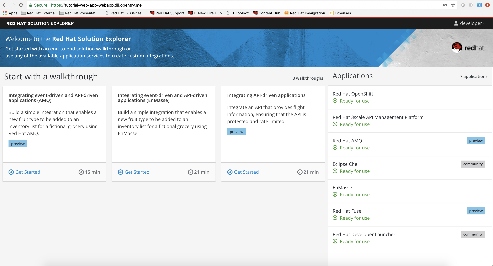

== Lab Instructions

=== Step 1: Define your API Proxy

Your 3scale Admin Portal provides access to a number of configuration features.

. Click on the `3scale Admin Dashboard` from the Red Hat Solution Explorer. The URL should look like
+
[source,bash]
----
 https://userX-admin.{openshift-app-host}/p/login
----
+
_Remember to replace `X` variable in the URL with your assigned user number._

. Log into 3scale using your designated <<environment,user and password>>. Click on *Sign In*.
+
image::images/01-login.png[01-login.png, role="integr8ly-img-responsive"]

. The first page you will land is the _API Management Dashboard_. Click on the *INTEGRATE THIS API*.
+
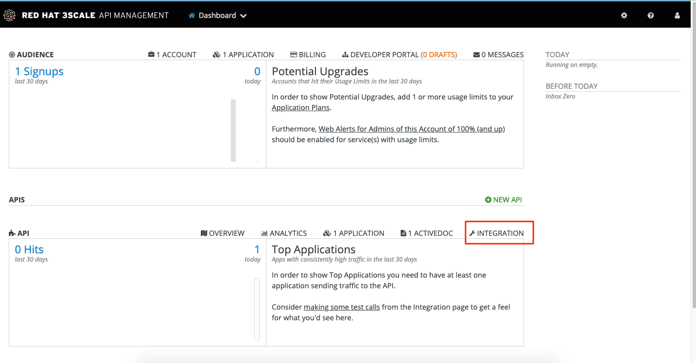

. Click on the *edit integration settings* to edit the API settings for the gateway.
+
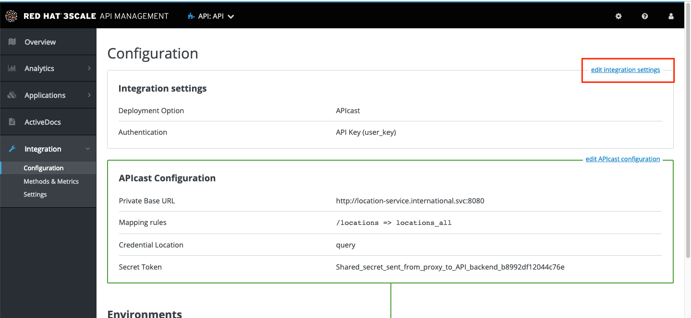

. Keep select the *APIcast* deployment option in the _Gateway_ section.
+
image::images/04-apicast.png[04-apicast.png, role="integr8ly-img-responsive"]

. Scroll down and keep the *API Key (user_key)* Authentication.
+
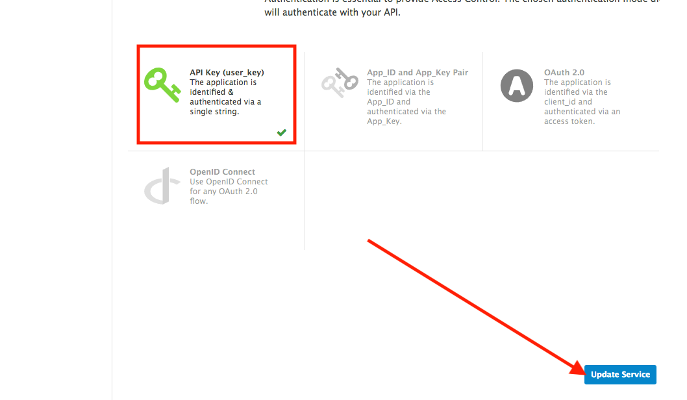

. Click on *Update Service*.
. Click on the *add the Base URL of your API and save the configuration* button.
+
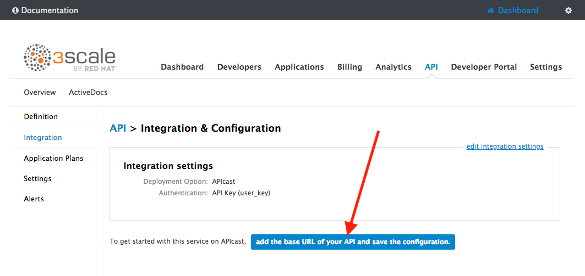

. Leave the settings for `Private Base URL`, `Staging Public Base URL`, and `Production Public Base URL` as it is. We will come back to the screen to update the correct values in later step.
. Scroll down and expand the *MAPPING RULES* section to define the allowed methods on our exposed API.
+
_The default mapping is the root ("/") of our API resources, and this example application will not use that mapping. The following actions will redefine that default root ("/") mapping._
+
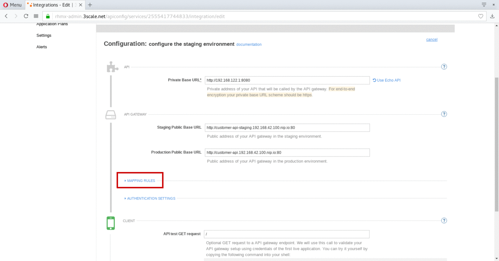

. Click on the *Metric or Method (Define)*  link.
+
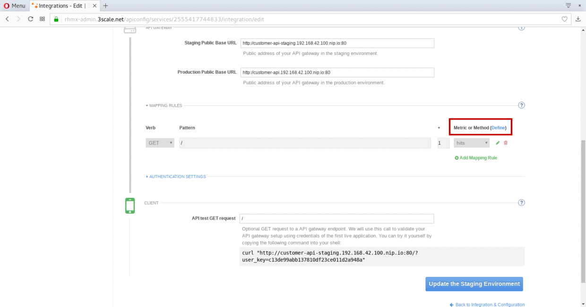

. Click on the *New Method* link in the _Methods_ section.
+
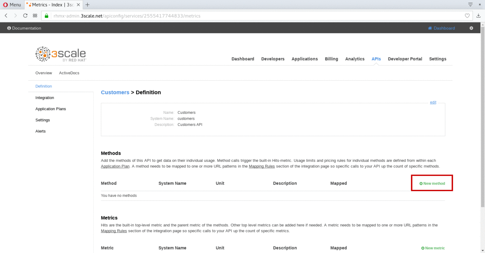

. Fill in the information for your Fuse Method.
 ** Friendly name: *Get Locations*
 ** System name: *locations_all*
 ** Description: *Method to return all locations*
+
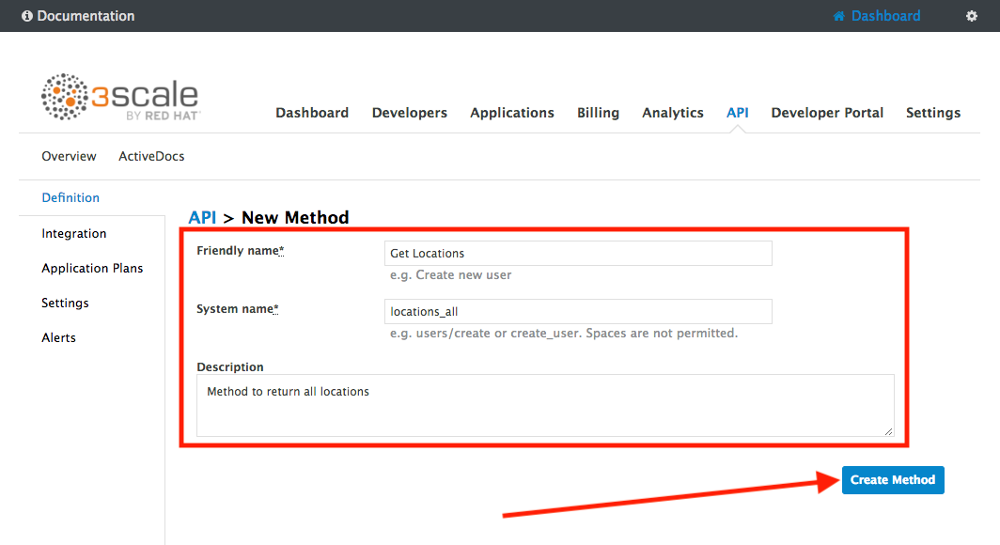

. Click on *Create Method*.
. Click on the *Add mapping rule* link.
+
image::images/07b-add-mapping-rule.png[07b-add-mapping-rule.png, role="integr8ly-img-responsive"]

. Click on the edit icon next to the GET mapping rule.
+
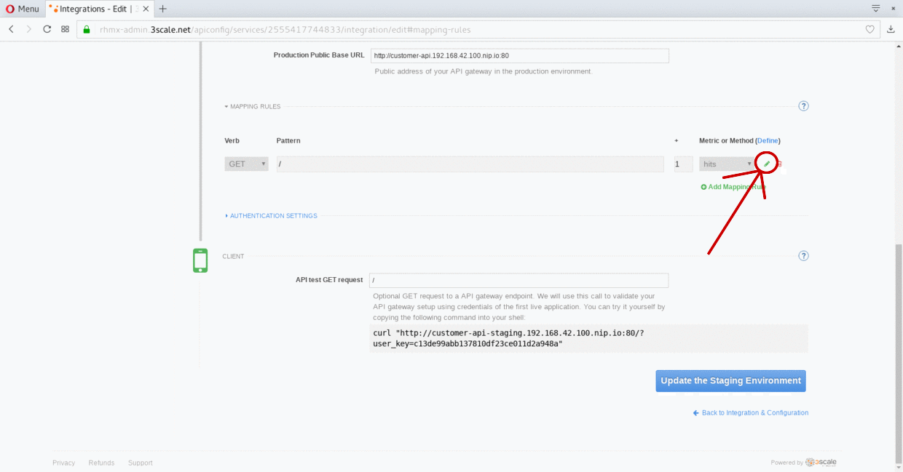

. Type in the _Pattern_ text box the following:
+
[source,bash]
----
 /locations
----

. Select *locations_all* as Method from the combo box.
+
image::images/07b-getall-rule.png[07b-getall-rule.png, role="integr8ly-img-responsive"]

=== Step 2: Define your API Policies

Red Hat 3scale API Management provides units of functionality that modify the behavior of the API Gateway without the need to implement code. These management components are know in 3scale as policies.

The order in which the policies are executed, known as the "`policy chain`", can be configured to introduce differing behavior based on the position of the policy in the chain. Adding custom headers, perform URL rewriting, enable CORS, and configurable caching are some of the most common API gateway capabilities implemented as policies.

. Scroll down and expand the *POLICIES* section to define the allowed methods on our exposed API.
+
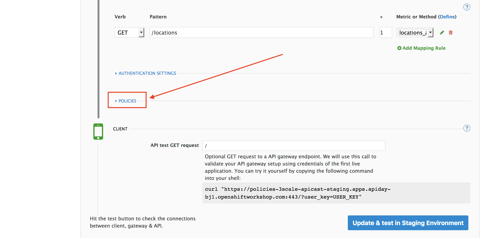
+
_The default policy in the Policy Chain is APIcast. This is the main policy and most of the times you want to keep it_.

. Click the *Add Policy* link to add a new policy to the chain.
+
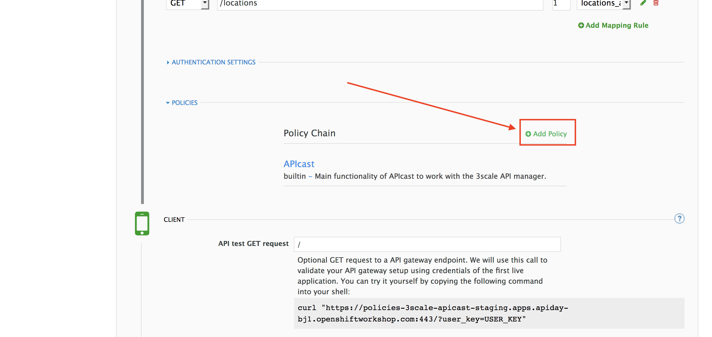
+
_Out-of-the-box 3scale includes a set of policies you can use to modify the way your API gateway behaves. For this lab, we will focus on the *Cross Origin Resource Sharing (CORS)* one as we will use it in the consumption lab_.

. Click in the *CORS* link to add the policy.
+
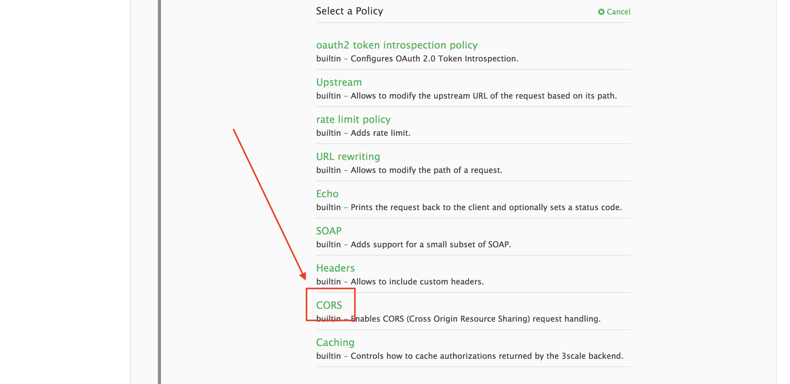

. Put your mouse over the right side of the policy name to enable the reorder of the chain. Drag and drop the CORS policy to the top of the chain.
+
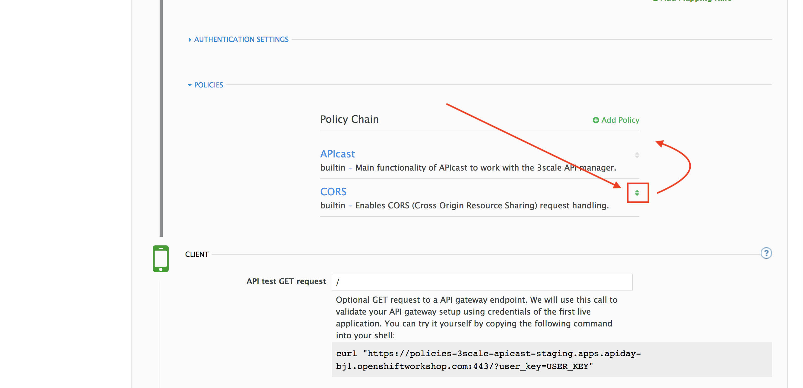

. Now *CORS* policy will be executed before the *APIcast*. Click the *CORS* link to edit the policy.
+
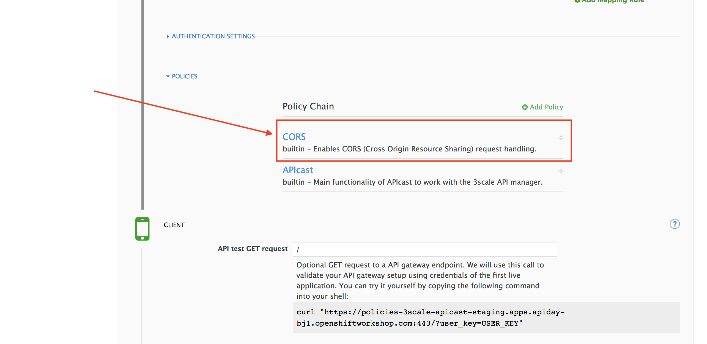

. In the _Edit Policy_ section, click the green *+* button to add the allowed headers.
+
image::images/policies-06.png[06-add-headers, role="integr8ly-img-responsive"]

. Type *Authorization* in the _Allowed headers_ field.
+
image::images/policies-07.png[07-authorization-header, role="integr8ly-img-responsive"]

. Tick the *allow_credentials* checkbox and fill in with a star (***) the _allow_origin_ text box.
+
image::images/policies-08.png[08-allow-origin, role="integr8ly-img-responsive"]

. Click twice the green *+* button under _ALLOW_METHODS_ to enable two combo boxes for the CORS allowed methods.
. Select *GET* from the first box and *OPTIONS* from the second box.
+
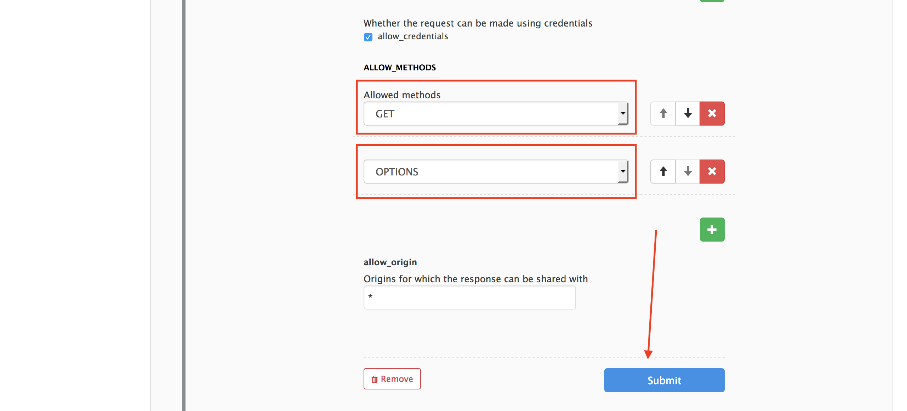

. Click the *Update Policy* button to save the policy configuration.

=== Step 3: Configure the Upstream Endpoint

. Scroll back to the top of the page. Fill in the information for accessing your API:
 ** Private Base URL: *http://location-service.international.svc:8080*
 ** Staging Public Base URL: *https://location-userX-api-staging.amp.{openshift-app-host}:443*
 ** Production Public Base URL: *https://location-userX-api.amp.{openshift-app-host}:443*

+
_Remember to replace the X with your user number_.

+
_We are using the internal API service, as we are deploying our services inside the same OpenShift cluster_.
+
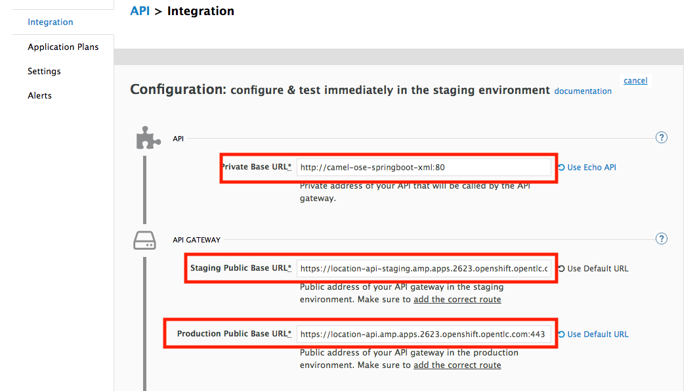

. Scroll down to the *API Test GET request*.
. Type in the textbox:
+
[source,bash]
----
 /locations
----

. Click on the *Update the Staging Environment* to save the changes and check the connection between client, gateway and API.
+
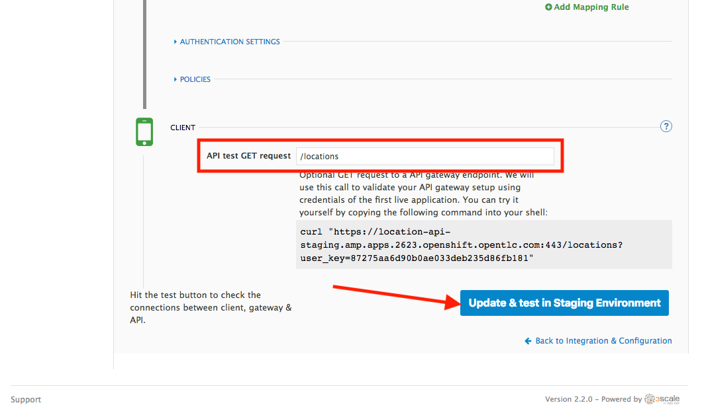
+
_If everything works, you will get a green message on the left_.

. Click on *Back to Integration & Configuration* link to return to your API overview.
+
image::images/08aa-back-to-integration.png[08aa-back-to-integration.png, role="integr8ly-img-responsive"]

. Click on the *Promote v.1 to Production* button to promote your configuration from staging to production.
+
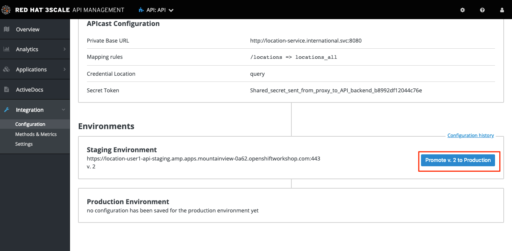

_Congratulations!_ You have configured 3scale access control layer as a proxy to only allow authenticated calls to your backend API. 3scale is also now:

* Authenticating (If you test with an incorrect API key it will fail)
* Recording calls (Visit the Analytics tab to check who is calling your API).

== Steps Beyond

In this lab we just covered the basics of creating a proxy for our API service. Red Hat 3scale API Management also allows us to keep track of  security (as you will see in the next lab) as well as the usage of our API. If getting money for your APIs is also important to you, 3scale  allows you to monetize your APIs with its embedded billing system.

Try to navigate through the rest of the tabs of your Administration Portal. Did you notice that there are application plans associated to your API? Application Plans allow you to take actions based on the usage of your API, like doing rate limiting or charging by hit (API call) or monthly usage.

== Summary

You set up an API management service and API proxies to control traffic into your API. From now on you will be able to issue keys and rights to users wishing to access the API.

You can now proceed to link:../lab05/#lab-5[Lab 5]

== Notes and Further Reading

* https://www.3scale.net/[Red Hat 3scale API Management]
* https://developers.redhat.com/blog/2017/05/22/how-to-setup-a-3scale-amp-on-premise-all-in-one-install/[Developers All-in-one 3scale install]
* https://www.thoughtworks.com/radar/platforms/overambitious-api-gateways[ThoughtWorks Technology Radar - Overambitious API gateways]
