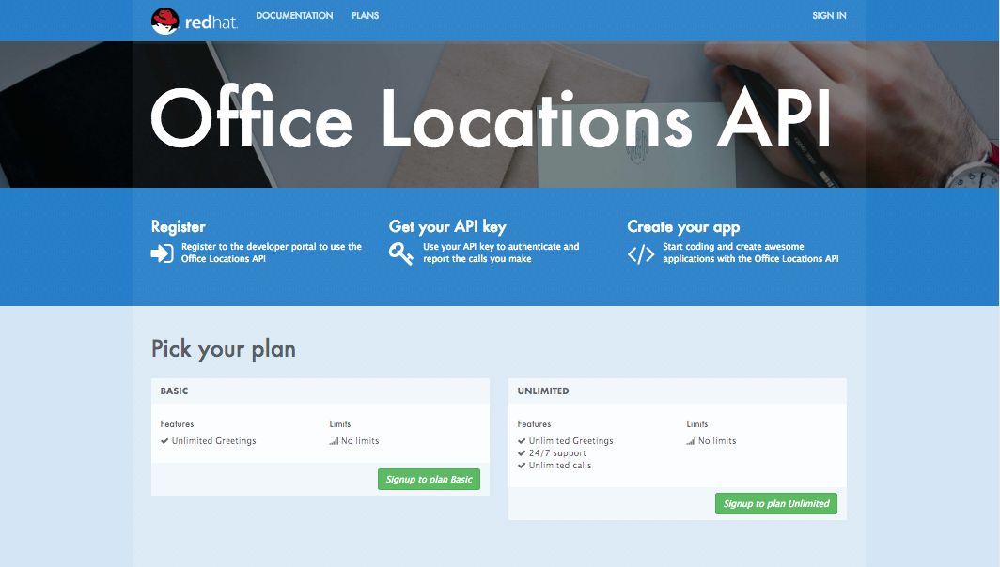
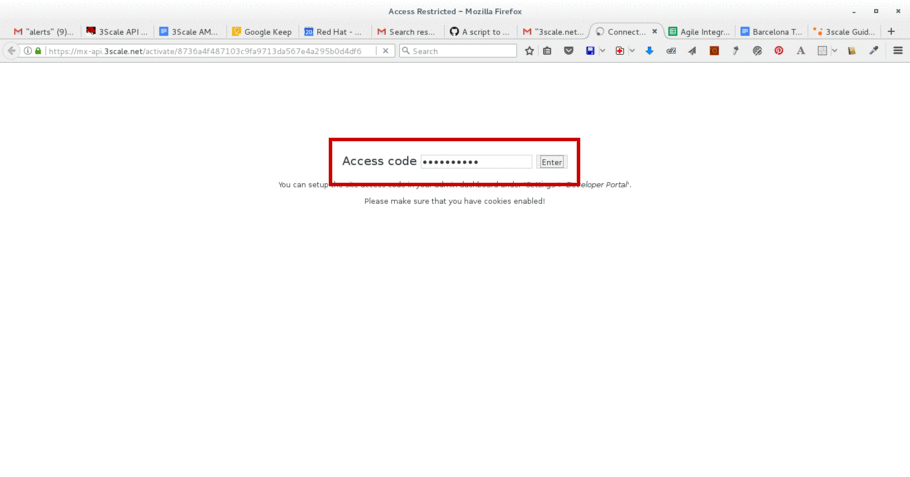

:walkthrough: Create and customize the API Developer Portal
:next-lab-url: https://tutorial-web-app-webapp.{openshift-app-host}/tutorial/dayinthelife-integration.git-citizen-integrator-track-lab06/
:3scale-url: https://www.3scale.net/
:3scale-admin-url: https://{user-username}-admin.{openshift-app-host}/p/login
:3scale-dev-portal-url: https://{user-username}.{openshift-app-host}/
:user-password: openshift

[id='api-security']
= Integrator Lab 5 - API Developer Portal

In this lab you will discover how to customize and configure 3scale's Developer Portal.

Audience: API Owners, Product Managers, Developers, Architects

*Overview*

The focal point of your developers experience is the API developer portal, and the level of effort you put into it will directly correlate to the level of success of your API program, and API developer engagement.

*Why Red Hat?*

https://www.3scale.net/[Red Hat 3scale API Management] Solution provides a built-in, state-of-the-art CMS portal, making it very easy to create your own branded hub with a custom domain to manage developer interactions, and help increase API adoption.

You can customize the look and feel of the entire Developer Portal to match your own branding. You have complete control over every element of the portal, so you can make it as easy as possible for developers to learn how to use your API.

*Credentials:*

Your username is: `{user-username}` +
Your password is: `{user-password}`

[type=walkthroughResource]
.3scale Admin Console
****
* link:{3scale-admin-url}[Console, window="_blank"]
****

[type=walkthroughResource]
.3scale Developer Portal
****
* link:{3scale-dev-portal-url}[Console, window="_blank"]
****

[time=5]
[id="custom-dev-portal"]
== Customizing Developer Portal

. Log in to link:{3scale-admin-url}[3scale Admin, window="_blank"] web console using `{user-username}` and password: `{user-password}`. Click on *Sign in*.
+
image::images/01-login.png[01-login.png, role="integr8ly-img-responsive"]

. Click on the *Developer Portal* tab to access the developer portal settings.
+

. Click on the *Visit Developer Portal* to take a look of how your developer portal looks like.
+

. You can see there is a default portal with information on your API, and how to signup. Unfortunately the API information is incorrect.
+
image::images/12-devportal-overview.png[12-devportal-overview.png, role="integr8ly-img-responsive"]
+
_We will edit our portal to update it with the correct information, and we will add the cool shadowman logo_.

. Go back to your admin portal browser tab and scroll down to the content sub-sections for the *Layouts* and select the *Main layout* menu option.
+

. First look for the *navbar* section of the main HTML. Replace the *{{ provider.name }}* for the shadowman image link:
+
[source,bash]
----

----
+

. Click the _Publish_ button at the bottom of the editor to save the changes and made them available in the site.
+

. Go back to browse the top of the content sub-sections and find the *Homepage* section.
+

. Change all the code *Echo* references in the homepage code for *Office Locations*.
. Click the *Publish* button.
. Refresh your Developer Portal's browser tab to check the changes. Your Developer Portal should now look like this:
+

[time=5]
[id="register-new-accounts"]
== Register New Accounts Using Developer Portal

. Take the place of one of your developers and signup for the *Basic* plan.
+

. Fill in your information and an email to register as a developer. Click on the *Sign up* button.
+
image::images/16b-signup-form.png[16b-signup-form.png, role="integr8ly-img-responsive"]

. The system will try to send a message with an activation link.
+

+
_Currently the lab environment doesn't have a configured email server, so we won't be able to receive the email_.

. Go back to your **Accounts > Listing** menu and navigate to *Developers* to activate the new account.
+

. Find your user under the _Accounts_ and click the *Activate* link.
+

+
_Your user is now active and can log into the portal_.

[time=5]
[id="login-dev-portal"]
== Login to the Developer Portal

. As your portal is not currently public, you will need your portal code to login. You can get the code in your admin portal navigating to: menu:Audience[Developer Portal > Domains & Access].
+

. Open a new _Incognito/Private_ browser window to test the Developer Portal login. Navigate to:
+
[source,bash]
----
 https://{user-username}.{openshift-app-host}/
----

. Type your portal code to finish the login.
+

. Sign in to the portal.
+
image::images/16f-dev-signin.png[16f-dev-signin.png, role="integr8ly-img-responsive"]

. You will land in the developers homepage, where you will be able to check your developers settings and retrieve your newly created *Client ID* and *Client Secret*.
+
image::images/16g-user-credentials.png[16g-user-credentials.png, role="integr8ly-img-responsive"]
+
_Congratulations! You have successfully customized your Developer Portal and completed a Sign Up process._

[time=1]
[id="summary"]
== Summary

In this lab you discovered how to add a developer facing experience to your APIs. Developers in your organization or outside of it can now register, gain access to API keys and develop sample applications.

You can now proceed to link:{next-lab-url}[Lab 6]

[time=1]
[id="further-reading"]
== Notes and Further Reading

Red Hat 3scale Developer Portal's CMS consists of a few elements:

* Horizontal menu in the Admin Portal with access to content, redirects, and changes
* The main area containing details of the sections above
* CMS mode, accessible through the preview option

image::images/09-developer-portal.png[09-developer-portal.png, role="integr8ly-img-responsive"]

https://github.com/Shopify/liquid[Liquid] is a simple programming language used for displaying and processing most of the data from the 3scale system available for API providers. In 3scale, it is used to expose server-side data to your API developers, greatly extending the usefulness of the CMS while maintaining a high level of security.

[time=1]
[id="links"]
== Links

* https://access.redhat.com/documentation/en-us/red_hat_3scale/2.2/html/developer_portal/[Developer Portal Documentation]
* https://github.com/Shopify/liquid[Liquid markup language]
* https://www.shopify.com/partners/blog/115244038-an-overview-of-liquid-shopifys-templating-language[And Overview of Liquid]
