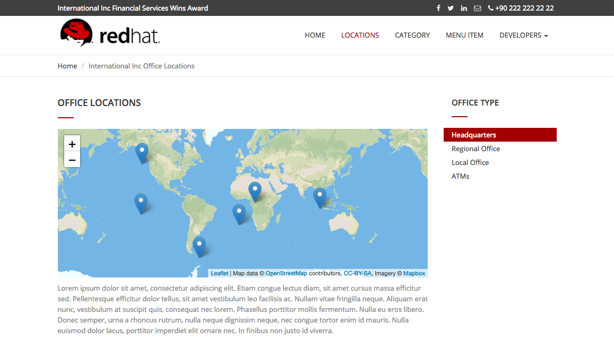

:walkthrough: Testing the International Inc. Locations page using our newly authenticated locations API
:next-lab-url: https://tutorial-web-app-webapp.{openshift-app-host}/tutorial/dayinthelife-integration.git-citizen-integrator-track-lab07/
:3scale-url: https://www.3scale.net/
:3scale-admin-url: https://{user-username}-admin.{openshift-app-host}/p/login
:3scale-dev-portal-url: https://{user-username}.{openshift-app-host}/
:sso-url:  http://sso-sso.{openshift-app-host}/auth/admin/{user-username}/console/
:openshift-url: {openshift-host}/console
:user-password: openshift

[id='testing-web-app']
= Integrator Lab 6 - Testing the web application

In this lab you will test the security enhancements for the International Inc. Locations web application.

Audience: API Consumers, Developers, Architects

*Overview*

This lab demonstrates the International Inc. Locations page using our newly authenticated locations API.

*Why Red Hat?*

Applications can be built from many technologies. In this case we use a simple web application, but a wide range of Red Hat and non-Red Hat technologies could be used.

*Credentials:*

Your username is: `{user-username}` +
Your password is: `{user-password}`

[type=walkthroughResource]
.Openshift Console
****
* link:{openshift-url}[Console, window="_blank"]
****

[type=walkthroughResource]
.Red Hat SSO Console
****
* link:{sso-url}[Console, window="_blank"]
****

[time=5]
[id="update-openshift"]
== Update OpenShift Deployment

Openshift allows you to automatically redeploy your changes when you setup a Continuous Integration / Continuous Deployment (CI/CD) pipeline through the use of a webhook. For this lab we will trigger the new build and deployment manually through the OpenShift Console.

. Open your link:{openshift-url}[Openshift Console, window="_blank"]. Navigate to your project's overview page. It will be called `{user-username} Project`.
. Scroll down and click in the www link in the BUILDS section.
+
image::images/deploy-10.png[01-scroll-down, role="integr8ly-img-responsive"]

. In the build configuration page, replace the `CLIENT_ID` from ``CHANGE_ME``to the one generated from Integrator Lab 4 (Task 4.6).
+

+
_Make sure the **`SSO_URL`** is set to begin with **`https`**. If it isn't, then replace the `http` with an `https`._

. Click Save button to persist the changes. A green pop up will show you that the changes were saved.

. Click the Start Build button to trigger a new build using the new environment variables pointing to your service.
+
image::images/deploy-12.png[03-start-build, role="integr8ly-img-responsive"]

. A new build will be triggered. Expand the row by clicking the Builds Icon.
+
image::images/deploy-13.png[04-view-build, role="integr8ly-img-responsive"]
+
_The build process checks out the code from the git repo, runs a source-to-image container image build, and redeploys the container with the new image using a rolling upgrade strategy._

. Wait for until the new Build to complete and the rolling upgrade to finish to test your new deployment.
+

[time=5]
[id="update-sso"]
== Update SSO On Application Callback

Redirect URLs are a critical part of the OAuth flow. After a user successfully authorizes an application, the authorization server will redirect the user back to the application with either an authorization code or access token in the URL. Because the redirect URL will contain sensitive information, it is critical that the service doesn't redirect the user to arbitrary locations.

. Open a browser window and navigate to `http://sso-sso.{openshift-app-host}/auth/admin/{user-username}/console/`.

. Log into Red Hat Single Sign On using your credentials. Click on *Sign In*.
+
image::images/00-login-sso.png[00-login-sso.png, role="integr8ly-img-responsive"]

. Select *Clients* from the left menu.
+
image::images/00-clients.png[00-clients.png, role="integr8ly-img-responsive"]
+
_3scale, through it's https://github.com/3scale/zync/[zync] component, already synchronized the application information into the Red Hat SSO security realm_.

. Click on the *CLIENT_ID* link to view the details.
+
_Remember to select CLIENT_ID with the one you got in the **Integrator Lab 4 API Security Lab**. It will easily identifiable as its and hexadecimal name_.
+
_If you do not find the CLIENT_ID, make sure you correctly executed the sync between 3scale and RHSSO in Lab 4, Task 3.11.  You should also check Step 1.4 in this lab to ensure that the **SSO_URL** correctly begins with `https://`_
+

. Scroll down, type in and select the following options in the application configuration:
+
|===
| Field | Value

| Access Type
| Public

| Standard Flow Enabled
| ON

| Implicit Flow Enabled
| OFF

| Valid Redirect URIs
| http://www-{user-username}.{openshift-app-host}/*

| Web Origins
| *
|===
+

. Finally, click *Save* button to persist the changes.

[time=5]
[id="test-webpage"]
== Opening International Inc Web Page

International Inc web development create a Node.js application for the company home page. They added a map service to locate the offices around the world. In this step you will deploy that application.

. Open a browser tab and navigate to `http://www-{user-username}.{openshift-app-host}`.

. You should now see what the development team created for International Inc. Click *LOCATIONS* to check the locations page.
+

. You can notice now the *Sign In* button in the page.
+

[time=5]
[id="test-SSO-integration"]
== Test the Single Sign On Integration

. Let's test the integration. Click the *Sign In* button.

. You are being redirected to Red Hat Single Sign On *Login Page*. Login using the user credentials you created in the link:../lab05/#step-2-add-user-to-realm[API Security Lab]
 ** Username: *apiuser*
 ** Password: *apipassword*
+

. You will be redirected again to the *LOCATIONS* page where now you will be able to see the map with the International Inc Offices.
+

[time=10]
[id="troubleshoot-webpage"]
== Troubleshooting the Locations Page

. In most cases, the Locations web page will *NOT* show the locations because of a self-signed certificate issue in your web-browser.  See the below example with missing locations:
+

. To resolve this issue in Chrome, navigate to _View > Developer > Developer Tools_ menu.  A Developer Tools console should appear.
+

. In the developer console, a red error should appear indicating a cert issue. Click on the link and accept the certificate.
+
_Example link: `https://location-{user-username}-api-staging.amp.{openshift-app-host}/locations`_

. Refresh the page, and the locations should appear.
+

+
_Congratulations!_ You have successfully tested the International Inc. Locations webpage using a full SSO authenticated API.

[time=1]
[id="summary"]
== Summary

In total you should now have been able to follow all the steps from designing and API, deploying it's code, issuing keys, connecting OpenID connect and calling it from an application. This gives you a brief overview of the creation and deployment of an API. There are many variations and extensions of these general principles to explore!

[time=1]
[id="steps-beyond"]
== Steps Beyond
So, you want more? If you have time, you can try our bonus lab. This lab focuses demonstrates Fuse Online, showcasing Apicurito to define your API contract, autogenerate an integration, deploy it, then secure your newly created API using 3scale Smart Discovery.

If you'd like to try this out, you can now proceed to link:{next-lab-url}[Lab 7]

[time=1]
[id="further-reading"]
== Notes and Further Reading

* http://microcks.github.io/[Red Hat 3scale API Management]
* https://developers.redhat.com/blog/2017/11/21/setup-3scale-openid-connect-oidc-integration-rh-sso/[Setup OIDC with 3scale]
