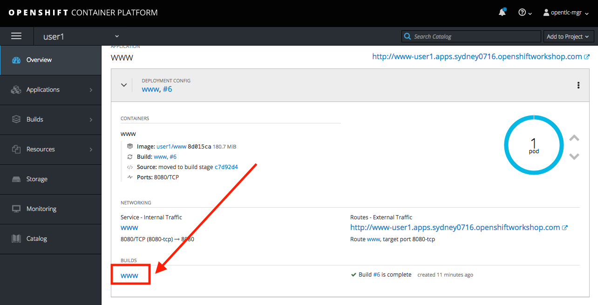
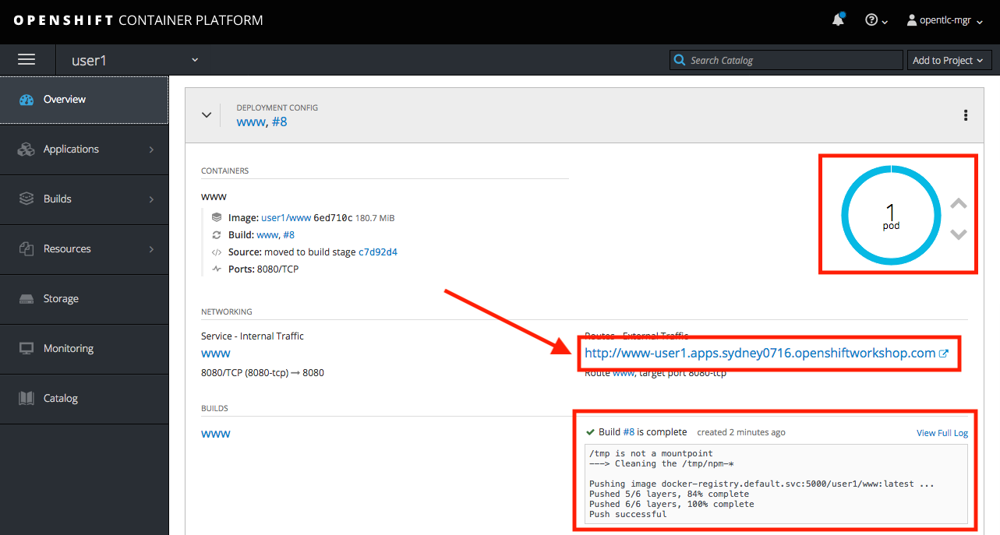

# Lab 7

## Testing the International Inc. Locations webpage

### Testing your web application

* Duration: 10 mins
* Audience: API Consumers, Developers, Architects

### Overview

This lab demonstrates the International Inc. Locations page using our newly authenticated locations API.  

### Why Red Hat?

Applications can be built from many technologies. In this case we use a simple web application, but a wide range of Red Hat and non-Red Hat technologies could be used.

### Skipping The Lab

If you decide to skip the lab you can check how a SSO enabled web applications looks like:

```bash
http://www-international.dil.opentry.me/
```

### Environment

**Credentials:**

Your username is your assigned user number. For example, if you are assigned user number **1**, your username is: 

```bash
user1
```

Please ask your instructor for your password.

**URLs:**

If you haven't done so already, you need to login to the **Red Hat Solution Explorer** webpage so that a unique lab environment can be provisioned on-demand for your exclusive use.  You should open a web browser and navigate to: 

```bash
https://tutorial-web-app-webapp.dil.opentry.me
```

You will be presented with a login page where you can enter your unique credentials:


Enter your credentials and click **Log in**.  You'll notice a web-page appear which explains that a *unique environment* is being provisioned.


Once the environment is provisioned, you will be presented with a page that presents all the available applications which you'll need in order to complete the labs:


## Lab Instructions

### Step 1: Update OpenShift Deployment

OpenShift let you automatically redeploy your changes when you setup a Continuous Integration / Continuous Deployment (CI/CD) pipeline through the use of webhook. For this lab we will trigger the new build and deployment manually through the OpenShift Console.

1. Go back to your OpenShift web console. Navigate to your project's overview page.

1. Scroll down and click in the www link in the BUILDS section.

   

1. In the build configuration page, replace the `CLIENT_ID` from `CHANGE_ME`to the one generated from [Lab 05 Step 4.6](../lab05##step-4-create-a-test-app)

   

1. Click Save button to persist the changes. A green pop up will show you that the changes were saved.

1. Click the Start Build button to trigger a new build using the new environment variables pointing to your service.

   

1. A new build will be triggered. Expand the row by clicking the Builds Icon.

   

*The build process checks out the code from the git repo, runs a source-to-image container image build, and redeploys the container with the new image using a rolling upgrade strategy.*

1. Wait for until the new Build to complete and the rolling upgrade to finish to test your new deployment.

   

### Step 2: Update Secured Service with Red Hat Single Sign On Application Callback

Redirect URLs are a critical part of the OAuth flow. After a user successfully authorizes an application, the authorization server will redirect the user back to the application with either an authorization code or access token in the URL. Because the redirect URL will contain sensitive information, it is critical that the service doesn’t redirect the user to arbitrary locations.

1. Open a browser window and navigate to:

    ```bash
    http://sso-sso.dil.opentry.me/auth/admin/userX/console/
    ```

    *Remember to replace the X with your user number.*

1. Log into Red Hat Single Sign On using your designated [user and password](#environment). Click on **Sign In**.

    

1. Select **Clients** from the left menu.

    

    *3scale, through it's [zync](https://github.com/3scale/zync/) component, already synchronized the application information into the Red Hat SSO security realm*.

1. Click on the **CLIENT_ID** link to view the details. 

    *Remember to select CLIENT_ID with the one you got in the [API Security Lab](../lab05/#step-4-create-a-test-app). It will easily identifiable as its and hexadecimal name*.

    *If you do not find the CLIENT_ID, make sure you correctly executed the sync between 3scale and RHSSO in [Step 3.12 Lab05](../lab05/#step-3-configure-3scale-integration)*

   

1. Scroll down, type in and select the following options in the application configuration:

    | Field | Value |
    | --- | --- |
    | Access Type | Public |
    | Standard Flow Enabled | ON |
    | Implicit Flow Enabled | OFF |
    | Valid Redirect URIs | http://www-userX.dil.opentry.me/* |
    | Web Origins | \* |

    *Remember to replace the X with your user number.*

    

1. Finally, click **Save** button to persist the changes.

### Step 3: Opening International Inc Web Page

International Inc web development create a Node.js application for the company home page. They added a map service to locate the offices around the world. In this step you will deploy that application.

1. Open a browser tab and navigate to `http://www-userX.dil.opentry.me`.

*Remember to replace the `X` variable in the URL with your assigned user number.*

1. You should now see what the development team created for International Inc. Click **LOCATIONS** to check the locations page.

    

1. You can notice now the **Sign In** button in the page.

    


### Step 4: Test the Single Sign On Integration

1. Let's test the integration. Click the **Sign In** button.

1. You are being redirected to Red Hat Single Sign On **Login Page**. Login using the user credentials you created in the [API Security Lab](../lab05/#step-2-add-user-to-realm)

    * Username: **apiuser**
    * Password: **apipassword**

    

1. You will be redirected again to the **LOCATIONS** page where now you will be able to see the map with the International Inc Offices.

    

### Step 5: Troubleshooting the Locations Page

1. In most cases, the Locations web page will **NOT** show the locations because of a self-signed certificate issue in your web-browser.  See the below example with missing locations:

    

1. To resolve this issue in Chrome, navigate to *View > Developer > Developer Tools* menu.  A Developer Tools console should appear.

    

1. In the developer console, a red error should appear indicating a cert issue. Click on the link and accept the certificate. 

*Example link: `https://location-userX-api-staging.amp.dil.opentry.me/locations`*

1. Refresh the page, and the locations should appear.

    

 *Congratulations!* You have successfully tested the International Inc. Locations webpage using a full SSO authenticated API.

## Steps Beyond

So, you want more? You can explore in detail the documentation on the Javascript Adapter to check what other things can you get from your authenticated user.

## Summary

In total you should now have been able to follow all the steps from designing and API, deploying it's code, issuing keys, connecting OpenID connect and calling it from an application. This gives you a brief overview of the creation and deployment of an API. There are many variations and extensions of these general principles to explore!

This is the last lab of this workshop.

## Notes and Further Reading

* [Red Hat 3scale API Management](http://microcks.github.io/)
* [Setup OIDC with 3scale](https://developers.redhat.com/blog/2017/11/21/setup-3scale-openid-connect-oidc-integration-rh-sso/)
