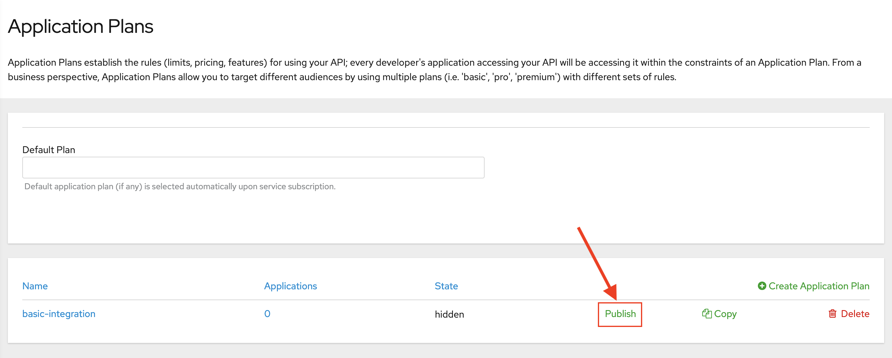
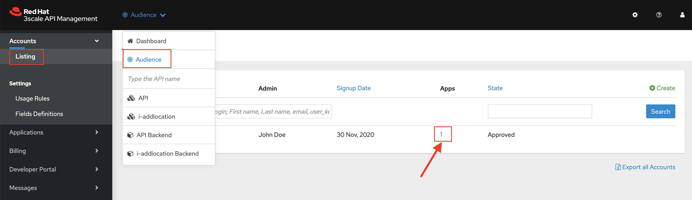

:walkthrough: Fuse Online and 3scale Smart Discovery Bonus Lab
:3scale-url: https://www.3scale.net/
:3scale-admin-url: https://{user-username}-admin.{openshift-app-host}/p/login
:3scale-dev-portal-url: https://{user-username}.{openshift-app-host}/
:fuse-url: https://syndesis-{user-username}-fuse.{openshift-app-host}
:openshift-url: {openshift-host}/console
:user-password: openshift

[id='fuse-bonus-lab']
= Fuse Online and 3scale Smart Discovery Bonus Lab

In this lab you will implement a simple API with Fuse Online and expose it using 3scale.

Audience: Integrators, Developers and Architects

*Overview*

When it comes to quick API development, you need both the integration experts as well as application developers to easily develop and deploy the APIs. This lab demonstrates how to implement a simple API with Fuse Online. Instead of using APICurio to create the API contract, we use Apicurito (an embedded version of Apicurio) to define our contract directly in Fuse Online. We then implement our API with Fuse, then manage and secure it using 3scale. This flow gives us an easy end-to-end walkthrough of defining, implementing, managing and securing an API.

*Why Red Hat?*

Red Hat Fuse integration solution empowers integration experts, application developers, and business users to engage in enterprise-wide collaboration and high-productivity self-service.

*Credentials:*

Your username is: `{user-username}` +
Your password is: `{user-password}`

[type=walkthroughResource]
.Fuse Online
****
* link:{fuse-url}[Fuse Online Console, window="_blank"]
****

[type=walkthroughResource]
.3scale Admin Console
****
* link:{3scale-admin-url}[Console, window="_blank"]
****

[time=10]
[id="create-database-connection"]
== Create database connection

. Launch a new tab on your web browser.
. Navigate to the Solution Explorer on that tab.
. Click on the *Red Hat Fuse Online* link.

. Open your link:{fuse-url}[Fuse Online Console, window="_blank"].

. The first time that you hit the Fuse Online URL, you will be presented with an _Authorize Access_ page. Click the *Allow selected permissions* button to accept the defaults.
+

. Click on *Connections > Create Connection*
+

. Select *Database*
+
image::images/fuse-online-select-database.png[01-select-database, role="integr8ly-img-responsive"]

. Enter below values for Database Configuration
** Connection URL: *`jdbc:postgresql://postgresql.international.svc:5432/sampledb`*
** Username: *`dbuser`*
** Password: *`password`*
** Schema: *<leave blank>*
+

. Click *Validate* and verify if the connection is successful. Click *Next* to proceed.
+

. Add the following details, then click **Save**:
** Connection Name: *`LocationDB`*
** Description: *`Location Database`*
+

. Verify that the *`Location Database`* is successfully created.

[type=verification]
Were you able to add the Database connection?

[type=verificationFail]
Try to redo this section, if any problem persists have your instructor check the Kubernetes pod that contains the Fuse Online application.

[time=15]
[id="no-code-api"]
== No CODE API developement

. Click on *Integrations > Create Integration*
+

. Choose *API Provider*
+

. Select *Create a new OpenAPI 3.x document*
+

. Change the name of the API to *Location* and click on the _Add a path_ link under the _Paths_ section.
+

. Enter *`/locations`* in the _Path_ field:
+

. Click on the *Add a datatype* link under the _Data Types_.
+

. Fill in the _Name_ field with the value *`locationinput`*. Scroll down to  _Enter JSON Example_ to paste the following example, then click *Save*:
** Name: *locationinput*
** JSON Example:
+

+
[source,bash]
----
{ "id": 1, "name": "Kamarhati", "type": "Regional Branch", "status": "1", "location": { "lat": "-28.32555", "lng": "-5.91531" } }
----
+
. Create another datatype, this time with the following config and click *Save*.
** Name: *location*
** JSON Example:
+
[source,bash]
----
{ "id": 1, "name": "International Inc Corporate Office", "location": { "lat": 51.5013673, "lng": -0.1440787 }, "type": "headquarter", "status": "1" }
----
+

. You will be able to see the two datatypes created.
+

. Click on the _Add Operation_ link under _POST_ to create a new POST operation.
+

. Edit the description of the post method to *`Add Location`* and click the orange _POST_ button to edit the operation.

. Click on *Add a request body*
+

. Choose *locationinput* as the _Request Body Type_
+

. Click the *Add a response* link.

. Set the _Response Status Code_ value to *201*. Click *Add*.
+

. Click on _No Description_ and place *Location Added* in _Description_ box. Click on the tick to save the changes

. Click on the _Type_ dropdown and select *location*.
+

. On the top section, under _Operation ID_, name it *addLocation* and click on tick to save the changes. On the very top of the page, click on the *Save* button to return to Fuse Online in order for us to start the API implementation.
+

. On the _Review Actions_ page, click on **Next**.
+

[type=verification]
Were you able to create the API Contract?

[type=verificationFail]
Try to redo this section, if any problem persists have your instructor check the Kubernetes pod that contains the Fuse Online application.

_Congratulations! You've created an API Contract.  Next up is the API implementation_

[time=15]
[id="implement-api"]
== Implement the API

. Save the integration
+image::images/fuse-online-int-save.png[n19b-save.png, role="integr8ly-img-responsive"]

. Set the following values:
** Integration Name: *`addLocation`*
** Description: *`Add Location`*
Click *`save`*
+

. Click on *Create flow*
+

. Click on the _plus sign_ between API entry and return endpoint.
+
+

. Since we are adding incoming data into the database, select *LocationDB* from the catalog.
+

. Select *Invoke SQL* and Enter the SQL statement and click *Next*.
+
[source,bash]
----
INSERT INTO locations (id,name,lat,lng,location_type,status) VALUES (:#id,:#name,:#lat,:#lng,:#location_type,:#status )
----
+

. Click on the warning sign near the _Invoke SQL_ and select _Add a data mapping step_ in the pop-up.
+

. Drag and drop the matching _Source_ Data types to all their corresponding _Targets_ as per the following screenshot. When finished, click *Done*.
+

. In the _Provided API return path_ step, click on warning sign and select _Add a data mapping step_ in the pop-up.
+

+
image::images/n30-choose-data-mapping.png[n30-choose-data-mapping, role="integr8ly-img-responsive"]

. Drag and drop the matching _Source_ Data types to all their corresponding _Targets_ as per the following screenshot. When finished, click *Done*.
+

. Click *Publish* on the next screen. 
+

. Click *Save and Publish* in the next page.
+

. Wait for a couple of minutes until the API is published. 
+

+
_This step generates the Integration code, builds it on KuberNetes and deploys it to your `{user-username}-fuse` namespace._

. Click the *Enable Discovery* button to allow the API to be directly imported to 3scale. Click *Yes* in the confirmation pop-up.
+

_The Integration will be re-published. Wait for the Integration to be in a Published state before proceeding to next section._

[type=verification]
Were you able to publish the Integration?

[type=verificationFail]
Try to redo this section, if any problem persists have your instructor check the Kubernetes pod that contains the Fuse Online application.

_Congratulations. You successfully published the integration._

[time=15]
[id="secure-api-smart-discovery"]
== Secure the API in 3scale using Smart Discovery

We will use 3scale to secure our newly deployed Fuse Online integration. We introduce a new feature, Smart Discovery, which detects that a new API was deployed to OpenShift.

. Log in to link:{3scale-admin-url}[3scale Admin, window="_blank"] web console using `{user-username}` and password: `{user-password}`.
+
image::images/01-login.png[01-login, role="integr8ly-img-responsive"]

. The first page you will land is the _API Management Dashboard_. Click on the *API* menu link.

. Click on the *New Proeuct*.
+

. Click on _Authenticate to enable this option_ so we can import our new API from OpenShift.
+
image::images/secure-05.png[secure-05, role="integr8ly-img-responsive"]

. Click on *Allow selected permissions* to Authorize access.
+

. Select the *Import from OpenShift* option. If all goes well, you should see your fuse namespace appear and a default *Name*. Click the **Create Product** button.
+

. The page should return to the dashboard. Refresh the page. Notice that the _I-ADDLOCATION API_ has been added to the list. Click *INTEGRATION*.
+

_Notice that the Staging Gateway URL is already provided and configuration of the backend is set up correctly._
+

[type=verification]
Were you able to import the service to 3scale?

[type=verificationFail]
Try to redo this section, if any problem persists have your instructor check the Kubernetes pod that contains the Fuse Online application.

[time=15]
[id="update-apicast-config"]
== Update the APIcast configuration

. Click on *Methods and Metrics* to define the methods for the API.
+

. Click on the *New Method* link in the _Methods_ section.

. Fill in the information for your Fuse Method.
** Friendly name: *`Add Locations`*
** System name: *`add_location`*
** Description: *`Method to add a new location`*
+

. Click on Create Method.

. Click on the *Mapping Rules* link to define the allowed methods exposed by the API.
+
_The default mapping is the root ("/") of our API resources, and this application will not use that mapping. The following actions will redefine that default root ("/") mapping._
+

. Click on the *Edit* next to the default mapping rule.

. Select *POST* as the Verb. Type in the _Pattern_ text box the following: `/locations`.

. Select *add_location* as Method from the combo box. Click on *Update Mapping Rule*.
+

. Click on *Configuration* and *Promote v.2 to Staging APIcast* to promote the changes to the staging gateway.
+

[type=verification]
Were you able to update the staging environment?

[type=verificationFail]
Try to redo this section, if any problem persists have your instructor check the Kubernetes pod that contains the 3scale API Management application.

[time=15]
[id="create-application-plan"]
== Create the Application Plan

. Our integration update is in error because we haven't yet created an application plan. To do this, click on *Start by creating an application plan* link in the staging section.
+

. Click *Create Application Plan* link again.
+

. Enter the Application Plan details, then click *Create Application Plan*.
**Name: *`basic-integration`*
**System name: *`basic-integration`*
+

. Click on *Publish* to publish your newly minted plan.
+

. Click on the *API: i-addlocation* dropdown menu, then select *Audience*. Next click *Listing* on the side menu. A listing of _Accounts_ should appear. Next click the link under *Apps* for *Developer* Account as shown below.
+

. Click on *Create Application*.
+

. Select *basic-integration* as the _Application Plan_.
. Select *Default* as the _Service Plan_.
. Enter *i-integration* as the _Name_.
. Click *Create Application*. 
+

. An Application page should appear. It will contain a newly created API User Key for use with your new `i-integration` application.
+

[type=verification]
Were you able to create the application?

[type=verificationFail]
Try to redo this section, if any problem persists have your instructor check the Kubernetes pod that contains the 3scale API Management application.

[time=15]
[id="complete-apicast-config"]
== Complete APIcast configuration

. Next, click on the _Integration > Configuration_ side-menu.

. Scroll down to the _Staging APIcast_ section. Copy the full _curl_ URL in the box. Paste it into a text editor as will need it shortly.
+

. Click on the *Promote v.2 to Production APIcast* button to promote your configuration from staging to production.

[type=verification]
Were you able to promote your configuration?

[type=verificationFail]
Try to redo this section, if any problem persists have your instructor check the Kubernetes pod that contains the 3scale API Management application.

[time=15]
[id="secure-api-smart-discovery"]
== Test the POST request

We will use an API Tester tool to create a record field in database.

. Open a browser window and navigate to: *`https://apitester.com/`*

. Below are the values for the request. Note: `id:101` in the payload as we are creating 101th record in the database. You will change this record number based on your user number shortly.
** Method: *POST*
** URL: *`https://i-addlocation-{user-username}-apicast-staging.amp.{openshift-app-host}:443/locations?user_key=XXX [copy the information you need from the 3scale curl command you copied earlier]`*
** Request Header: *`Content-Type` and `application/json`*
** Post Data:
+
[source,bash]
----
{"id": 102, "name": "Kamarhati", "type": "Regional Branch", "status": "1", "location": { "lat": "-28.32555", "lng": "-5.91531" }}
----
+
_Don't forget to update the id field to end with your user number e.g. 102 if you are user2._
+
image::images/15-apitester.png[15-apitester, role="integr8ly-img-responsive"]

. The page will load the `201` response information from the service which means the request was successfully fulfilled.
+
image::images/16-response-header.png[16-response-header, role="integr8ly-img-responsive"]

. Click on _Activity > Refresh_ and verify if the newly record is created.
+

. _(Optional)_ Visit the application URL in browser and verify if the record can be fetched. *Don't forget to append your username to the record ID e.g user6 = 106*

*REQUEST*
`http://location-service-international.{openshift-app-host}/locations/101`

*RESPONSE*
`{
    "id" : 101,
    "name" : "Kamarhati",
    "type" : "Regional Branch",
    "status" : "1",
    "location" : {
      "lat" : "-28.32555",
      "lng" : "-5.91531"
    }
  }`

[type=verification]
Were you able to receive the correct response?

[type=verificationFail]
Try to redo this section, if any problem persists have your instructor check the Kubernetes pods involved.

[time=1]
[id="summary"]
== Summary

In this lab you discovered how to create an adhoc API service using Fuse Online, then managing it with 3scale using the new _Smart Discovery_ feature.

This is the last lab of this workshop.

[time=1]
[id="further-reading"]
== Notes and Further Reading

*Fuse Online*

* https://www.redhat.com/en/technologies/jboss-middleware/fuse-online[Webpage]
* https://access.redhat.com/documentation/en-us/red_hat_fuse/7.7/html/fuse_online_sample_integration_tutorials/index[Sample tutorials]
* https://developers.redhat.com/blog/2017/11/02/work-done-less-code-fuse-online-tech-preview-today/[Blog]
