:walkthrough: Fuse Online and 3scale Smart Discovery Bonus Lab
:3scale-url: https://www.3scale.net/
:3scale-admin-url: https://{user-username}-admin.{openshift-app-host}/p/login
:3scale-dev-portal-url: https://{user-username}.{openshift-app-host}/
:openshift-url: {openshift-host}/console
:user-password: openshift

[id='fuse-bonus-lab']
= Fuse Online and 3scale Smart Discovery Bonus Lab

In this lab you will implement a simple API with Fuse Online and expose it using 3scale.

Audience: Integrators, Developers and Architects

*Overview*

When it comes to quick API development, you need both the integration experts as well as application developers to easily develop and deploy the APIs. This lab demonstrates how to implement a simple API with Fuse Online. Instead of using APICurio to create the API contract, we use Apicurito (an embedded version of Apicurio) to define our contract directly in Fuse Online. We then implement our API with Fuse, then manage and secure it using 3scale. This flow gives us an easy end-to-end walkthrough of defining, implementing, managing and securing an API.

*Why Red Hat?*

Red Hat Fuse integration solution empowers integration experts, application developers, and business users to engage in enterprise-wide collaboration and high-productivity self-service.

*Credentials:*

Your username is: `{user-username}` +
Your password is: `{user-password}`

[type=walkthroughResource]
.Fuse Online
****
* link:{fuse-url}[Fuse Online Console, window="_blank"]
****

[type=walkthroughResource]
.3scale Admin Console
****
* link:{3scale-admin-url}[Console, window="_blank"]
****

[time=10]
[id="create-database-connection"]
== Create database connection

. Open your link:{fuse-url}[Fuse Online Console, window="_blank"].

. The first time that you hit the Fuse Online URL, you will be presented with an _Authorize Access_ page. Click the *Allow selected permissions* button to accept the defaults.
+
image::images/design-54.png[design-54, role="integr8ly-img-responsive"]

. Click on *Connections > Create Connection*
+

. Select *Database*
+
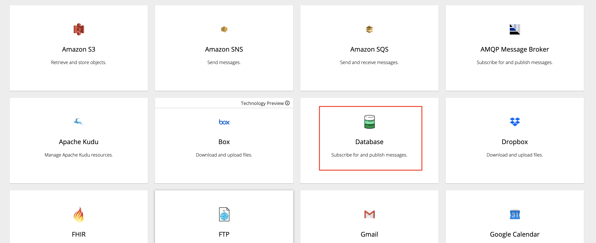

. Enter below values for Database Configuration
** Connection URL: *`jdbc:postgresql://postgresql.international.svc:5432/sampledb`*
** Username: *`dbuser`*
** Password: *`password`*
** Schema: *<leave blank>*

. Click Validate and verify if the connection is successful. Click Next to proceed.
+
image::images/02-click-validate.png[02-click-validate, role="integr8ly-img-responsive"]

. Add the following details, then click **Create**:
** Connection Name: *`LocationDB`*
** Description: *`Location Database`*
+
image::images/03-connection-details.png[03-connection-details, role="integr8ly-img-responsive"]

. Verify that the *`Location Database`* is successfully created.

[time=15]
[id="no-code-api"]
== No CODE API developement

. Click on *Integrations > Create Integration*
+
image::images/04-create-integration.png[04-create-integration.png, role="integr8ly-img-responsive"]

. Choose *API Provider*
+
image::images/n02-api-provider.png[n02-api-provider.png, role="integr8ly-img-responsive"]

. Select *Create from scratch*
+
image::images/n03-api-from-scratch.png[n03-api-from-scratch, role="integr8ly-img-responsive"]

. Change the name of the API to *Location* and click on the _Add a path_ link under the _Paths_ section.
+
image::images/n04-api-name.png[n04-api-name, role="integr8ly-img-responsive"]

. Enter *`/locations`* in the _Path_ field:
+
image::images/n05-api-path.png[n05-api-path, role="integr8ly-img-responsive"]

. Click on the *Add a datatype* link under the _Data Types_.
+
image::images/n06-data-type.png[n06-data-type, role="integr8ly-img-responsive"]

. Fill in the _Name_ field with the value *`locationinput`*. Expand the _Enter JSON Example_ to paste the following example, then click *Save*:
** Name: *locationinput*
** JSON Example:
+
[source,bash]
----
{ "id": 1, "name": "Kamarhati", "type": "Regional Branch", "status": "1", "location": { "lat": "-28.32555", "lng": "-5.91531" } }
----
+

. Create another datatype, this time with the following config and click *Save*.
** Name: *location*
** JSON Example:
+
[source,bash]
----
{ "id": 1, "name": "International Inc Corporate Office", "location": { "lat": 51.5013673, "lng": -0.1440787 }, "type": "headquarter", "status": "1" }
----
+
image::images/n09-location-datatype.png[n09-location-datatype, role="integr8ly-img-responsive"]

. You will be able to see the two datatypes created.
+
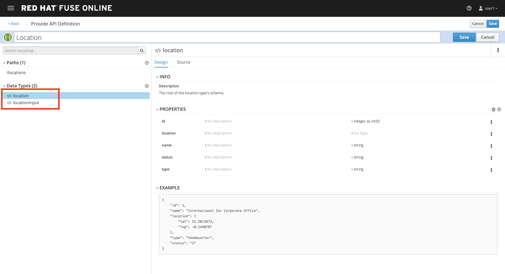

. Click on the _Create Operation_ link under _POST_ to create a new POST operation.
+
image::images/n11-post-method.png[n11-post-method, role="integr8ly-img-responsive"]

. Edit the description of the post method to *`Add Location`* and click the orange _POST_ button to edit the operation
+

. Click on *Add a request body*
+
image::images/n13-request.png[n13-request, role="integr8ly-img-responsive"]

. Choose *locationinput* as the _Request Body Type_
+
image::images/n14-post-request-location-input.png[n14-post-request-location-input, role="integr8ly-img-responsive"]

. Click the *Add a response* link.
+
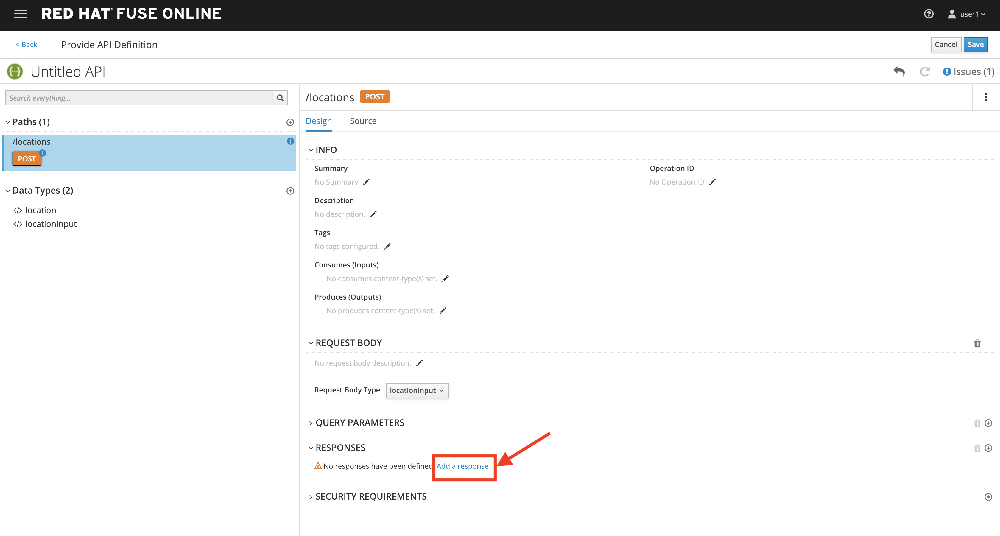

. Set the _Response Status Code_ value to *201*. Click *Add*.
+
image::images/n15-post-response.png[n15-post-response, role="integr8ly-img-responsive"]

. Click on _No Description_ and place *Location Added* in _Description_ box. Click on the tick to save the changes
+
image::images/n16-post-description.png[n16-post-description, role="integr8ly-img-responsive"]

. Click on the _Type_ dropdown and select *location*.
+
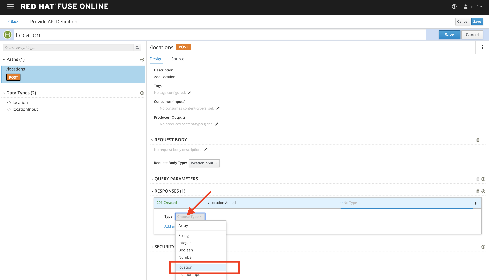

. On the top section, under _Operation ID_, name it *addLocation* and click on tick to save the changes. On the very top of the page, click on the *Save* button to return to Fuse Online in order for us to start the API implementation.
+
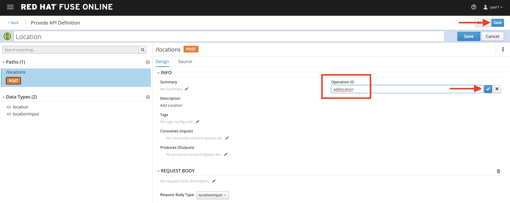
+
_Congratulations! You've created an API Contract.  Next up is the API implementation_

[time=15]
[id="implement-api"]
== Implement the API

. On the _Start integration with an API call_ page, click the *Next* button.
+

. Set the following values:
** Integration Name: *`addLocation`*
** Description: *`Add Location`*
+
image::images/n20-integration-name.png[n20-integration-name, role="integr8ly-img-responsive"]

. Click on *Add Location* operation.
+
image::images/n21-choose-operation.png[n21-choose-operation, role="integr8ly-img-responsive"]

. Since we are adding incoming data into the database, click on the plus sign in between API entry point and return endpoint, then select *Add connection*.
+
image::images/n22-add-db-connection.png[n22-add-db-connection, role="integr8ly-img-responsive"]

. Click on *LocationDB* from the catalog and then select *Invoke SQL*
+
image::images/n24-invoke-sql.png[n24-invoke-sql, role="integr8ly-img-responsive"]

. Enter the SQL statement and click *Done*.
+
[source,bash]
----
INSERT INTO locations (id,name,lat,lng,location_type,status) VALUES (:#id,:#name,:#lat,:#lng,:#location_type,:#status )
----
+
image::images/n25-sql-statement.png[n25-sql-statement, role="integr8ly-img-responsive"]

. In between top API endpoint and the Database connection, click on the plus sign and select _Add step_ and select _Data Mapper_
+
image::images/n26-input-data-mapping.png[n26-input-data-mapping, role="integr8ly-img-responsive"]
+
image::images/n27-choose-data-mapping.png[n27-choose-data-mapping, role="integr8ly-img-responsive"]

. Drag and drop the matching _Source_ Data types to all their corresponding _Targets_ as per the following screenshot. When finished, click *Done*.
+
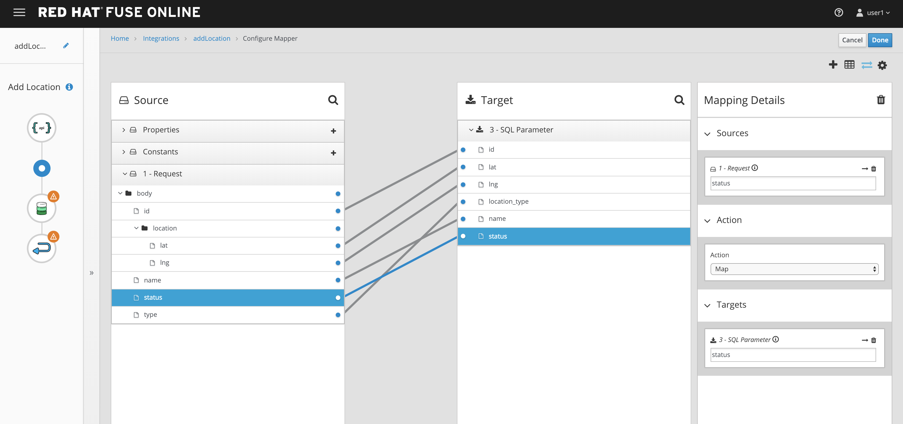

. In between the Database connection and the endpoint, click on the plus sign and select _Add step_ and select _Data Mapper_
+
image::images/n29-output-data-mapping.png[n29-output-data-mapping, role="integr8ly-img-responsive"]
+
image::images/n30-choose-data-mapping.png[n30-choose-data-mapping, role="integr8ly-img-responsive"]

. Drag and drop the matching _Source_ Data types to all their corresponding _Targets_ as per the following screenshot. When finished, click *Done*.
+
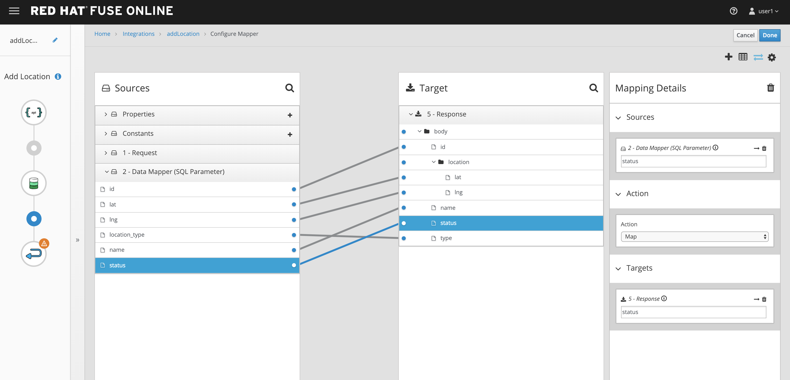

. Click *Publish* on the next screen.
+

+
_Congratulations. You successfully published the integration. (Wait for few minutes to build and publish the integration)_

[time=15]
[id="secure-api-smart-discovery"]
== Secure the API in 3scale using Smart Discovery

We will use 3scale to secure our newly deployed Fuse Online integration. We introduce a new feature, Smart Discovery, which detects that a new API was deployed to OpenShift.

. Log in to link:{3scale-admin-url}[3scale Admin, window="_blank"] web console using `{user-username}` and password: `{user-password}`.
+
image::images/01-login.png[01-login, role="integr8ly-img-responsive"]

. The first page you will land is the _API Management Dashboard_. Click on the *API* menu link.

. Click on the *New API*.
+
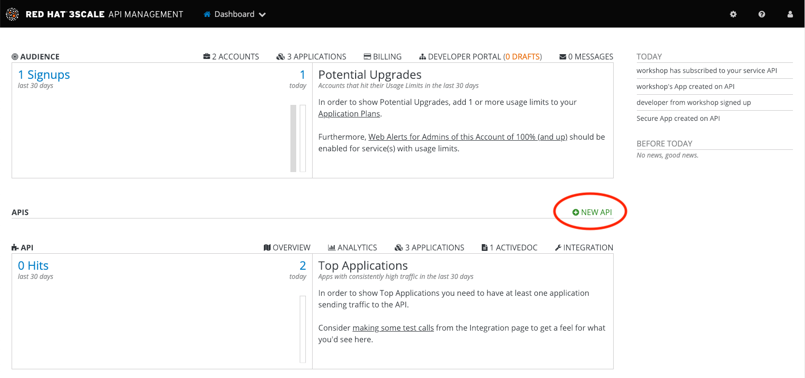

. Click on _Authenticate to enable this option_ so we can import our new API from OpenShift.
+
image::images/secure-05.png[secure-05, role="integr8ly-img-responsive"]

. Click on *Allow selected permissions* to Authorize access.
+
image::images/secure-06.png[secure-06, role="integr8ly-img-responsive"]

. Select the *Import from OpenShift* option. If all goes well, you should see your fuse namespace appear and a default *Name*. Click the **Create Service** button.
+
image::images/secure-07.png[secure-07, role="integr8ly-img-responsive"]

. The page should return to the dashboard. Refresh the page. Notice that the _I-ADDLOCATION API_ has been added to the list. Click *Integrate this API*.
+
image::images/secure-08.png[secure-08, role="integr8ly-img-responsive"]

. Click on the *edit integration settings* to edit the API settings for the gateway.
+
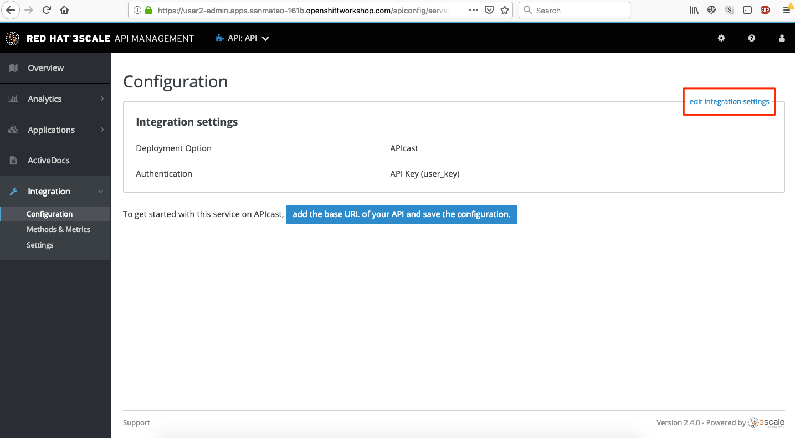

. Keep the *APIcast* deployment option selected in the _Gateway_ section.
+
image::images/04-apicast.png[04-apicast, role="integr8ly-img-responsive"]

. Scroll down and keep the *API Key (user_key)* Authentication.
+
image::images/05-authentication.png[05-authentication, role="integr8ly-img-responsive"]

. Click on *Update Service*.

[time=15]
[id="update-apicast-config"]
== Update the APIcast configuration

. Click on the *edit APIcast configuration* link..
+
image::images/secure-09.png[secure-09, role="integr8ly-img-responsive"]

. Leave the settings for _Private Base URL_ as it is. Update the _Staging Public Base URL_ and _Production Public Base URL_ fields to the following:
** Staging Public Base: *`https://i-addlocation-{user-username}-apicast-staging.amp.{openshift-app-host}:443`*
** Production Public Base URL: *`https://i-addlocation-{user-username}-apicast-production.amp.{openshift-app-host}:443`*
+
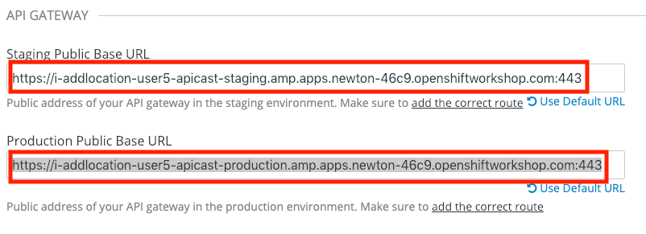

. Scroll down and expand the *MAPPING RULES* section to define the allowed methods on our exposed API.
+
_The default mapping is the root ("/") of our API resources, and this example application will not use that mapping. The following actions will redefine that default root ("/") mapping._
+
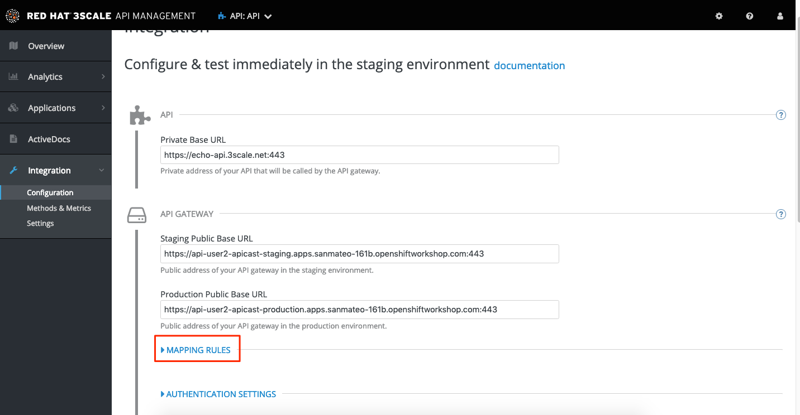

. Click on the *Metric or Method (Define)* link.
+
image::images/07b-mapping-rules-define.png[07b-mapping-rules-define, role="integr8ly-img-responsive"]

. Click on the *New Method* link in the _Methods_ section.
+
image::images/07b-new-method.png[07b-new-method, role="integr8ly-img-responsive"]

. Fill in the information for your Fuse Method.
** Friendly name: *`Add Locations`*
** System name: *`add_location`*
** Description: *`Method to add a new location`*
+
image::images/07b-new-method-data.png[07b-new-method-data, role="integr8ly-img-responsive"]

. Click on Create Method.

. Click on the *Add mapping rule* link.
+
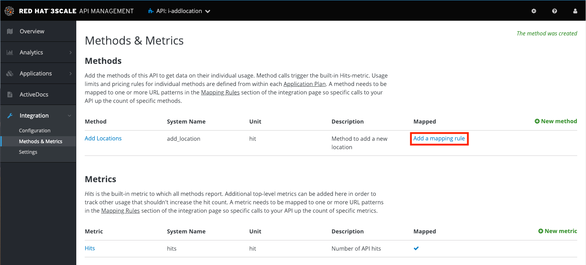

. Click on the *Add Mapping Rule* link.
+
image::images/07b-edit-mapping-rule.png[07b-edit-mapping-rule, role="integr8ly-img-responsive"]

. Select *POST* as the Verb. Type in the _Pattern_ text box the following: `/locations`.

. Select *add_location* as Method from the combo box.
+
image::images/07b-getall-rule.png[07b-getall-rule, role="integr8ly-img-responsive"]

. Scroll down to the *API Test GET request*.

. Type in the textbox: `/openapi.json`

. Click on the *Update the Staging Environment* to save the changes and check the connection between client, gateway and API.
+
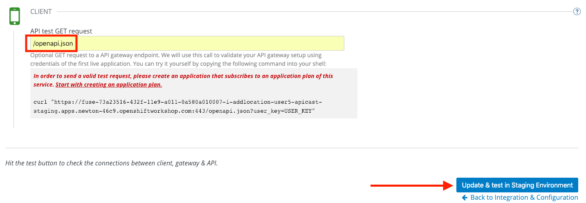
+
_You should expect to get an error message._

[time=15]
[id="create-application-plan"]
== Create the Application Plan

. Our integration update is in error because we haven't yet created an application plan. To do this, click on the link inside of the the error message.
+
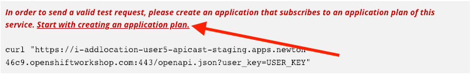

. Click *Create Application Plan* link again.
+
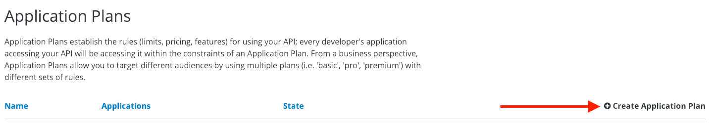

. Enter the Application Plan details, then click *Create Application Plan*.
**Name: *`basic-integration`*
**System name: *`basic-integration`*
+
image::images/04-app-plan-details.png[04-app-plan-details, role="integr8ly-img-responsive"]

. Click on *Publish* to publish your newly minted plan.
+
image::images/04-click-publish.png[04-click-publish, role="integr8ly-img-responsive"]

. Click on the *API: i-addlocation* dropdown menu, then select *Audience*. Next click *Listing* on the side menu. A listing of _Accounts_ should appear. Next click the *Developer* Account.
+
image::images/04-setup-account.png[04-setup-account, role="integr8ly-img-responsive"]

. An Account configuration page should appear. Click on the _1 Application_ link at the top of the page.
+
image::images/04-click-applications.png[04-click-applications, role="integr8ly-img-responsive"]

. Click on *Create Application*.
+
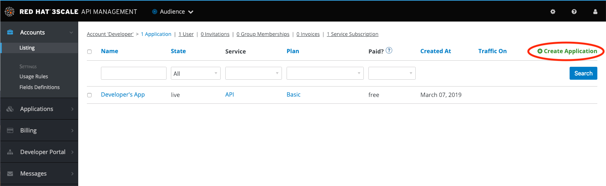

. Select *basic-integration* as the _Application Plan_. Select *Default* as the _Service Plan_. Enter *i-integration* as the _Name_. Click *Create Applicatio*n. An Application page should appear. It will contain a newly created API User Key for use with your new `i-integration` application.
+
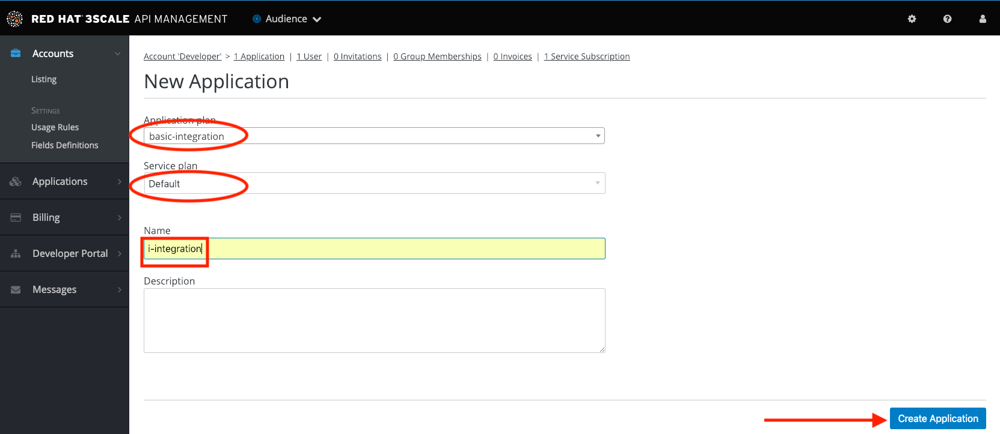

[time=15]
[id="complete-apicast-config"]
== Complete APIcast configuration

. Next, click on the _Integration > Configuration_ side-menu.
+
image::images/04-integration-configuration.png[04-integration-configuration, role="integr8ly-img-responsive"]

. Next, click on _edit APIcast configuration._
+
image::images/04-edit-api-config.png[04-edit-api-config, role="integr8ly-img-responsive"]

. Update the _Staging Public Base URL_ and _Production Public Base URL_ fields to the following:
** Staging Public Base: *`https://i-addlocation-{user-username}-apicast-staging.amp.{openshift-app-host}:443`*
** Production Public Base URL: *`https://i-addlocation-{user-username}-apicast-production.amp.{openshift-app-host}:443`*

. Scroll down to the _Client_ section. Copy the full _curl_ URL in the box. Paste it into a text editor as will need it shortly.
+
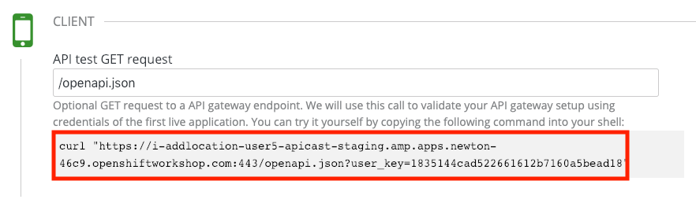

. Click on the *Update the Staging Environment* button to save the changes and check the connection between client, gateway and API.
+

+
_If everything works, you will get a green message on the left._

. Click on *Back to Integration & Configuration* link to return to your API overview.
+
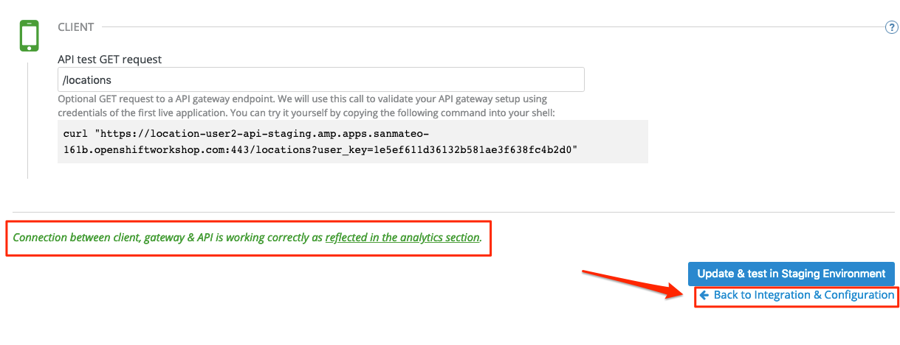

. Click on the *Promote v.1 to Production* button to promote your configuration from staging to production.
+
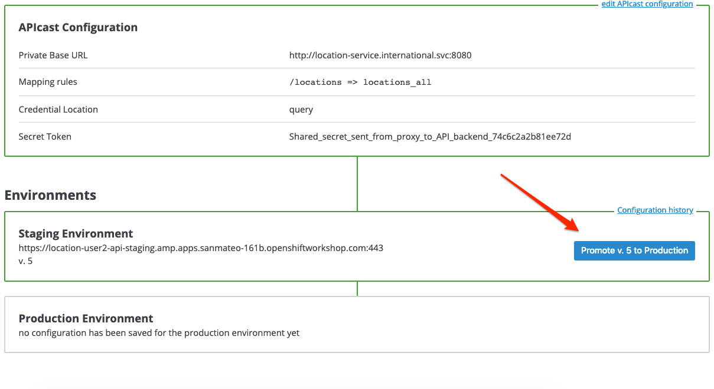

[time=15]
[id="secure-api-smart-discovery"]
== Test the POST request

We will use an API Tester tool to create a record field in database.

. Open a browser window and navigate to: *`https://apitester.com/`*

. Below are the values for the request. Note: `id:101` in the payload as we are creating 101th record in the database. You will change this record number based on your user number shortly.
** Method: *POST*
** URL: *`https://i-addlocation-{user-username}-apicast-staging.amp.{openshift-app-host}:443/locations?user_key=XXX [copy the information you need from the 3scale curl command you copied earlier]`*
** Request Header: *`Content-Type` and `application/json`*
** Post Data:
+
[source,bash]
----
{"id": 102, "name": "Kamarhati", "type": "Regional Branch", "status": "1", "location": { "lat": "-28.32555", "lng": "-5.91531" }}
----
+
_Don't forget to update the id field to end with your user number e.g. 102 if you are user2._
+
image::images/15-apitester.png[15-apitester, role="integr8ly-img-responsive"]

. The page will load the `201` response information from the service which means the request was successfully fulfilled.
+

. Click on _Activity > Refresh_ and verify if the newly record is created.
+
image::images/17-activity-refresh.png[17-activity-refresh, role="integr8ly-img-responsive"]

. _(Optional)_ Visit the application URL in browser and verify if the record can be fetched. *Don't forget to append your username to the record ID e.g user6 = 106*

*REQUEST*
`http://location-service-international.{openshift-app-host}/locations/101`

*RESPONSE*
`{
    "id" : 101,
    "name" : "Kamarhati",
    "type" : "Regional Branch",
    "status" : "1",
    "location" : {
      "lat" : "-28.32555",
      "lng" : "-5.91531"
    }
  }`

[time=1]
[id="summary"]
== Summary

In this lab you discovered how to create an adhoc API service using Fuse Online, then managing it with 3scale using the new _Smart Discovery_ feature.

This is the last lab of this workshop.

[time=1]
[id="further-reading"]
== Notes and Further Reading

*Fuse Online*

* https://www.redhat.com/en/technologies/jboss-middleware/fuse-online[Webpage]
* https://access.redhat.com/documentation/en-us/red_hat_fuse/7.1/html-single/fuse_online_sample_integration_tutorials/index[Sample tutorials]
* https://developers.redhat.com/blog/2017/11/02/work-done-less-code-fuse-online-tech-preview-today/[Blog]
