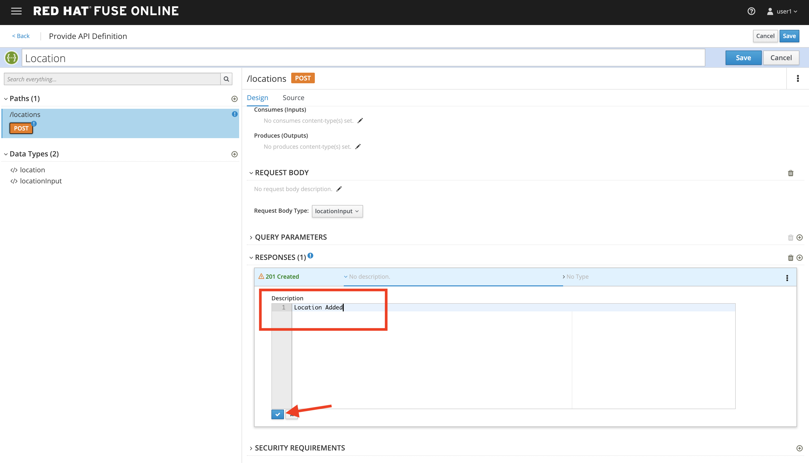
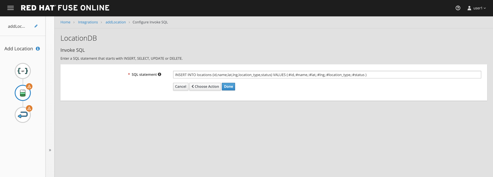

:walkthrough: Fuse Online and 3scale Smart Discovery Bonus Lab
:3scale-url: https://www.3scale.net/
:3scale-admin-url: https://{user-username}-admin.{openshift-app-host}/p/login
:3scale-dev-portal-url: https://{user-username}.{openshift-app-host}/
:openshift-url: {openshift-host}/console
:user-password: openshift

[id='fuse-bonus-lab']
= Fuse Online and 3scale Smart Discovery Bonus Lab

In this lab you will implement a simple API with Fuse Online and expose it using 3scale.

Audience: Integrators, Developers and Architects

*Overview*

When it comes to quick API development, you need both the integration experts as well as application developers to easily develop and deploy the APIs. This lab demonstrates how to implement a simple API with Fuse Online. Instead of using APICurio to create the API contract, we use Apicurito (an embedded version of Apicurio) to define our contract directly in Fuse Online. We then implement our API with Fuse, then manage and secure it using 3scale. This flow gives us an easy end-to-end walkthrough of defining, implementing, managing and securing an API.

*Why Red Hat?*

Red Hat Fuse integration solution empowers integration experts, application developers, and business users to engage in enterprise-wide collaboration and high-productivity self-service.

*Credentials:*

Your username is: `{user-username}` +
Your password is: `{user-password}`

[type=walkthroughResource]
.Fuse Online Console
****
* link:{fuse-url}[Console, window="_blank"]
****

[time=10]
[id="create-database-connection"]
== Create database connection

. Open your link:{fuse-url}[Fuse Online Console, window="_blank"].

. The first time that you hit the Fuse Online URL, you will be presented with an _Authorize Access_ page. Click the *Allow selected permissions* button to accept the defaults.
+
image::images/design-54.png[design-54, role="integr8ly-img-responsive"]

. Click on *Connections > Create Connection*
+
image::images/00-create-connection.png[00-create-connection, role="integr8ly-img-responsive"]

. Select *Database*
+
image::images/01-select-database.png[01-select-database, role="integr8ly-img-responsive"]

. Enter below values for Database Configuration
** Connection URL: *`jdbc:postgresql://postgresql.international.svc:5432/sampledb`*
** Username: *`dbuser`*
** Password: *`password`*
** Schema: *<leave blank>*

. Click Validate and verify if the connection is successful. Click Next to proceed.
+
image::images/02-click-validate.png[02-click-validate, role="integr8ly-img-responsive"]

. Add the following details, then click **Create**:
** Connection Name: *`LocationDB`*
** Description: *`Location Database`*
+
image::images/03-connection-details.png[03-connection-details, role="integr8ly-img-responsive"]

. Verify that the *`Location Database`* is successfully created.

[time=15]
[id="no-code-api"]
== No CODE API developement

. Click on *Integrations > Create Integration*
+

. Choose *API Provider*
+
image::images/n02-api-provider.png[n02-api-provider.png, role="integr8ly-img-responsive"]

. Select *Create from scratch*
+

. Change the name of the API to *Location* and click on the _Add a path_ link under the _Paths_ section.
+
image::images/n04-api-name.png[n04-api-name, role="integr8ly-img-responsive"]

. Enter *`/locations`* in the _Path_ field:
+

. Click on the *Add a datatype* link under the _Data Types_.
+
image::images/n06-data-type.png[n06-data-type, role="integr8ly-img-responsive"]

. Fill in the _Name_ field with the value *`locationinput`*. Expand the _Enter JSON Example_ to paste the following example, then click *Save*:
** Name: *locationinput*
** JSON Example:
+
[source,bash]
----
{ "id": 1, "name": "Kamarhati", "type": "Regional Branch", "status": "1", "location": { "lat": "-28.32555", "lng": "-5.91531" } }
----
+
image::images/n07-location-input-datatype.png[n07-location-input-datatype, role="integr8ly-img-responsive"]

. Create another datatype, this time with the following config and click *Save*.
** Name: *location*
** JSON Example:
+
[source,bash]
----
{ "id": 1, "name": "International Inc Corporate Office", "location": { "lat": 51.5013673, "lng": -0.1440787 }, "type": "headquarter", "status": "1" }
----
+
image::images/n09-location-datatype.png[n09-location-datatype, role="integr8ly-img-responsive"]

. You will be able to see the two datatypes created.
+
image::images/n10-datatype-all.png[n10-datatype-all, role="integr8ly-img-responsive"]

. Click on the _Create Operation_ link under _POST_ to create a new POST operation.
+

. Edit the description of the post method to *Add Location* and click the orange _POST_ button to edit the operation
+
image::images/n12-post-description.png[n12-post-description, role="integr8ly-img-responsive"]

. Click on *Add a request body*
+

. Choose *locationinput* as the _Request Body Type_
+
image::images/n14-post-request-location-input.png[n14-post-request-location-input, role="integr8ly-img-responsive"]

. Click the *Add a response* link.
+
image::images/n13-response.png[n13-response, role="integr8ly-img-responsive"]

. Set the _Response Status Code_ value to *201*. Click *Add*.
+
image::images/n15-post-response.png[n15-post-response, role="integr8ly-img-responsive"]

. Click on _No Description_ and place *Location Added* in _Description_ box. Click on the tick to save the changes
+

. Click on the _Type_ dropdown and select *location*.
+
image::images/n17-post-response-type.png[n17-post-response-type, role="integr8ly-img-responsive"]

. On the top section, under _Operation ID_, name it *addLocation* and click on tick to save the changes. On the very top of the page, click on the *Save* button to return to Fuse Online in order for us to start the API implementation.
+
image::images/n18-post-operation-id.png[n18-post-operation-id, role="integr8ly-img-responsive"]
+
_Congratulations! You've created an API Contract.  Next up is the API implementation_

[time=15]
[id="implement-api"]
== Implement the API

. On the _Start integration with an API call_ page, click the *Next* button.
+
image::images/n19-start-of-integration.png[n19-start-of-integration, role="integr8ly-img-responsive"]

. Set the following values:
** Integration Name: *addLocation*
** Description: *Add Location*
+

. Click on *Add Location* operation.
+

. Since we are adding incoming data into the database, click on the plus sign in between API entry point and return endpoint, then select *Add connection*.
+

. Click on *LocationDB* from the catalog and then select *Invoke SQL*
+
image::images/n24-invoke-sql.png[n24-invoke-sql, role="integr8ly-img-responsive"]

. Enter the SQL statement and click *Done*.
+
image::images/n24-invoke-sql.png[n24-invoke-sql, role="integr8ly-img-responsive"]
+
[source,bash]
----
INSERT INTO locations (id,name,lat,lng,location_type,status) VALUES (:#id,:#name,:#lat,:#lng,:#location_type,:#status )
----
+

. In between top API endpoint and the Database connection, click on the plus sign and select _Add step_ and select _Data Mapper_
+

+
image::images/n27-choose-data-mapping.png[n27-choose-data-mapping, role="integr8ly-img-responsive"]

. Drag and drop the matching _Source_ Data types to all their corresponding _Targets_ as per the following screenshot. When finished, click *Done*.
+
image::images/n28-data-map-db.png[n28-data-map-db, role="integr8ly-img-responsive"]

. In between the Database connection and the endpoint, click on the plus sign and select _Add step_ and select _Data Mapper_
+

+
image::images/n30-choose-data-mapping.png[n30-choose-data-mapping, role="integr8ly-img-responsive"]

. Drag and drop the matching _Source_ Data types to all their corresponding _Targets_ as per the following screenshot. When finished, click *Done*.
+
image::images/n31-data-map-response.png[n31-data-map-response, role="integr8ly-img-responsive"]

. Click *Publish* on the next screen.
+
image::images/n32-publish.png[n32-publish, role="integr8ly-img-responsive"]
+
_Congratulations. You successfully published the integration. (Wait for few minutes to build and publish the integration)_

[time=15]
[id="secure-api-smart-discovery"]
== Secure the API in 3scale using Smart Discovery

. Let's test the integration. Click the *Sign In* button.

. You are being redirected to Red Hat Single Sign On *Login Page*. Login using the user credentials you created in the link:../lab05/#step-2-add-user-to-realm[API Security Lab]
 ** Username: *apiuser*
 ** Password: *apipassword*
+
image::images/consume-23.png[23-realm-login, role="integr8ly-img-responsive"]

. You will be redirected again to the *LOCATIONS* page where now you will be able to see the map with the International Inc Offices.
+
image::images/consume-14.png[11-locations-page, role="integr8ly-img-responsive"]

[time=10]
[id="troubleshoot-webpage"]
== Troubleshooting the Locations Page

. In most cases, the Locations web page will *NOT* show the locations because of a self-signed certificate issue in your web-browser.  See the below example with missing locations:
+
image::images/00-missing-locations.png[00-missing-locations, role="integr8ly-img-responsive"]

. To resolve this issue in Chrome, navigate to _View > Developer > Developer Tools_ menu.  A Developer Tools console should appear.
+
image::images/00-developer-console.png[00-developer-console, role="integr8ly-img-responsive"]

. In the developer console, a red error should appear indicating a cert issue. Click on the link and accept the certificate.
+
_Example link: `https://location-{user-username}-api-staging.amp.{openshift-app-host}/locations`_

. Refresh the page, and the locations should appear.
+
image::images/consume-14.png[11-locations-page, role="integr8ly-img-responsive"]
+
_Congratulations!_ You have successfully tested the International Inc. Locations webpage using a full SSO authenticated API.

[time=1]
[id="summary"]
== Summary

In total you should now have been able to follow all the steps from designing and API, deploying it's code, issuing keys, connecting OpenID connect and calling it from an application. This gives you a brief overview of the creation and deployment of an API. There are many variations and extensions of these general principles to explore!

[time=1]
[id="steps-beyond"]
== Steps Beyond
So, you want more? If you have time, you can try our bonus lab. This lab focuses demonstrates Fuse Online, showcasing Apicurito to define your API contract, autogenerate an integration, deploy it, then secure your newly created API using 3scale Smart Discovery.

If you'd like to try this out, you can now proceed to link:{next-lab-url}[Lab 7]

[time=1]
[id="further-reading"]
== Notes and Further Reading

* http://microcks.github.io/[Red Hat 3scale API Management]
* https://developers.redhat.com/blog/2017/11/21/setup-3scale-openid-connect-oidc-integration-rh-sso/[Setup OIDC with 3scale]
