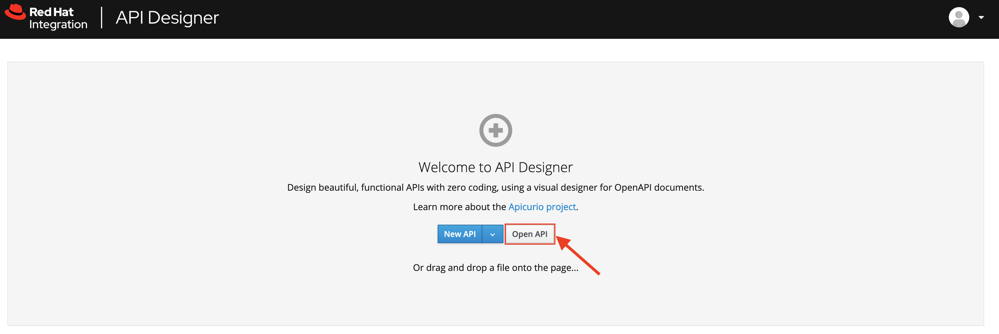
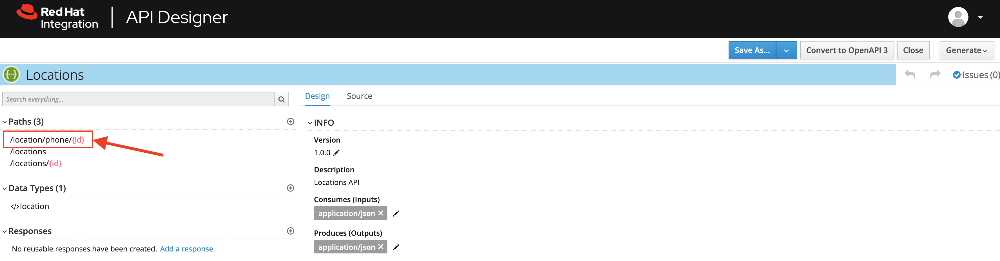
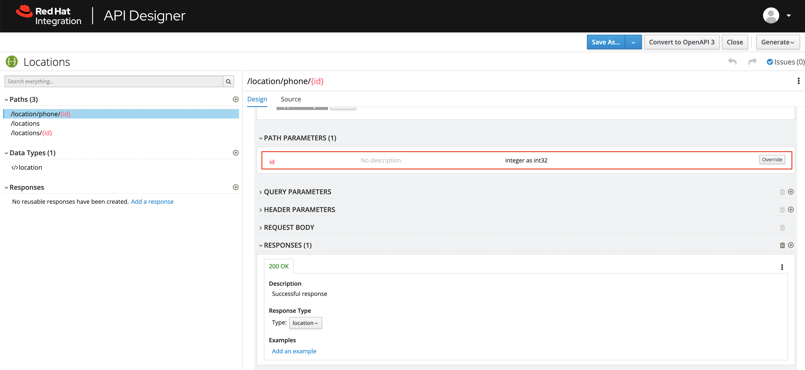
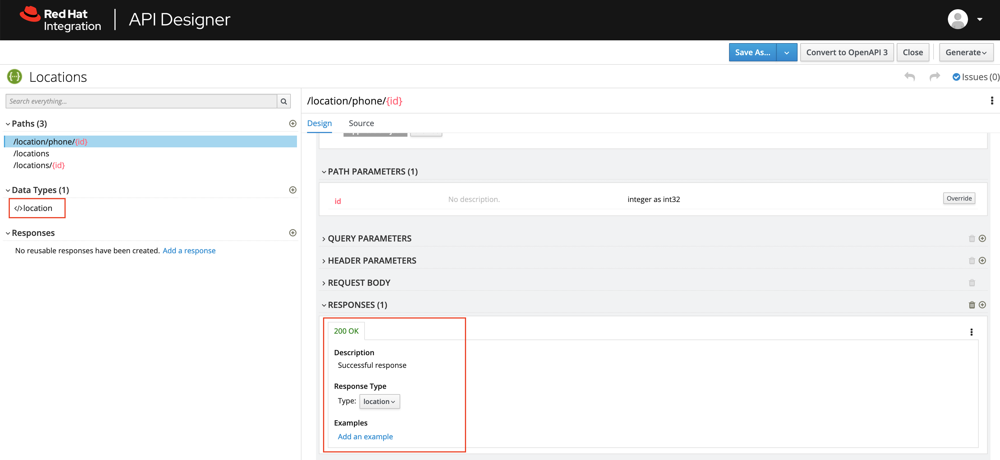
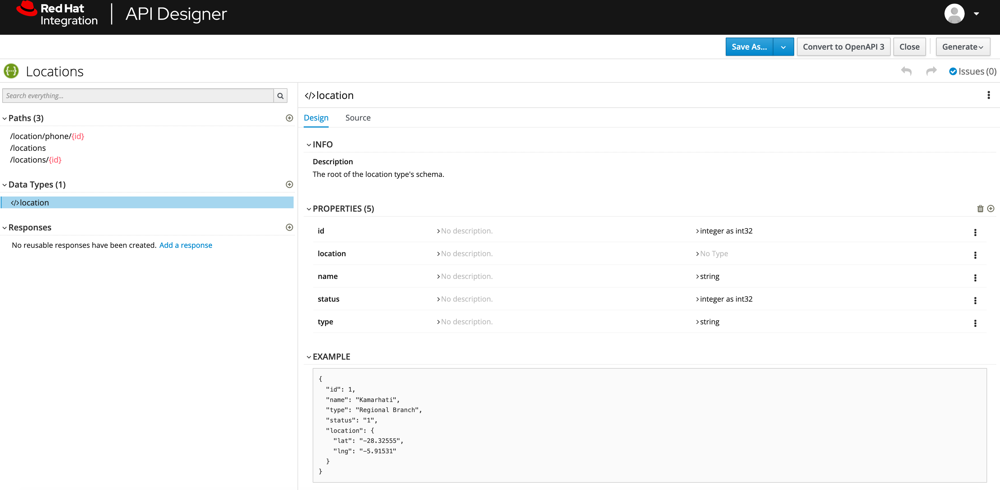
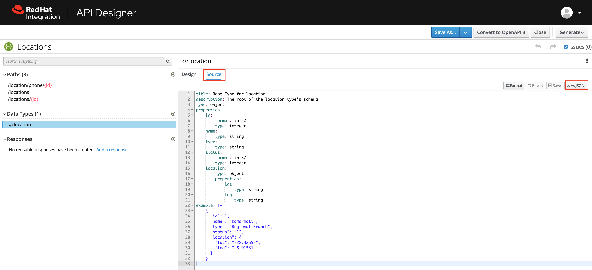
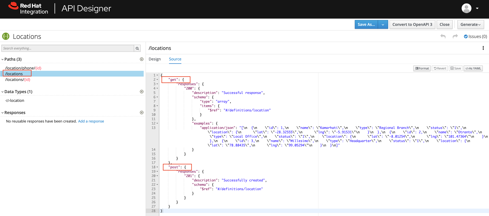

:walkthrough: Import an OpenAPI Specification using Apicurio Studio
:api-designer-url: https:///apicurito-ui-apicurito.{openshift-app-host}
:next-lab-url: https://tutorial-web-app-webapp.{openshift-app-host}/tutorial/dayinthelife-integration.git-developer-track-lab02/
:user-password: openshift

ifdef::env-github[]
:next-lab-url: ../lab02/walkthrough.adoc
endif::[]

[id='api-design']
= Developer Lab 1 - API Design

In this lab you will use Red Hat API Designer to Import a simple OpenAPI definition in APIcurio Studio.

Audience: API Owner, Product Manager, Developers, Architects

*Overview*

As APIs become more widespread in the enterprise, consistent design and usage is critically important to improve reusability. The more reusable APIs are, the less friction there is for other internal or external teams to make progress. Having design standards and tools baked into the API development and maintenance process is a very powerful way to enable this consistency.

As a developer, we need to be familiar with API Design even though it's not our core capability.  Therefore, in this lab we will review Red Hat's API Designer product, Apicurio, so that we're familiar with it's capabilities only.

*Why Red Hat?*

Red Hat is one of the founding members of the Linux Foundation Open API Initiative (OAI) which produces the leading standard for REST API specifications. Red Hat consistently uses this standard throughout its tooling, starting with the Apicurio Studio API Design editor.

*Skipping The Lab*

If you are planning to skip this lab and follow the next one, here is a https://github.com/hguerrero/3scaleworkshop-openapi/blob/Lab-01/locations-api/Locations-UserX.yaml[link] to the specification generated in this lab.

[type=walkthroughResource]
.API Designer
****
* link:{api-designer-url}[API Designer, window="_blank"]
****

[time=10]
[id="importing-apis-with-api-designer"]
== Importing APIs with API Designer

. Launch a new tab on your web browser.
. Navigate to the Solution Explorer on that tab.
. Click on the *API Designer* link.

. Open link:{api-designer-url}[Apicurio Studio, window="_blank"] web console.
+

. Import the API created by your friendly Citizen Integrator, download the following API specification to your laptop:
 ** Url: `+https://raw.githubusercontent.com/RedHat-Middleware-Workshops/dayinthelife-integration/master/docs/labs/developer-track/resources/Locations.yaml+`

. In the API Designer, click on *Open API* and select the *Locations.yaml* file.

[type=verification]
Did the API successfully get imported?

[type=verificationFail]
Have your instructor check the Kubernetes pod that contains the API Designer application.

=== Step 2: Verifying APIs

You are now in the main screen to edit your APIs. Different from other API editor products, API Designer's Editor is a graphical, form-based editor. With API Designer, you don't need master in and out all the details of the *OpenAPI Specification*. It allows you to design beautiful, functionals APIs with zero coding.

Let's start verifying your API.

. Time to verify our data definitions for the API. Click on the `+location/phone/{id}+` link under the _Paths_.
+

. Notice that this API path has a single path parameter (`id` defined as an `int32`) and a single GET operation defined.  Click on the GET operation, then click the location drop-down which is part of the 200 OK response.
+

. Notice that this API path has a single response defined (a `200 OK` response) and the type that is returned is a `location` object.
+

[type=verification]
Were the correct HTTP Response received?

[type=verificationFail]
Have your instructor check the Kubernetes pod that contains the API Designer application.

=== Step 3: Verify the location object

. Click on the `</> location` object link under the _Data Types_ section.  Notice that the object has a bunch of properties defined which make up the object.
+

. Click on the source link and notice that we have both YAML and JSON schemas generated by our object design:
+

=== Step 4: Verify the /locations path

. Click the */locations* path.  Then click on the source tab.  Notice that we have both a GET and POST request defined, together with a couple of example requests.  Using a POST method, we can insert a new record into our sample database with Fuse.
+

[type=verification]
Were the location object successfully created?

[type=verificationFail]
Have your instructor check the Kubernetes pod that contains the API Designer application.

_Congratulations!_ You have imported your first API definition based on the OpenAPI Specification  using Red Hat's API Designer.

[time=1]
[id="step-beyond"]
== Steps Beyond

So, you want more? Did you notice the link *source* when editing the _Paths_ or the _Definitions_? Get back to the API editor and follow the link. What do you see? API Designer lets you follow the form-based editor or go one step beyond and also lets you direct edit the source of your API definition.
[time=1]
[id="summary"]
== Summary

In this lab you used API Designer to import a simple API definition using the OpenAPI Specification (Swagger 2.0). You learned how to author and download a standards compliant API Specification using Red Hat's APICurio.

You can now proceed to link:{next-lab-url}[Lab 2].

[time=1]
[id="further-reading"]
== Notes and Further Reading

* Apicurio
 ** https://www.apicur.io[Webpage]
 ** https://www.apicur.io/roadmap/[Roadmap]
* OpenAPI
 ** https://www.openapis.org/[OpenAPI Initiative]
 ** https://github.com/OAI/OpenAPI-Specification/blob/master/versions/2.0.md[Swagger Specification 2.0]
 ** https://github.com/OAI/OpenAPI-Specification/blob/master/versions/3.0.2.md[OpenAPI Specification 3.0.2]
