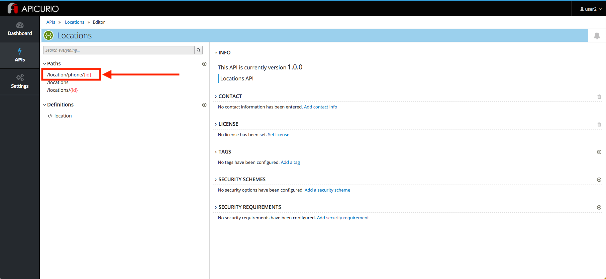
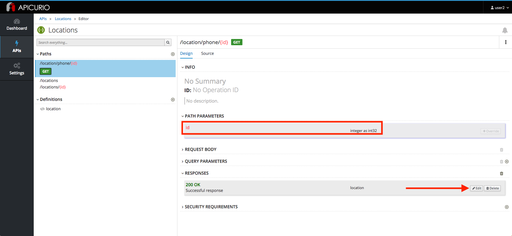
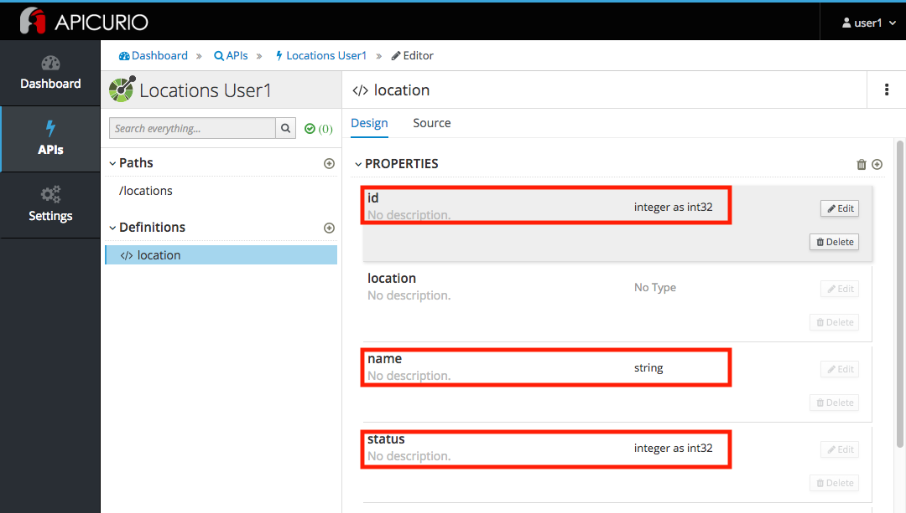
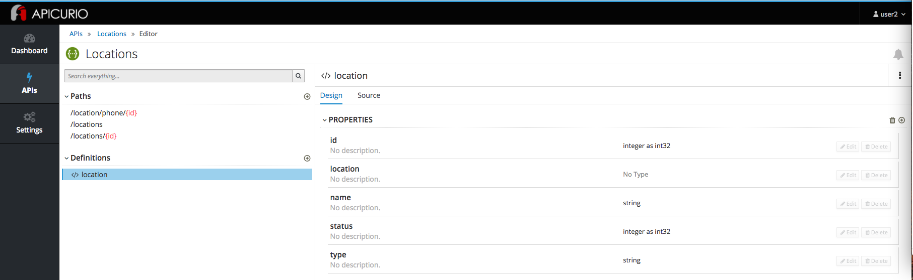
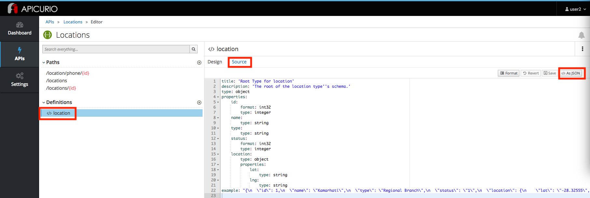

:walkthrough: Import an OpenAPI Specification using Apicurio Studio
:apicurio-studio-url: http://apicurio-studio.{openshift-app-host}
:user-password: openshift

[id='api-design']
= Developer Lab 1 - API Design

In this lab you will use Apicurio Studio to Import a simple OpenAPI definition in APIcurio Studio.

Audience: API Owner, Product Manager, Developers, Architects

[time=2]
[id="overview"]
== Overview

As APIs become more widespread in the enterprise, consistent design and usage is critically important to improve reusability. The more reusable APIs are, the less friction there is for other internal or external teams to make progress. Having design standards and tools baked into the API development and maintenance process is a very powerful way to enable this consistency.

As a developer, we need to be familiar with API Design even though it's not our core capability.  Therefore, in this lab we will review Red Hat's API Designer product, Apicurio, so that we're familiar with it's capabilities only.

=== Why Red Hat?

Red Hat is one of the founding members of the Linux Foundation Open API Initiative (OAI) which produces the leading standard for REST API specifications. Red Hat consistently uses this standard throughout its tooling, starting with the Apicurio Studio API Design editor.

=== Skipping The Lab

If you are planning to skip this lab and follow the next one, here is a https://github.com/hguerrero/3scaleworkshop-openapi/blob/Lab-01/locations-api/Locations-UserX.yaml[link] to the specification generated in this lab.

=== Environment

*Credentials:*

Your username is: `{user-username}` +
Your password is: `{user-password}`

[type=walkthroughResource]
.Apicurio
****
* link:{apicurio-studio-url}[Apicurio Studio, window="_blank"]
****

[time=10]
[id="importing-apis-with-apicurio-studio"]
== Importing APIs with Apicurio Studio

. Log in to link:{apicurio-studio-url}[Apicurio Studio, window="_blank"] web console using `{user-username}` and `{user-password}`.
+
image::images/design-01.png[design-login, role="integr8ly-img-responsive"]

. Click on *APIs* in the left side navigation menu from the Dashboard page.
+
image::images/design-02.png[design-apis, role="integr8ly-img-responsive"]

. Click on *Import API*.
+
image::images/design-03.png[design-new-api, role="integr8ly-img-responsive"]

. Import the API created by your friendly Citizen Integrator:
 ** Import Type: *Import From URL*
 ** Url: `+https://raw.githubusercontent.com/RedHatWorkshops/dayinthelife-integration/master/docs/labs/developer-track/resources/Locations.yaml+`

+
image::images/design-04.png[design-import-api, role="integr8ly-img-responsive"]
. Click on *Import API*.
. Finally, click on *Edit API* to walkthrough your newly imported API.
+
image::images/design-05.png[design-edit-api, role="integr8ly-img-responsive"]

=== Step 2: Verifying APIs

You are now in the main screen to edit your APIs. Different from other API editor products, Apicurio's Editor is a graphical, form-based editor. With Apicurio you don't need master in and out all the details of the *OpenAPI Specification*. It allows you to design beautiful, functionals APIs with zero coding.

Let's start verifying your API.

. Time to verify our data definitions for the API. Click on the `+location/phone{id}+` link under the _Paths_.
+

. Notice that this API path has a single path parameter (`id` defined as an `int32`) and a single GET operation defined.  Click on the GET operation, then click the location drop-down which is part of the 200 OK response.
+

. Notice that this API path has a single response defined (a `200 OK` response) and the type that is returned is a `location` object.
+

=== Step 3: Verify the location object

. Click on the `</> location` object link under the _Data Types_ section.  Notice that the object has a bunch of properties defined which make up the object.
+

. Click on the source link and notice that we have both YAML and JSON schemas generated by our object design:
+

=== Step 4: Verify the /locations path

. Click the */locations* path.  Then click on the source tab.  Notice that we have both a GET and POST request defined, together with a couple of example requests.  Using a POST method, we can insert a new record into our sample database with Fuse.
+
image::images/design-23.png[design-locations-api, role="integr8ly-img-responsive"]

_Congratulations!_ You have imported your first API definition based on the OpenAPI Specification  using Red Hat's Apicurio.

[time=1]
[id="step-beyond"]
== Steps Beyond

So, you want more? Did you notice the link *source* when editing the _Paths_ or the _Definitions_? Get back to the API editor and follow the link. What do you see? Apicurio lets you follow the form-based editor or go one step beyond and also lets you direct edit the source of your API definition.
[time=1]
[id="summary"]
== Summary

In this lab you used Apicurio Studio to import a simple API definition using the OpenAPI Specification (Swagger 2.0). You learned how to author and download a standards compliant API Specification using Red Hat's APICurio.

You can now proceed to link:../lab02/#lab-2[Lab 2]

[time=1]
[id="further-reading"]
== Notes and Further Reading

* Apicurio
 ** https://www.apicur.io[Webpage]
 ** https://www.apicur.io/roadmap/[Roadmap]
* OpenAPI
 ** https://www.openapis.org/[OpenAPI Initiative]
 ** https://github.com/OAI/OpenAPI-Specification/blob/master/versions/2.0.md[Swagger Specification 2.0]
 ** https://github.com/OAI/OpenAPI-Specification/blob/master/versions/3.0.2.md[OpenAPI Specification 3.0.2]
