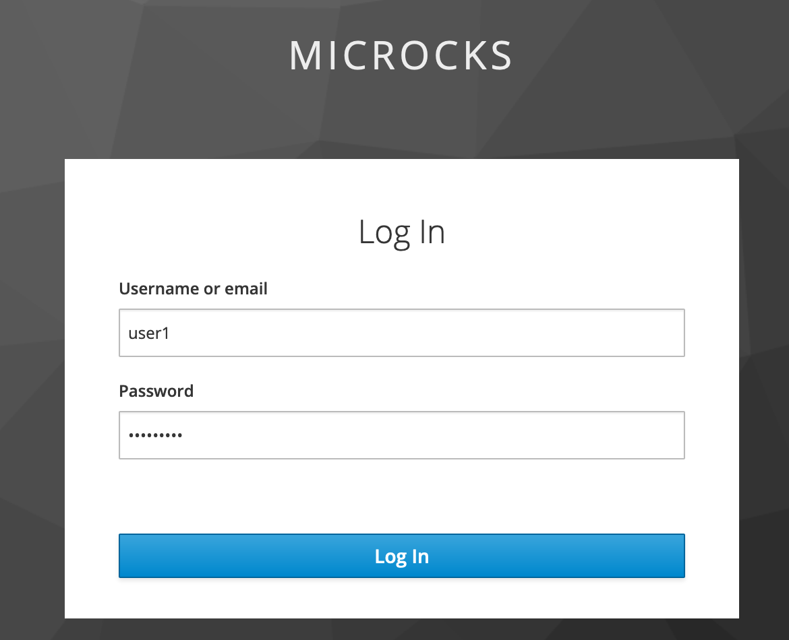
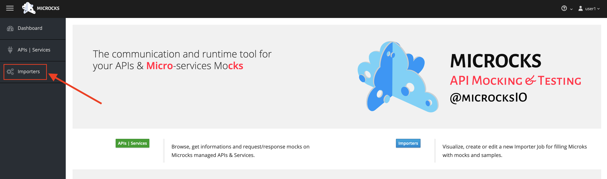
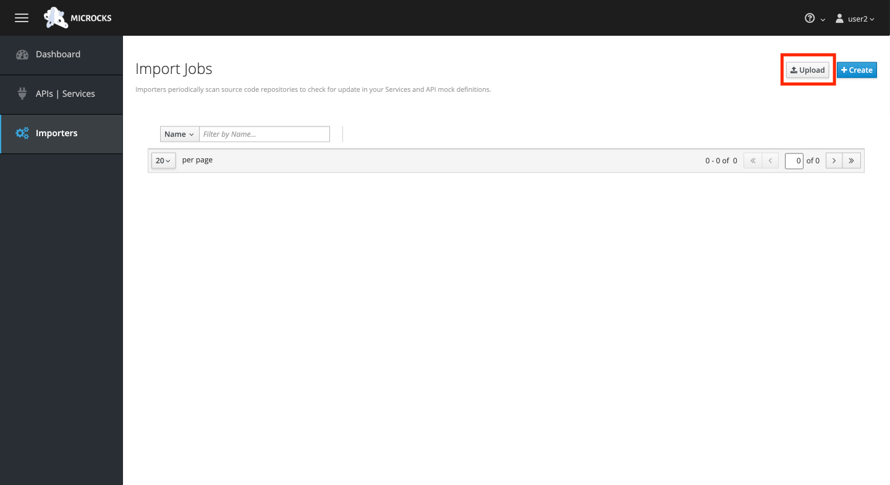
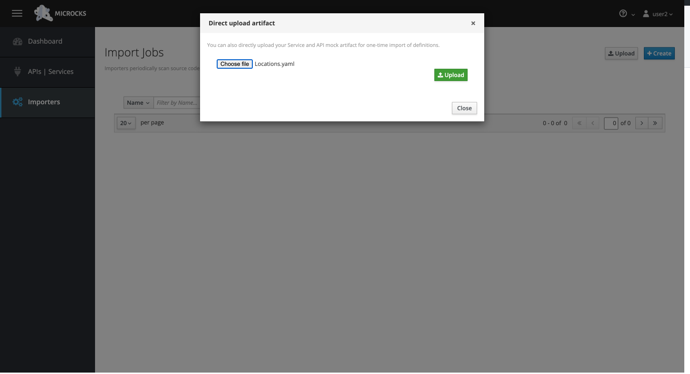
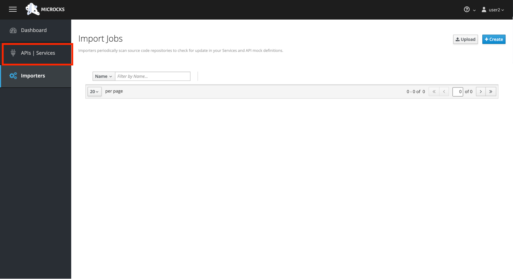
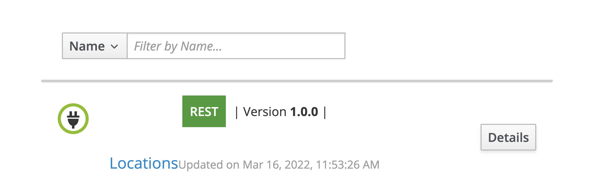
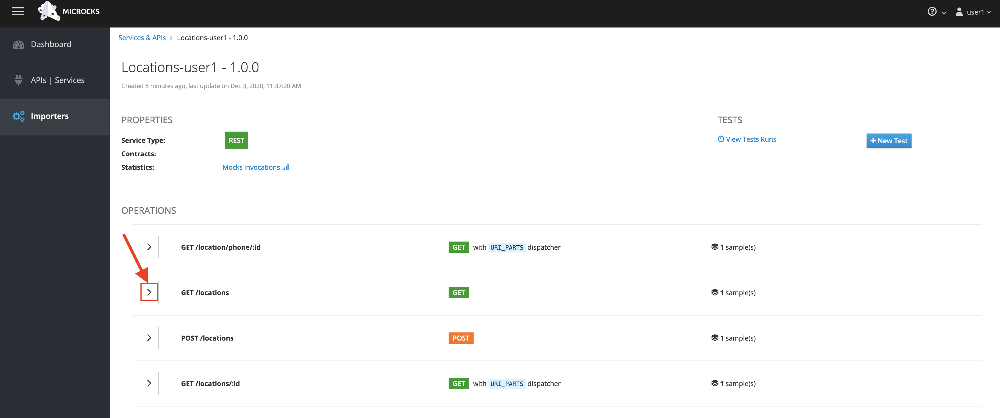
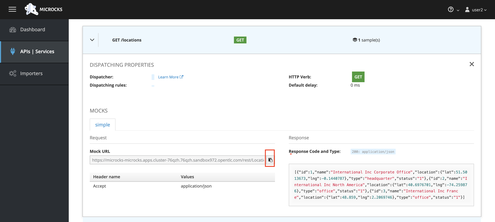
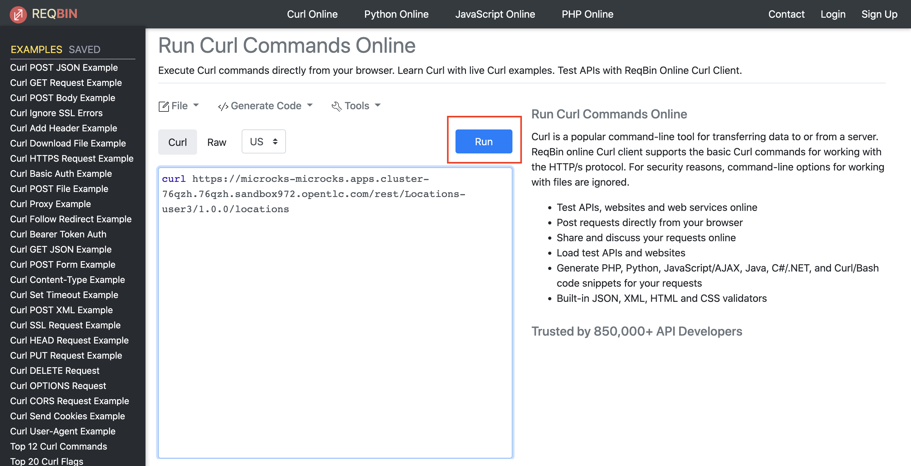
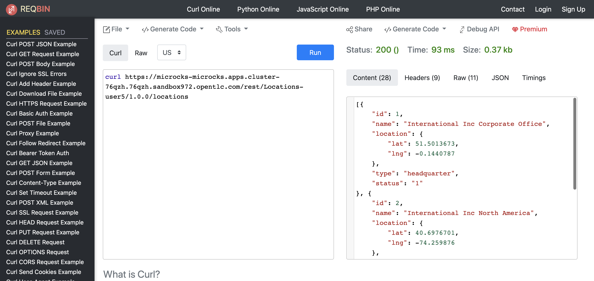

:walkthrough: API Mocking
:microcks-url: https://microcks-microcks.{openshift-app-host}
:next-lab-url: https://tutorial-web-app-webapp.{openshift-app-host}/tutorial/dayinthelife-integration.git-developer-track-lab03/
:user-password: openshift
:wip-link: http://location-service-international.{openshift-app-host}/locations
:gogs-url: http://gogs.{openshift-app-host}

ifdef::env-github[]
:next-lab-url: ../lab03/walkthrough.adoc
endif::[]

[id='mocking']
= Developer Lab 2 - API Mocking

In this lab you will use Microcks to configure a REST mock service for the API definition you created in the previous lab.

Audience: API Owner, Product Manager, Developers, Architects

*Overview*

When building and working with APIs, you often need to simulate the responses of the system before it has been fully completed. This is what we explore in this workshop - mocking up API structures quickly so they can be subjected to testing without having to create all the final service code.

*Why Red Hat?*

Red hat combines and number of commercial and Open Source tools to cover each part of the API Design lifecycle. In this lab we'll be using the http://microcks.github.io/[Microcks] open source tool.

*Skipping The Lab*

If you are planning to follow the next lab, here is a link:{wip-link}[link] to the REST mock service running the Location API.

*Credentials:*

Your username is: `{user-username}` +
Your password is: `{user-password}`

[type=walkthroughResource]
.Microcks
****
* link:{microcks-url}[Microcks Console, window="_blank"]
****

[time=6]
[id="Microcks setup"]
== Microcks setup

=== Step 1: Create a Microcks Job

. Click on the *Microcks Console* link.

. Log in into Microcks using your credentials `{user-username}` and `{user-password}`.
+

. You are now in the main Microcks page. Click the *Importers* button to access the Importers page.
+

. Click the *upload* button to create your first job.
+

. Upload the Locations.yaml file(Open API specification file) we used with the API Designer in the preious lab here. In case you skipped the previous lab you can download the file from here:
  ** Url: `+https://raw.githubusercontent.com/RedHat-Middleware-Workshops/dayinthelife-integration/master/docs/labs/developer-track/resources/Locations.yaml+`
+

. After the upload is complete, click on APIs|Services tab to locate your mock API
+

. Click on the API that is listed
+

. This is your new REST mock service based on the OpenAPI definition you just loaded to Microcks. Click on the arrow to expand the *GET /locations* operation.
+

. You can check that the example we added to the definition in Lab 1 will be used to return the mock values. Scroll down, copy and save the *Mock URL*, we will use that endpoint to test the REST mock service.
+

[type=verification]
Did you copy the *Mock URL*?

[type=verificationFail]
Try to redo this section, if any problem persists have your instructor check the Kubernetes pod that contains the Microcks application.

=== Step 2: Test the REST Mock Service

We now have a working REST mock service listening for requests. We will use an online cURL tool to test it.

. Open a browser window and navigate to https://reqbin.com/curl.

. Copy and paste the Mock URL from earlier step. It should look like.
+
[source,bash,subs="attributes+"]
----
curl https://microcks.{openshift-app-host}/rest/Locations-{user-username}/1.0.0/locations
----

. Click the *Run* button.
+

. The page will load the response information from the service. The _Content_ tab contains the examples we added during the design phase. You can also review the _Headers_ tab if you'd like.
+

[type=verification]
Did the response include the example JSON added during the design phase?

[type=verificationFail]
Try to redo this section, if any problem persists have your instructor check the Kubernetes pod that contains the Microcks application.

_Congratulations!_ You have successfully configure a Microcks Job to create a REST mock service to test your API.

[time=1]
[id="Summary"]
== Summary

In this lab you used Microcks to configure a REST mock service for the API definition you created in the previous lab. REST mock services allows you to simulate a REST API service when you are in a prototyping stage of your API program journey.

Microcks allows you to test a number of various responses for client application requests. When deploying API, micro-services or SOA practices at large scale, Microcks solves the problems of providing and sharing consistent documentation and mocks to the involved teams. It acts as a central repository and server that can be used for browsing but also by your Continuous Integration builds or pipelines.

You can now proceed to link:{next-lab-url}[Lab 3].

[time=1]
[id="Reading"]
== Notes and Further Reading

* Microcks
 ** http://microcks.github.io/[Webpage]
 ** http://microcks.github.io/automating/jenkins/[Jenkins Plugin]
 ** http://microcks.github.io/installing/openshift/[Installing on OpenShift]
