= Developer Lab 2 - API Mocking
:walkthrough: Bring your APIs to life

[time=20]
== API Mocking

=== Bring your APIs to life

* Duration: 20 mins
* Audience: Developers, Architects, Testers, Quality Engineers

== Overview

When building and working with APIs, you often need to simulate the responses of the system before it has been fully completed. This is what we explore in this workshop - mocking up API structures quickly so they can be subjected to testing without having to create all the final service code.

=== Why Red Hat?

Red Hat combines a number of commercial and Open Source tools to cover each part of the API Design lifecycle. In this lab we'll be using the http://microcks.github.io/[Microcks] open source tool.

=== Skipping The Lab

If you are planning to follow the next lab, here is a link:wip-link[link] to the REST mock service running the Location API.

=== Environment

*Credentials:*

Your username is your assigned user number. For example, if you are assigned user number *1*, your username is:

[source,bash]
----
user1
----

Please ask your instructor for your password.

*URLs:*

If you haven't done so already, you need to login to the *Red Hat Solution Explorer* webpage so that a unique lab environment can be provisioned on-demand for your exclusive use.  You should open a web browser and navigate to:

[source,bash]
----
https://tutorial-web-app-webapp.{openshift-app-host}
----

You will be presented with a login page where you can enter your unique credentials:

image::images/design-50.png[design-login, role="integr8ly-img-responsive"]

Enter your credentials and click *Log in*.  You'll notice a web-page appear which explains that a _unique environment_ is being provisioned.

image::images/design-51.png[design-login, role="integr8ly-img-responsive"]

Once the environment is provisioned, you will be presented with a page that presents all the available applications which you'll need in order to complete the labs:

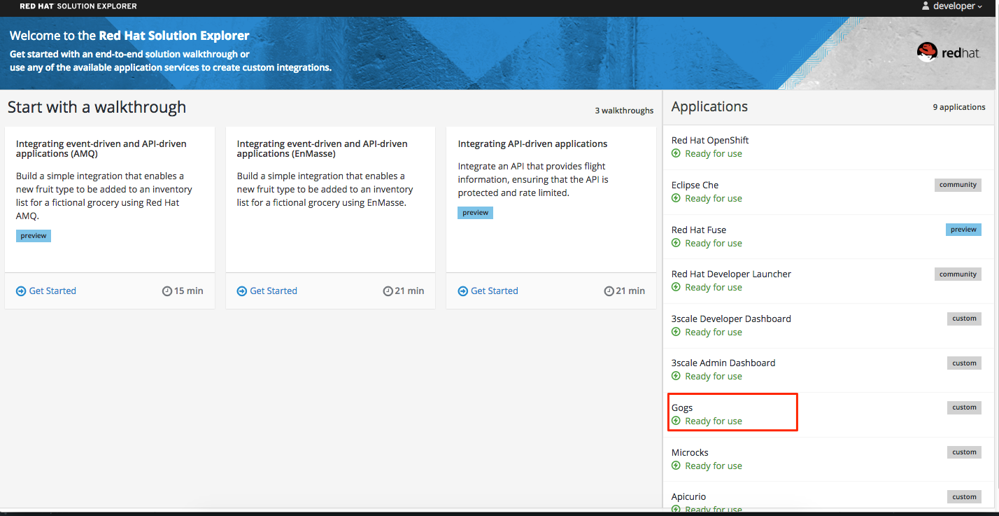

== Lab Instructions

=== Step 1: Create a Microcks Job

. Open a browser window and navigate to:
+
[source,bash]
----
 http://microcks.{openshift-app-host}
----

. Log in into Microks using your designated <<environment,user and password>>.
+
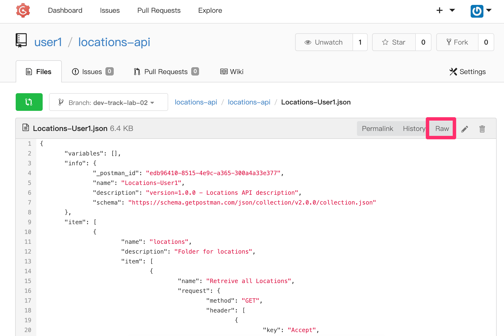

. You are now in the main Microcks page. Click the *Importers* button to access the Importers page.
+
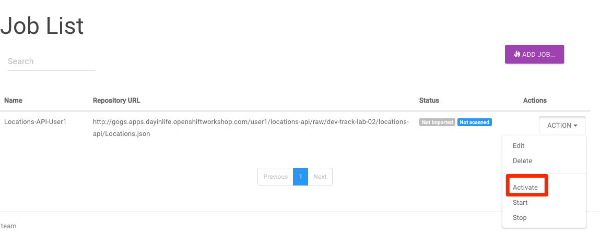

. Click the *Upload* button to upload the *Locations-UserX.yaml* spec generated from xref:lab01.adoc[Lab 1].
+
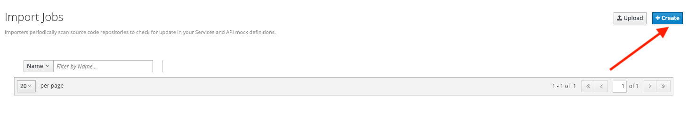

. Click on *Upload*.
+
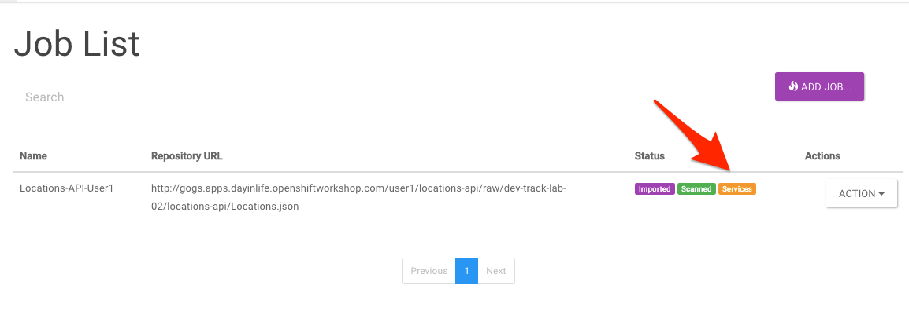
+
_Congratulations! The spec is successfully imported_

. {blank}
+
[cols=2*]
|===
| Navigate to **APIs
| Services** tab.
|===
+
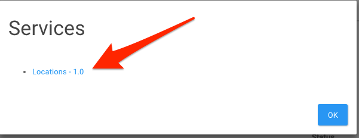

. Click on the link for your username. eg: *Locations-User1*.
+
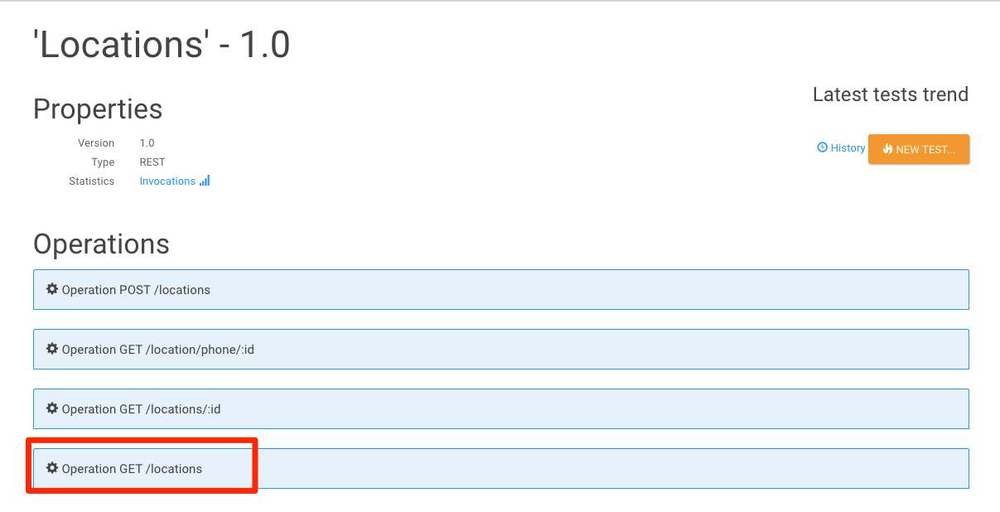

. Click on the arrow to expand the *Operation GET /locations*.
+
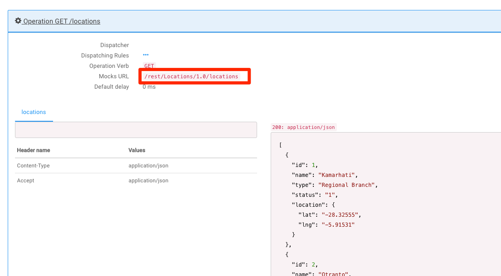

. You can check that the example we added to the definition in xref:lab01.adoc[Lab 1] will be used to return the mock values. Copy and save the *Mocks URL*, we will use that endpoint to test the REST mock service.
+
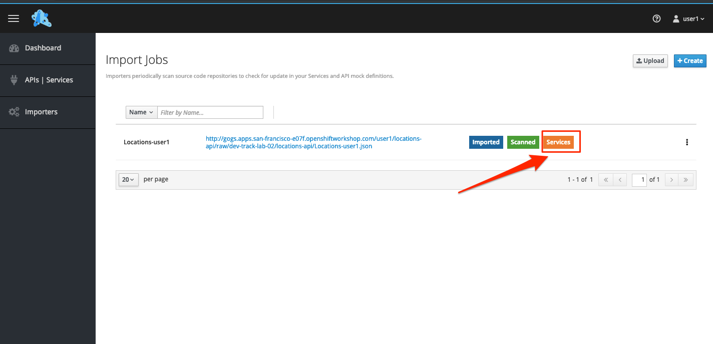

=== Step 2: Test the REST Mock Service

We now have a working REST mock service listening for requests. We will use an online cURL tool to test it.

. Open a browser window and navigate to:
+
[source,bash]
----
 https://onlinecurl.com/
----

. Enter the copied URL from *Step 9*. It should look like this:
+
[source,bash]
----
 http://microcks.{openshift-app-host}/rest/Locations-User1/1.0.0/locations
----

. Click the *START YOUR CURL* button.
+
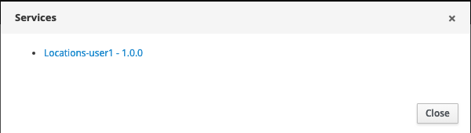

. The page will load the response information from the service. You will be able to see the _RESPONSE HEADERS_ and the actual _RESPONSE_BODY_. This last part contains the examples we add during the design phase.
+
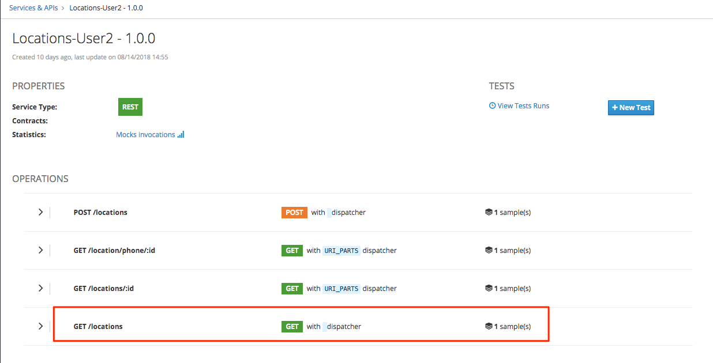

_Congratulations!_ You have successfully configure a Microcks Job to create a REST mock service to test your API.

== Steps Beyond

____
So, you want more? ...
____

== Summary

In this lab you used Microcks to configure a REST mock service for the API definition you created in the previous lab. REST mock services allows you to simulate a REST API service when you are in a prototyping stage of your API program journey.

Microcks allows you to test a number of various responses for client application requests. When deploying API, micro-services or SOA practices at large scale, Microcks solves the problems of providing and sharing consistent documentation and mocks to the involved teams. It acts as a central repository and server that can be used for browsing but also by your Continuous Integration builds or pipelines.

You can now proceed to link:../lab03/#lab-3[Lab 3]

== Notes and Further Reading

* Microcks
 ** http://microcks.github.io/[Webpage]
 ** http://microcks.github.io/automating/jenkins/[Jenkins Plugin]
 ** http://microcks.github.io/installing/openshift/[Installing on OpenShift]
