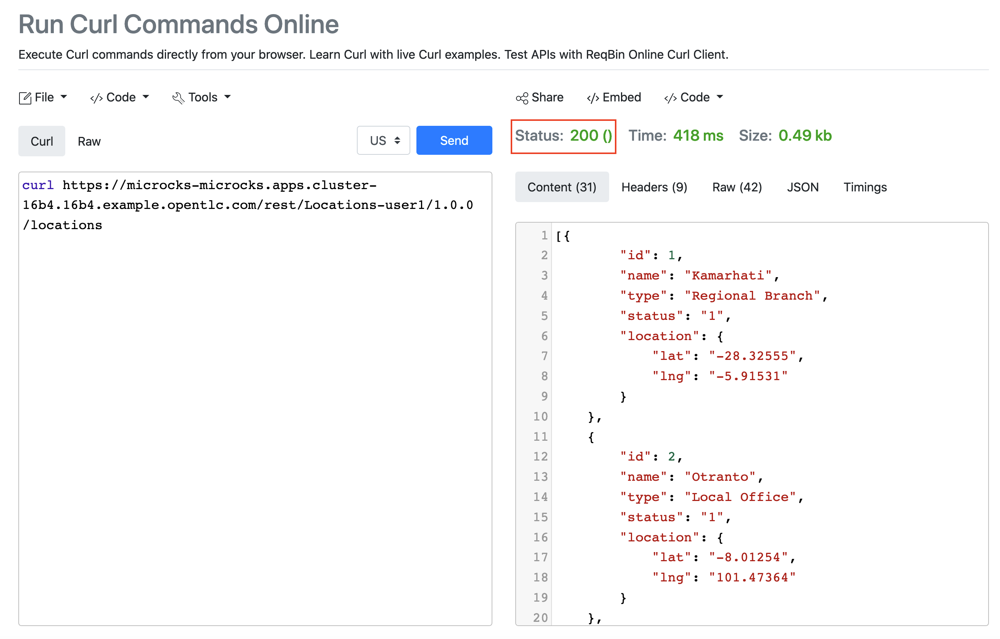

:walkthrough: API Mocking
:microcks-url: http://microcks-microcks.{openshift-app-host}
:next-lab-url: https://tutorial-web-app-webapp.{openshift-app-host}/tutorial/dayinthelife-integration.git-developer-track-lab03/
:user-password: openshift
:wip-link: http://location-service-international.{openshift-app-host}/locations
:gogs-url: http://gogs.{openshift-app-host}

ifdef::env-github[]
:next-lab-url: ../lab03/walkthrough.adoc
endif::[]

[id='mocking']
= Developer Lab 2 - API Mocking

In this lab you will use Microcks to configure a REST mock service for the API definition you created in the previous lab.

Audience: API Owner, Product Manager, Developers, Architects

*Overview*

When building and working with APIs, you often need to simulate the responses of the system before it has been fully completed. This is what we explore in this workshop - mocking up API structures quickly so they can be subjected to testing without having to create all the final service code.

*Why Red Hat?*

Red hat combines and number of commercial and Open Source tools to cover each part of the API Design lifecycle. In this lab we'll be using the http://microcks.github.io/[Microcks] open source tool.

*Skipping The Lab*

If you are planning to follow the next lab, here is a link:{wip-link}[link] to the REST mock service running the Location API.

*Credentials:*

Your username is: `{user-username}` +
Your password is: `{user-password}`

[type=walkthroughResource]
.Microcks
****
* link:{microcks-url}[Microcks Console, window="_blank"]
****

[type=walkthroughResource]
.Gogs
****
* link:{gogs-url}[Gogs Console, window="_blank"]
****

[time=5]
[id="Prerequisite"]
== Prerequisite: Setup the collaboration environment using Git (Gogs)

For the Developer track, we require a collaboration environment based on Git. For this purpose, we  decided to use Gogs which is a hosted, lighter-weight version of Gitlab. This lab environment has created a user for you in Gogs.

Follow this instructions to set up the repository.

. Click on the *Gogs Console* link, located on the right of this walkthrough.

. Click on *Sign In*.
+

. Log into Gogs using `{user-username}` and `{user-password}`. You should see the repository dashboard.
+

. In the main page, click in the + sign in the right top corner to display the New menu. Click the New Migration option.
+

. Fill in the information of the repository migration with the following values:
 ** Clone Address: *https://github.com/RedHatWorkshops/dayinthelife-openapi.git*
 ** Owner: *`{user-username}`*
 ** Repository Name: *locations-api*
+

. Click on *Migrate Repository* to fork the GitHub repo into Gogs.
. Switch to branch `dev-track-lab-02`
+

. Open the `locations-api` folder and click on the filename link *Locations-userX.json* to open and review the file.
+

. If everything is fine, click the *Edit* button to apply your personal user settings.
+

. Replace all occurances of *userX* with your user number i.e ``{user-username}``.
+

. Scroll down to bottom of the page and commit the changes to gogs.
+

. Click the *RAW* button to get the raw download version of the file.
+

. Copy the browser tab URL. Store that URL address as you will use it in the next steps of the lab. The URL should look like the following:
+
[source,bash,subs="attributes+"]
----
http://gogs.{openshift-app-host}/{user-username}/locations-api/raw/dev-track-lab-02/locations-api/Locations-{user-username}.json
----

[type=verification]
Was the valid URL address created successfully?

[type=verificationFail]
Try to redo this section, if any problem persists have your instructor check the Kubernetes pod that contains the Gogs application.

[time=6]
[id="Microcks setup"]
== Microcks setup

=== Step 1: Create a Microcks Job

. Open a browser window and navigate to:
+
[source,bash,subs="attributes+"]
----
 http://microcks-microcks.{openshift-app-host}
----

. Log in into Microcks using your credentials `{user-username}` and `{user-password}`.
+
image::images/microcks-login-page.png[microcks-login-page.png, role="integr8ly-img-responsive"]

. You are now in the main Microcks page. Click the *Importers* button to access the Importers page.
+
image::images/microcks-importers-link.png[microcks-importers-link, role="integr8ly-img-responsive"]

. Click the *Create* button to create your first job.
+

. In the _Create a New Job_ dialog, type in the following information. Click *Next*.
 ** Name: *`Locations-{user-username}`*
 ** Repository URL: *`http://gogs.{openshift-app-host}/{user-username}/locations-api/raw/dev-track-lab-02/locations-api/Locations-{user-username}.json`*

. Click *Next* for the Authentication options. 
+

. Leave Authentication options unchanged and click *Next*.

. Review the details and click on *Create* to create the job.
+

. Click on the *Force Import* option. This will start the synchronization job.
+

. Refresh your window to get it to the latest state.
. You will see 3 labels next to your Job. Click the *Services* label.
+

. In the dialog you will see your service listed. Click on the *Locations-{user-username} - 1.0.0.* link.
+

. Click *Close* to dismiss the dialog.
. This is your new REST mock service based on the OpenAPI definition you just loaded to Microcks. Click on the arrow to expand the *GET /locations* operation.
+

. You can check that the example we added to the definition in Lab 1 will be used to return the mock values. Scroll down, copy and save the *Mocks URL*, we will use that endpoint to test the REST mock service.
+

[type=verification]
Was the *Mocks URL* created successfully?

[type=verificationFail]
Try to redo this section, if any problem persists have your instructor check the Kubernetes pod that contains the Microcks application.

=== Step 2: Test the REST Mock Service

We now have a working REST mock service listening for requests. We will use an online cURL tool to test it.

. Open a browser window and navigate to:
+
[source,bash,subs="attributes+"]
----
 https://reqbin.com/curl
----

. Copy and paste the Mock URL from earlier step. It should look like.
+
[source,bash,subs="attributes+"]
----
curl http://microcks.{openshift-app-host}/rest/Locations-{user-username}/1.0.0/locations
----

. Click the *Send* button.
+

. The page will load the response information from the service. You will be able to see the _RESPONSE HEADERS_ and the actual _RESPONSE_BODY_. This last part contains the examples we add during the design phase.
+

[type=verification]
Were the _RESPONSE HEADERS_ and the _RESPONSE_BODY_ created successfully?

[type=verificationFail]
Try to redo this section, if any problem persists have your instructor check the Kubernetes pod that contains the Microcks application.

_Congratulations!_ You have successfully configure a Microcks Job to create a REST mock service to test your API.

[time=1]
[id="Summary"]
== Summary

In this lab you used Microcks to configure a REST mock service for the API definition you created in the previous lab. REST mock services allows you to simulate a REST API service when you are in a prototyping stage of your API program journey.

Microcks allows you to test a number of various responses for client application requests. When deploying API, micro-services or SOA practices at large scale, Microcks solves the problems of providing and sharing consistent documentation and mocks to the involved teams. It acts as a central repository and server that can be used for browsing but also by your Continuous Integration builds or pipelines.

You can now proceed to link:{next-lab-url}[Lab 3].

[time=1]
[id="Reading"]
== Notes and Further Reading

* Microcks
 ** http://microcks.github.io/[Webpage]
 ** http://microcks.github.io/automating/jenkins/[Jenkins Plugin]
 ** http://microcks.github.io/installing/openshift/[Installing on OpenShift]
