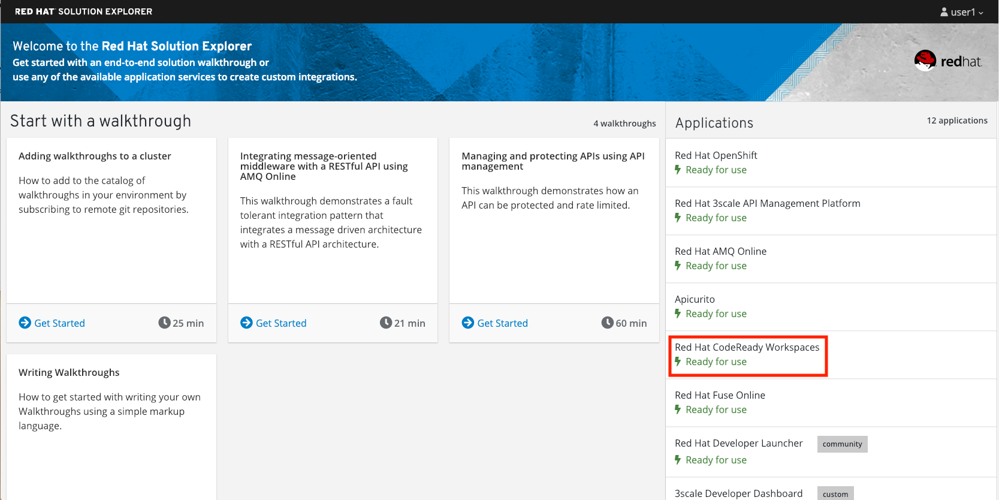
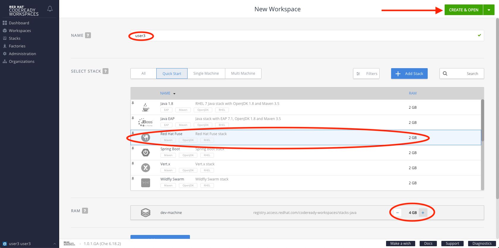
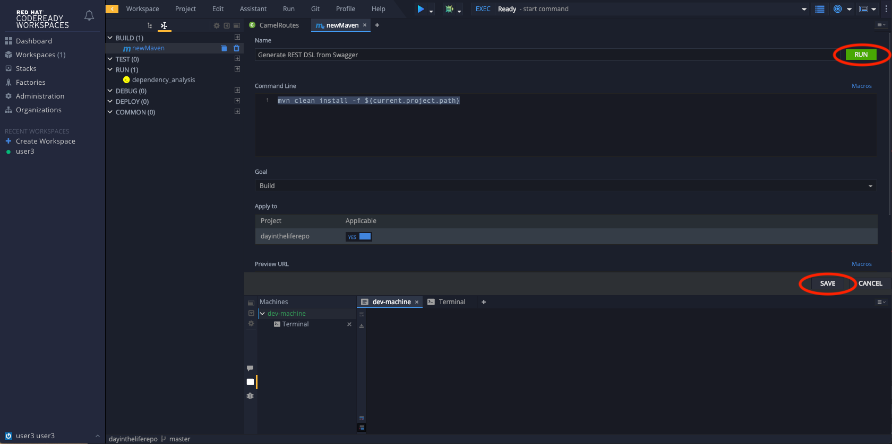

# Lab 3

## Swagger to REST

### Contract-first API development with a database interface, implemented using Eclipse Che

* Duration: 20 mins
* Audience: Developers and Architects

## Overview

In the context of defining API's, it's common for a Business Analyst (or Citizen Integrator) to first create an API specification or contract.  By beginning the process with a clearly defined contract, a Developer can easily take the contract and auto-generate the underlying service to implement that API.  This *separation of concern*, whereby a Citizen Integrator and Developer can independently collaborate and contribute to create an end-to-end API implementation, is a powerful method for defining API's.

### Why Red Hat?

Eclipse Che, our online IDE, provides important functionality for implementing API services. In this lab you can see how our API tooling fits together with 3scale, Fuse and OpenShift to create a scalable API.

### Skipping The Lab

If you are planning to follow to the next lab or are having trouble with this lab, you can reference the working project [here](https://github.com/RedHatWorkshops/dayinthelife-integration/tree/master/projects/location-service)

### Environment

**Credentials:**

Your username is your assigned user number. For example, if you are assigned user number **1**, your username is: 

```bash
user1
```

Please ask your instructor for your password.

**URLs:**

If you haven't done so already, you need to login to the **Red Hat Solution Explorer** webpage so that a unique lab environment can be provisioned on-demand for your exclusive use.  You should open a web browser and navigate to: 

```bash
https://tutorial-web-app-webapp.dil.opentry.me
```

You will be presented with a login page where you can enter your unique credentials:


Enter your credentials and click **Log in**.  You'll notice a web-page appear which explains that a *unique environment* is being provisioned.


Once the environment is provisioned, you will be presented with a page that presents all the available applications which you'll need in order to complete the labs:


Login to the Red Hat Solution Explorer, here you will find the link to Che.



Enter dummy values for `First Name` and `Last Name`. Click **Submit**.


## Lab Instructions

### Step 1: Create an Eclipse Che environment for your personal use

1. Click on Eclipse Che in **Red Hat Solution Explorer** .

    
1. Click on **Create Workspace**.

    

1. Use your unique username as your workspace name e.g. userX.  Select "day in the life workshop" stack, increase the RAM to 4GB and then click **Create**.

    

1. Click on **Open** to generate and open the workspace.

    


### Step 2: Create your own personal Openshift project and setup a sample database

1. Open a browser window and navigate to:

    ```bash
    https://dil.opentry.me/console
    ```

1. Click on your unique namespace to enter your workspace e.g. `user39`.

    

1. Click on **Browse Catalog**, then navigate to the **Databases** menu and select **Postgres**.  From there, select the **PostgreSQL** (Ephemeral) template.

    

1. In the pop-up window that appears, click the **Next** button to reach the **Configuration** page.  Update **PostgreSQL Connection Username** to `dbuser` and **PostgreSQL Connection Password** to `password`.

    

1. Click **Next** and ensure *Do not Bind at this time* is selected.  Click **Create** to generate the service.


### Step 3: Import the skeleton projects from Git and convert them to Maven projects.

1. In Eclipse Che, click on Workspace > Import Project from the main menu.  A pop-up will appear.

    

1. Enter `http://gogs.dil.opentry.me/userX/dayintheliferepo` as the git URL, making sure to update `userX` with your unique username.  Select **Import Recursively** and then click **Import**.

1. When the "Save" pop-up appears, click the "X" to close the pop-up.

    

1. Open the newly created folder, and right-click on the **location-soap2rest** project and select **Convert to Project**

    

1. Select **Maven** then click **Save**.

    

1. Convert the remaining projects to Maven, by repeating steps 4 & 5 for the **location-service** and **location-gateway** projects.


### Step 4: Import the Swagger specification

Once you've received the swagger specification (API contract) from your friendly Citizen Integrator, we need to import it into our skeleton Maven project (`location-service`).  Follow these steps:

1. Expand the `location-service` project and right-click on the `src` folder, selecting New > Folder.  Give the folder the name `spec`.

    

1. Right-click on your newly created spec folder and select New > File.  Name the file `location.yaml`.

    

1. Copy the contents of this [file](https://raw.githubusercontent.com/RedHatWorkshops/dayinthelife-integration/master/docs/labs/developer-track/resources/Locations.yaml) to your newly created `location.yaml` file.  The file will auto-save so no need to click **Save**.

1. Open the `pom.xml` file, and examine and update the plugin entry for `camel-restdsl-swagger-plugin` located at the bottom of the file.  Take a look at the location of the yaml file, make sure it maps to the one you created. 

    ```xml
	  <plugin>
		  <groupId>org.apache.camel</groupId>
		  <artifactId>camel-restdsl-swagger-plugin</artifactId>
		  <version>2.21.0</version>
		  <configuration>
		    <specificationUri>${project.basedir}/src/spec/location.yaml</specificationUri>
		    <className>CamelRoutes</className>
		    <packageName>com.redhat</packageName>
		    <outputDirectory>${project.basedir}/src/main/java</outputDirectory>      
		  </configuration>
	  </plugin>
    ```

    

1. After you've updated the `pom.xml` file, we need to run a Maven command to generate the Camel RESTdsl from our specification.  To do this, first highlight the `location-service` project then click the **Manage Commands** button.

    

1. Double-click the **Generate REST DSL from..** script to open the command window.  Click **Run** to execute the script. If everything completes successfully, it should generate a new file under `src/main/java/com/redhat` called `CamelRoutes.java`.  If the Maven script fails, it's probably because you forgot to first highlight the `location-service` project in the previous step.  Be sure to do this and re-run the command to fix the error.

    

1. Click on the workspace button (located next to the **Manage Commands** button).  Open the `CamelRoutes.java` file under `src/main/java/com/redhat`.  Notice that the `camel-restdsl-swagger-plugin` maven plugin has generated Camel RESTdsl code for the various HTTP GET and POST operations.  What is missing though are the underlying Camel routes, which will form our API service implementations. If the `CamelRoutes.java` hasn't appeared, please right-click on the `location-service` project and click **Refresh** to manually refresh the project tree.

    

    ```java
    package com.redhat;
    
    import javax.annotation.Generated;
    import org.apache.camel.builder.RouteBuilder;
    import org.apache.camel.model.rest.RestParamType;
    
    /**
     * Generated from Swagger specification by Camel REST DSL generator.
     */
    @Generated("org.apache.camel.generator.swagger.PathGenerator")
    public final class CamelRoutes extends RouteBuilder {
        /**
         * Defines Apache Camel routes using REST DSL fluent API.
         */
        public void configure() {
            rest()
                .get("/locations")
                    .to("direct:rest1")
                .post("/locations")
                    .to("direct:rest2")
                .get("/locations/{id}")
                    .param()
                        .name("id")
                        .type(RestParamType.path)
                        .dataType("integer")
                        .required(true)
                    .endParam()
                    .to("direct:rest3")
                .get("/location/phone/{id}")
                    .param()
                        .name("id")
                        .type(RestParamType.path)
                        .dataType("integer")
                        .required(true)
                    .endParam()
                    .to("direct:rest4");
        }
    }
    
    ```


1. Open the generated `CamelRoutes.java` file.  We need to first instantiate our newly created Result Processors' and include the necessary imports.  Insert the following import statements into the `CamelRoutes.java` file:

    ```java
	...
	import com.redhat.processor.*;
	import com.redhat.model.*;
	import org.springframework.stereotype.Component;
	import org.apache.camel.model.rest.RestBindingMode;
	...
    ````

1. As we're using SpringBoot, we should also include the `@Component` declaration to the class definition statement (under the `@Generated`).

    ```java
	...
	/**	
	* Generated from Swagger specification by Camel REST DSL generator.	
	*/	
	@Generated("org.apache.camel.generator.swagger.PathGenerator")
	@Component
	public class CamelRoutes extends RouteBuilder {
	...
    ```

1. Next we need to include an `@Override` statement for our `configure()` method, and include references to our result processors

    ```java
	...
	@Override
	public void configure() throws Exception {		
		
		ContactInfoResultProcessor ciResultProcessor = new ContactInfoResultProcessor();
		LocationResultProcessor locationResultProcessor = new LocationResultProcessor();
	...
    ```

1. In order to startup an HTTP server for our REST service, we need to instantiate the `restConfiguration` bean with the corresponding properties.  Please include the following block underneath the result processor lines you inserted in the previous step:

    ```java
	...
		restConfiguration()
			.component("servlet")
        	.port(8080)
        	.bindingMode(RestBindingMode.json)
			.contextPath("/")
        	.dataFormatProperty("prettyPrint", "true")
        	.enableCORS(true)
        	.apiContextPath("/api-doc")
        	.apiProperty("api.title", "Location and Contact Info API")
        	.apiProperty("api.version", "1.0.0")
        ;
	...
    ```

    If the IDE has any issues compiling the code and you receive errors, then navigate to **Project > Configure Classpath** then click **Done**.  This will trigger the compiler to run in the background and should eliminate any errors. 

    Notice that we now have both ResultProcessor's instantiated, and we've stood-up an Servlet HTTP listener for our RESTful endpoint, together with some basic self-documenting API docs that describe our new service.

1. Next we need to implement our Camel routes.  We need to create 4 routes, each matching their associated HTTP GET / POST endpoint.  Add the following code below the generated RESTdsl code in the `configure()` method:

    ```java
	...
        from("direct:getalllocations")
			.to("sql:select * from locations?dataSource=dataSource")
			.process(locationResultProcessor)
			.log("${body}")
	;
		
	from("direct:getlocation")
			.to("sql:select * from locations where id=cast(:#id as int)?dataSource=dataSource")
			.process(locationResultProcessor)
			.choice()
				.when(simple("${body.size} > 0"))
					.setBody(simple("${body[0]}"))
				.otherwise()
					.setHeader("HTTP_RESPONSE_CODE",constant("404"))
			.log("${body}")
	;
		
        from("direct:addlocation")
            		.log("Creating new location")
			.to("sql:INSERT INTO locations (id,name,lat,lng,location_type,status) VALUES (:#${body.id},:#${body.name},:#${body.location.lat},:#${body.location.lng},:#${body.type},:#${body.status});?dataSource=dataSource")
		;
		
        from("direct:getlocationdetail")
			.to("sql:select * from location_detail where id=cast(:#id as int)?dataSource=dataSource")
			.process(ciResultProcessor)
	;
	...
    ```

1. Lastly, we need to update the RESTdsl code to accommodate our new routes.  Replace the existing RESTdsl block in the `configure()` method with the following:

    ```java
	...
       rest()
            .get("/locations")
                .to("direct:getalllocations")
            .post("/locations")
                .type(Location.class)
                .to("direct:addlocation")
            .get("/locations/{id}")
                .param()
                    .name("id")
                    .type(RestParamType.path)
                    .dataType("integer")
                    .required(true)
                .endParam()
                .to("direct:getlocation")
            .get("/location/phone/{id}")
                .param()
                    .name("id")
                    .type(RestParamType.path)
                    .dataType("integer")
                    .required(true)
                .endParam()
                .outType(ContactInfo.class)
                .to("direct:getlocationdetail")
        ;
    ```

    *Sample [CamelRoutes.java](https://gist.githubusercontent.com/VinayBhalerao/af845d8992a206630265cfd0bf0410bd/raw/68c2282fa3c1cfc748666f30df3e8a26b08a6935/CamelRoutes.java) for reference, just incase if you miss any step earlier.*

1. Before we test our newly created Camel Routes, we need to update `src/main/resources/application.properties` to point to our Postgres database.  Set the `postgresql.service.name` property to `postgresql.OCPPROJECT.svc` so that it points to our OpenShift service. Replace `OCPPROJECT` with the OpenShift project name you created in Step 2 to host Postgres Database (this should be your unique username).

    

1. Now we are ready to test our new Camel route locally. To do this, navigate back to the **Manage commands** screen, double-click the **run:spring-boot** script and hit **Run**.  The script will run locally in Eclipse Che.

     

1. Once SpringBoot has started-up, right-click the dev-machine (under **Machines**) and select **Servers**.  Click the link corresponding to port 8080.  A new tab should open.

     

1. Click on the route link above the location-service pod and append `/locations` to the URI.  As a result, you should receive a list of all locations

    

1. Now that we've tested our API service implementation locally, we can deploy it to our running OpenShift environment.  First we need to login to OpenShift via the Terminal.  Navigate back to the OpenShift web UI and click the **Copy Login Command** link.  If you aren't logged-in to OpenShift, open a new tab and navigate to `https://dil.opentry.me/console`.

    

1.  Navigate back to Eclipse Che, open the terminal, and paste the login command from your clipboard.  Once you've logged-in, select the OpenShift project you created earlier using `oc project userX` (replacing userX with your username).

    

1. To run the fabric8 Maven command to deploy our project, navigate back to the **Manage commands** screen, double-click the **fabric8:deploy** script and hit **Run**.  The script will run and deploy to your OCPPROJECT.

    

1. If the deployment script completes successfully, navigate back to your OCPPROJECT web console and verify the pod is running

    

1. Click on the route link above the location-service pod and append `locations` to the URI.  Initially, you may receive a `404` error when opening the route URL, but once you append `locations` and refresh you should receive a list of all locations

    

1. You can also search for individual locations by adjusting the URI to `/locations/{id}` e.g. `/locations/100`.

    
1. Lastly, via the Eclipse Che terminal, test the HTTP POST using curl.  You can use the following command:

    ```bash
	curl --header "Content-Type: application/json" --request POST --data '{"id": 101,"name": "Kakadu","type": "HQ","status": "1","location": {"lat": "78.88436","lng": "99.05295"}}' http://location-service-OCPPROJECT.dil.opentry.me/locations
    ```

    Remember to replace OCPPROJECT with your username.

1.  If the HTTP POST is successful, you should be able to view it by repeating the HTTP GET /locations test.

*Congratulations!* You have now an application to test your Swagger to RESTdsl integration.

## Summary

You have now successfully created a contract-first API using a Swagger contract together with generated Camel RESTdsl, incorporating both HTTP GET and POST requests that perform select and inserts on a Postgres database table.

You can now proceed to [Lab 4](../lab04/#lab-4)

