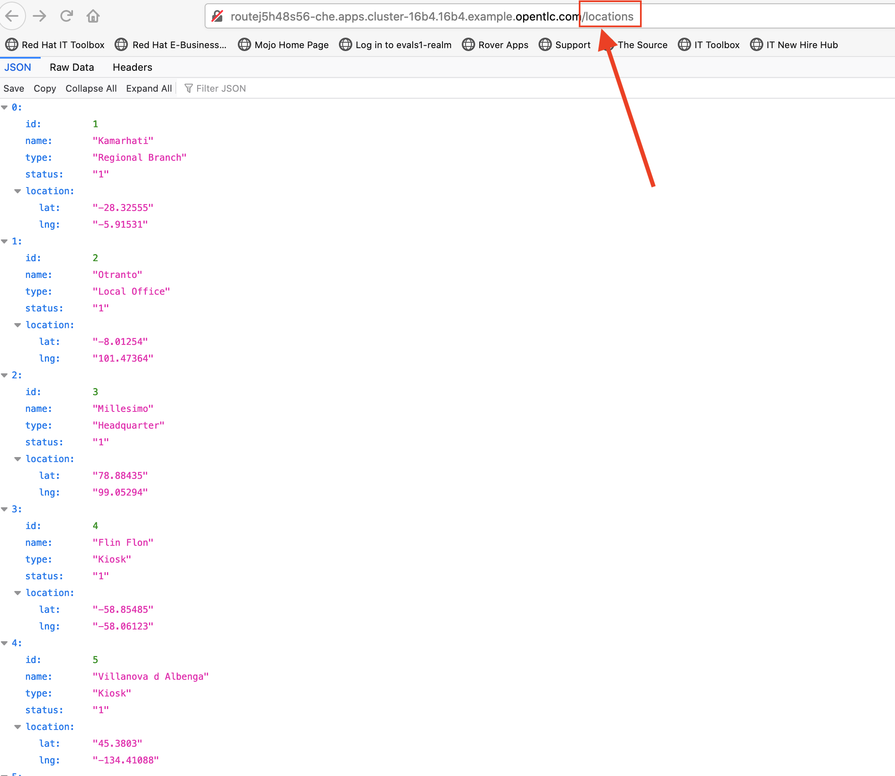

:walkthrough: Contract-first API development with a database interface, implemented using CodeReady Workspaces
:codeready-url: http://che-che.{openshift-app-host}
:openshift-url: {openshift-host}/console
:next-lab-url: https://tutorial-web-app-webapp.{openshift-app-host}/tutorial/dayinthelife-integration.git-developer-track-lab04/
:user-password: openshift

ifdef::env-github[]
:next-lab-url: ../lab04/walkthrough.adoc
endif::[]

[id='swagger-rest']
= Developer Lab 3 - Swagger to REST

In this lab, we will use Contract-first API development with a database interface, implemented using CodeReady Workspaces, based on Eclipse Che Open Source project.

Audience: API Owner, Product Manager, Developers, Architects

*Overview*

In the context of defining API's, it's common for a Business Analyst (or Citizen Integrator) to first create an API specification or contract.  By beginning the process with a clearly defined contract, a Developer can easily take the contract and auto-generate the underlying service to implement that API.  This _separation of concern_, whereby a Citizen Integrator and Developer can independently collaborate and contribute to create an end-to-end API implementation, is a powerful method for defining API's.

*Why Red Hat?*

CodeReady Workspaces, our online IDE, provides important functionality for implementing API services. In this lab you can see how our API tooling fits together with 3scale, Fuse and OpenShift to create a scalable API.

*Skipping The Lab*

If you are planning to follow to the next lab or are having trouble with this lab, you can reference the working project link:https://github.com/RedHatWorkshops/dayinthelife-integration/tree/master/projects/location-service[here]

*Credentials:*

Your username is: `{user-username}` +
Your password is: `{user-password}`

[type=walkthroughResource]
.CodeReady Workspaces
****
* link:{codeready-url}[Console, window="_blank"]
****

[type=walkthroughResource]
.Openshift Console
****
* link:{openshift-url}[Console, window="_blank"]
****

[time=3]
[id="Che setup"]
== Create a CodeReady Workspaces environment

. Launch a new tab on your web browser.
. Navigate to the Solution Explorer on that tab.
. Click on the *Red Hat CodeReady Workspaces* link.

. Logon to link:{codeready-url}[CodeReady Workspaces, window="_blank"] using the  credentials provided above. Click *Log In*.
+

. Notice a workspace `{user-username}/dil-ai-{user-username}` is created for you. Click on the workspace to see the details.
+

. Notice the workspace is in _Running_ state. 
+

. Click on *Open* to enter the workspace.
+

. After a couple of minutes, the workspace opens and a project is cloned from the git repository for the workshop.
+

[type=verification]
Were you able to open the workspace?

[type=verificationFail]
Try to redo this section, if any problem persists have your instructor check the Kubernetes pod that contains the CodeReady Workspaces application.

[time=2]
[id="DB setup"]
== Setup a sample database

. Open your link:{openshift-url}[Openshift Console, window="_blank"].

. Enter your credentials: `{user-username}` and `{user-password}`

. In the *Administrator* view, click on the *Projects* link, and choose `{user-username}` project.
+

. Choose the *Developer view*.
+

. Navigate your mouse pointer to the *+Add* link and click on *Database*.
+
image::images/ocp-user-add-db.png[ocp-user-add-db, role="integr8ly-img-responsive"]

. Select the *PostgreSQL (Ephemeral)* template.
+

. In the pop-up window that appears, click on *Instantiate template*.
+

. Update *PostgreSQL Connection Username* to `dbuser` and *PostgreSQL Connection Password* to `password`.
+

. Click *Create* to generate the service.

[type=verification]
Were you able to generate the service?

[type=verificationFail]
Try to redo this section, if any problem persists have your instructor check the Kubernetes pod that contains the CodeReady Workspaces application.

[time=3]
[id="git-import"]
== View the skeleton projects imported from Git

. In CodeReady Workspaces, notice that the projects are imported from your *Gogs* repository.
+

. There should be 3 projects imported:
.. *location-gateway*
.. *location-service*
.. *location-soap2rest*

[type=verification]
Were you able to view the projects in your workspace?

[type=verificationFail]
Try to redo this section, if any problem persists have your instructor check the Kubernetes pod that contains the CodeReady Workspaces application.

[time=2]
[id="open-api-import"]
== Import the OpenAPI specification

Once you've received the OpenAPI specification (API contract) from your friendly Citizen Integrator, we need to import it into our skeleton Maven project (`location-service`).  Follow these steps:

. Expand the `location-service` project and right-click on the `src` folder, selecting New > Folder. 
+

.  Give the folder the name `spec`.
+

. Right-click on your newly created spec folder and select New > File.  Name the file `location.yaml`.
+

. Copy the contents of this https://raw.githubusercontent.com/RedHat-Middleware-Workshops/dayinthelife-integration/master/docs/labs/developer-track/resources/Locations.yaml[file] to your newly created `location.yaml` file.  The file will auto-save so no need to click *Save*.

. Select *Open Terminal* -> *Open Terminal in a specific container* -> *openshift tools* and notice that a new terminal window opens in the lower section of the workspace.
+

. We need to login to OpenShift via the Terminal.  Navigate back to the OpenShift web UI and click the **Copy Login Command** link.
+

. Login to OpenShift web console and click on *Display Token* to view the login token. Copy the *oc login* command.
+

. Once you've logged-in, select the OpenShift project you created earlier using command below:
+
[source,text,subs="attributes+"]
----
oc project {user-username}
----

. In the terminal, type following command to change directory to the *location-service*
+
[source,text]
----
cd DILAgileIntegration/location-service/
----

. Next, enter the Maven command to run the build:
+
[source,text]
----
mvn camel-restdsl-swagger:generate 
----

. If everything completes successfully, it should generate a new file under `src/main/java/com/redhat` called `CamelRoutes.java`.  If the Maven script fails, it's probably because you forgot to first highlight the `location-service` project in the previous step.  Be sure to do this and re-run the command to fix the error.
+

[type=verification]
Were you able to generate the `CamelRoutes.java` file?

[type=verificationFail]
Try to redo this section, if any problem persists have your instructor check the Kubernetes pod that contains the CodeReady Workspaces application.

[time=10]
[id="Camel Route Update"]
== Update the Camel Routes

. Click on the workspace button (located next to the **Manage Commands** button).  Open the `CamelRoutes.java` file under `src/main/java/com/redhat`.  Notice that the `camel-restdsl-swagger-plugin` maven plugin has generated Camel RESTdsl code for the various HTTP GET and POST operations.  What is missing though are the underlying Camel routes, which will form our API service implementations. If the `CamelRoutes.java` hasn't appeared, please right-click on the `location-service` project and click **Refresh** to manually refresh the project tree. The following file should be generated:
+
[source,java,subs="attributes+"]
----
 package com.redhat;

 import javax.annotation.Generated;
 import org.apache.camel.builder.RouteBuilder;
 import org.apache.camel.model.rest.RestParamType;

 /**
  * Generated from Swagger specification by Camel REST DSL generator.
  */
 @Generated("org.apache.camel.generator.swagger.PathGenerator")
 public final class CamelRoutes extends RouteBuilder {
     /**
      * Defines Apache Camel routes using REST DSL fluent API.
      */
     public void configure() {
         rest()
             .get("/locations")
                 .to("direct:rest1")
             .post("/locations")
                 .to("direct:rest2")
             .get("/locations/{id}")
                 .param()
                     .name("id")
                     .type(RestParamType.path)
                     .dataType("integer")
                     .required(true)
                 .endParam()
                 .to("direct:rest3")
             .get("/location/phone/{id}")
                 .param()
                     .name("id")
                     .type(RestParamType.path)
                     .dataType("integer")
                     .required(true)
                 .endParam()
                 .to("direct:rest4");
     }
 }
----

. Open the generated `CamelRoutes.java` file.  We need to first instantiate our newly created Result Processors' and include the necessary imports.  Insert the following import statements into the `CamelRoutes.java` file:
+
[source,java,subs="attributes+"]
----
 ...
import com.redhat.processor.*;
import com.redhat.model.*;
import org.apache.camel.model.rest.RestBindingMode;
 ...
----

. As we're using SpringBoot, we should also include the `@Component` declaration to the class definition statement (under the `@Generated`).
+
[source,java,subs="attributes+"]
----
 ...
 /**
 * Generated from Swagger specification by Camel REST DSL generator.
 */
 @Generated("org.apache.camel.generator.swagger.PathGenerator")
 @Component
 public class CamelRoutes extends RouteBuilder {
 ...
----

. Next we need to include an `@Override` statement for our `configure()` method, and include references to our result processors
+
[source,java,subs="attributes+"]
----
 ...
 @Override
 public void configure() throws Exception {

     ContactInfoResultProcessor ciResultProcessor = new ContactInfoResultProcessor();
     LocationResultProcessor locationResultProcessor = new LocationResultProcessor();
 ...
----

. In order to startup an HTTP server for our REST service, we need to instantiate the `restConfiguration` bean with the corresponding properties.  Please include the following block underneath the result processor lines you inserted in the previous step:
+
[source,java,subs="attributes+"]
----
 ...
     restConfiguration()
         .component("servlet")
        .port(8080)
        .bindingMode(RestBindingMode.json)
         .contextPath("/")
        .dataFormatProperty("prettyPrint", "true")
        .enableCORS(true)
        .apiContextPath("/api-doc")
        .apiProperty("api.title", "Location and Contact Info API")
        .apiProperty("api.version", "1.0.0")
     ;
 ...
----
+
Notice that we now have both ResultProcessor's instantiated, and we've stood-up an Servlet HTTP listener for our RESTful endpoint, together with some basic self-documenting API docs that describe our new service.

. Next we need to implement our Camel routes.  We need to create 4 routes, each matching their associated HTTP GET / POST endpoint.  Add the following code below the generated RESTdsl code in the `configure()` method:
+
[source,java,subs="attributes+"]
----
 ...
     from("direct:getalllocations")
         .to("sql:select * from locations?dataSource=dataSource")
         .process(locationResultProcessor)
         .log("${body}")
 ;

 from("direct:getlocation")
         .to("sql:select * from locations where id=cast(:#id as int)?dataSource=dataSource")
         .process(locationResultProcessor)
         .choice()
             .when(simple("${body.size} > 0"))
                 .setBody(simple("${body[0]}"))
             .otherwise()
                 .setHeader("HTTP_RESPONSE_CODE",constant("404"))
         .log("${body}")
 ;

     from("direct:addlocation")
                .log("Creating new location")
         .to("sql:INSERT INTO locations (id,name,lat,lng,location_type,status) VALUES (:#${body.id},:#${body.name},:#${body.location.lat},:#${body.location.lng},:#${body.type},:#${body.status});?dataSource=dataSource")
     ;

     from("direct:getlocationdetail")
         .to("sql:select * from location_detail where id=cast(:#id as int)?dataSource=dataSource")
         .process(ciResultProcessor)
 ;
 ...
----

. Lastly, we need to update the RESTdsl code to accommodate our new routes.  Replace the existing RESTdsl block in the `configure()` method with the following:
+
[source,java,subs="attributes+"]
----
 ...
    rest()
         .get("/locations")
             .to("direct:getalllocations")
         .post("/locations")
             .type(Location.class)
             .to("direct:addlocation")
         .get("/locations/{id}")
             .param()
                 .name("id")
                 .type(RestParamType.path)
                 .dataType("integer")
                 .required(true)
             .endParam()
             .to("direct:getlocation")
         .get("/location/phone/{id}")
             .param()
                 .name("id")
                 .type(RestParamType.path)
                 .dataType("integer")
                 .required(true)
             .endParam()
             .outType(ContactInfo.class)
             .to("direct:getlocationdetail")
     ;
----
+
_Sample https://gist.githubusercontent.com/VinayBhalerao/af845d8992a206630265cfd0bf0410bd/raw/68c2282fa3c1cfc748666f30df3e8a26b08a6935/CamelRoutes.java[CamelRoutes.java] for reference, just in case if you miss any step earlier._

. Before we test our newly created Camel Routes, we need to update `src/main/resources/application.properties` to point to our Postgres database.  Set the `postgresql.service.name` property to `postgresql.{user-username}.svc` so that it points to our OpenShift service.
+
image::images/00-update-properties.png[00-update-properties.png, role="integr8ly-img-responsive"]

. Now we are ready to test our new Camel route locally. To do this, type the following command at the Terminal:
+
[source,java,subs="attributes+"]
----
mvn spring-boot:run
----

. If the build is successful, you will see the camel routes being started locally.

[type=verification]
Were you able to run the script?

[type=verificationFail]
Try to redo this section, if any problem persists have your instructor check the Kubernetes pod that contains the CodeReady Workspaces application.

[time=2]
[id="test-springboot"]
== Test local spring:boot service

. Once SpringBoot has started-up, notice the pop-up link on exposing the port 8080 as a route. Click on *open in New Tab* to open the route.
+

. Click on the route link and this would open in a new tab. Append `/locations` to the URI.  As a result, you should receive a list of all locations.
+

[type=verification]
Were you able to retrieve a list of locations?

[type=verificationFail]
Try to redo this section, if any problem persists have your instructor check the Kubernetes pod that contains the CodeReady Workspaces application.

[time=3]
[id="deploy-location-service"]
== Deploy location service to Openshift

. Now that we've tested our API service implementation locally, we can deploy it to our running OpenShift environment.  First of all, stop the *spring:boot* process by entering *Ctrl + C* in the terminal. 

. Enter the following *Maven* command to deploy the application to OpenShift.
+
[source,java,subs="attributes+"]
----
mvn fabric8:deploy
----
+

. If the deployment script completes successfully, navigate back to your {user-username} Openshift web console and verify the pod is running
+

. Click on the route link highlighted and append `locations` to the URI.  Initially, you may receive a `404` error when opening the route URL, but once you append `locations` and refresh you should receive a list of all locations

. You can also search for individual locations by adjusting the URI to `+/locations/{id}+` e.g. `/locations/100`.
. Lastly, via the CodeReady Workspaces terminal, test the HTTP POST using curl.  You can use the following command:
+
[source,bash,subs="attributes+"]
----
 curl --header "Content-Type: application/json" --request POST --data '{"id": 101,"name": "Kakadu","type": "HQ","status": "1","location": {"lat": "78.88436","lng": "99.05295"}}' http://location-service-{user-username}.{openshift-app-host}/locations
----
+
. If the HTTP POST operation is successful, you should be able to view it by repeating the HTTP GET /locations test.

[type=verification]
Were all the HTTP POST operations successful?

[type=verificationFail]
Try to redo this section, if any problem persists have your instructor check the Kubernetes pod that contains the web service application.

_Congratulations!_ You have now an application to test your Swagger to RESTdsl integration.

[time=2]
[id="summary"]
== Summary

You have now successfully created a contract-first API using a Swagger contract together with generated Camel RESTdsl, incorporating both HTTP GET and POST requests that perform select and inserts on a Postgres database table.

You can now proceed to link:{next-lab-url}[Lab 4].
