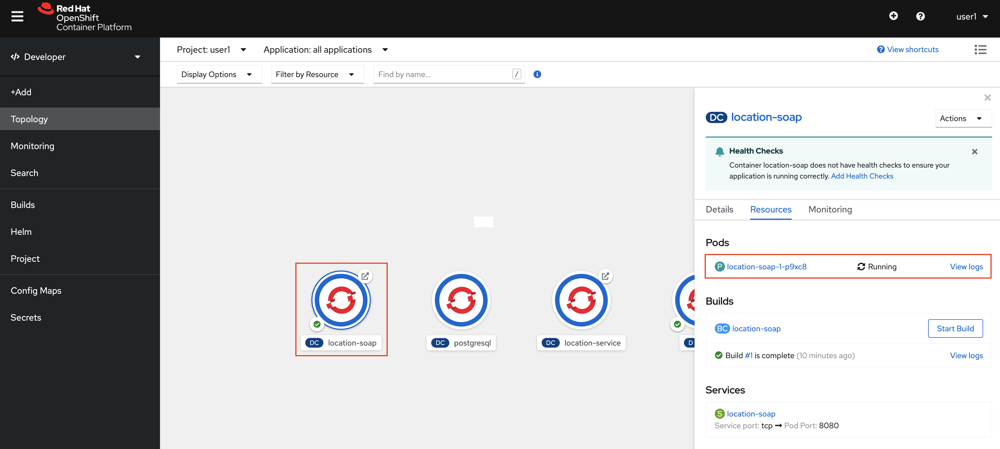
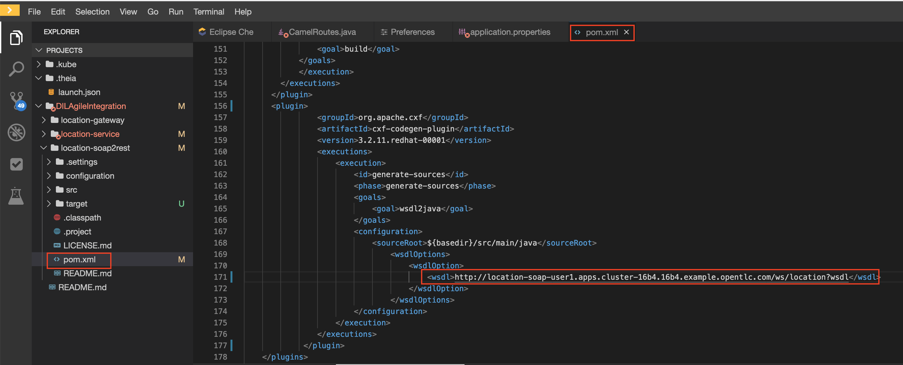
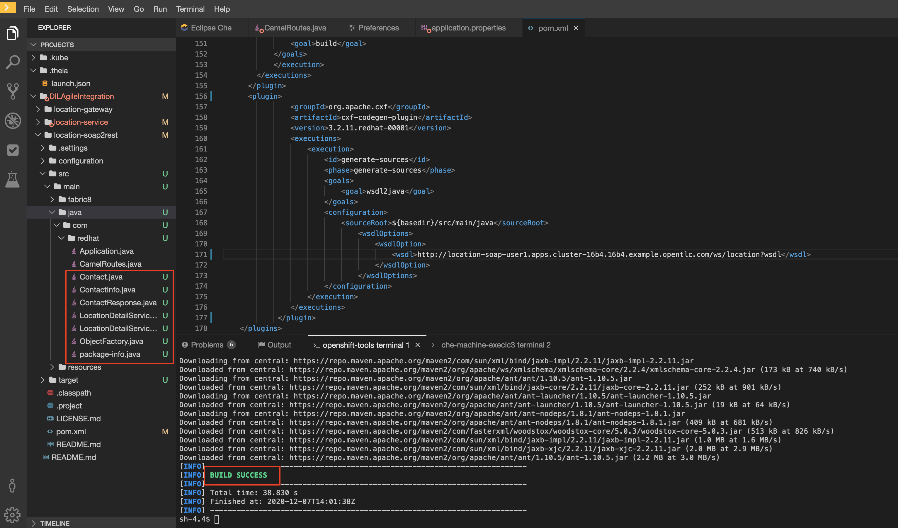
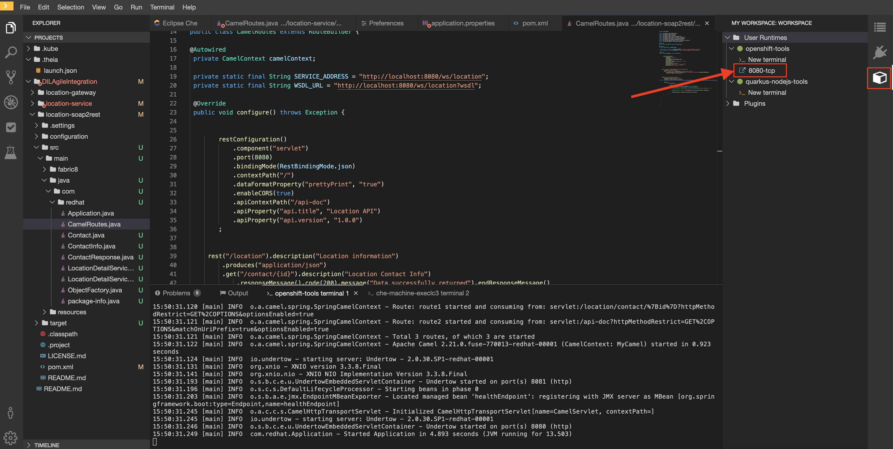
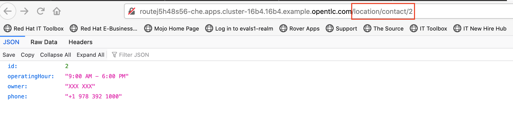
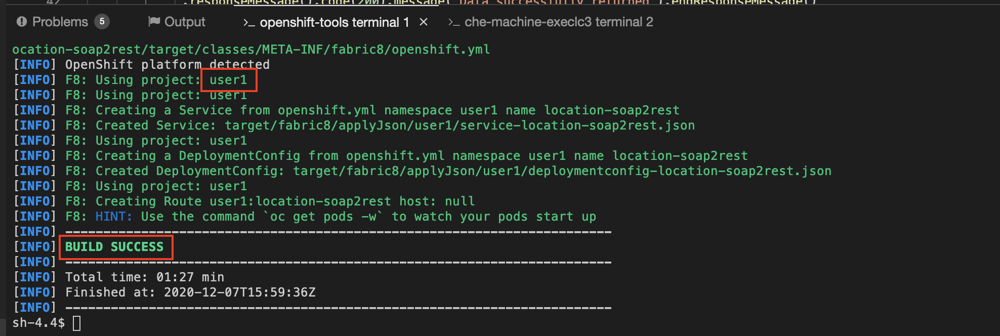
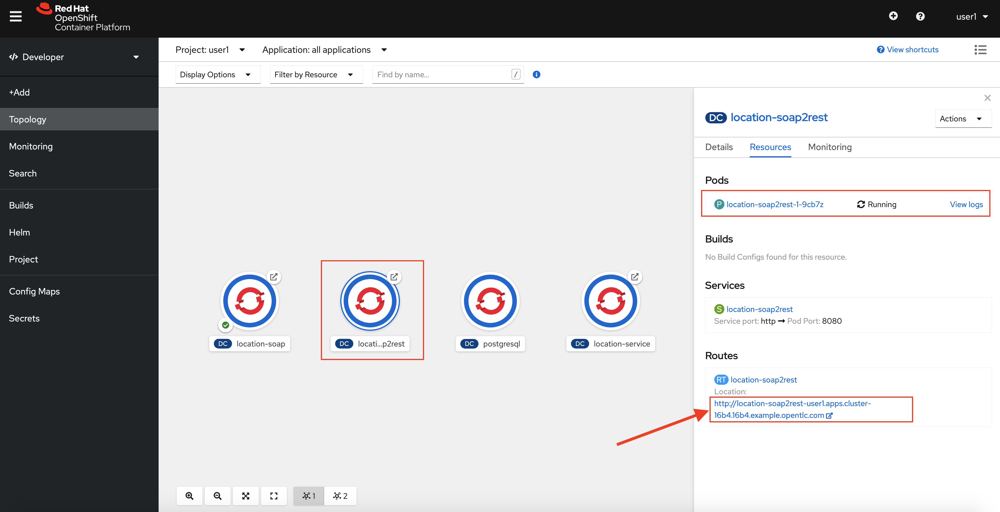

:walkthrough: Contract-first API development wrapping an existing SOAP service, implemented using CodeReady Workspaces
:codeready-url: https://che-che.{openshift-app-host}
:next-lab-url: https://tutorial-web-app-webapp.{openshift-app-host}/tutorial/dayinthelife-integration.git-developer-track-lab05/
:user-password: openshift

ifdef::env-github[]
:next-lab-url: ../lab05/walkthrough.adoc
endif::[]

[id='soap-to-rest']
= Developer Lab 4 - SOAP to REST Transformation

In this lab, we will be using existing legacy SOAP service and wrap it with a new RESTful endpoint

Audience: Developers, Architects

*Overview*

Another important use case in developing API's is to take an existing legacy SOAP service and wrap it with a new RESTful endpoint.  This SOAP to REST transformation is implemented in the API service layer (Fuse).  This lab will walk you through taking an existing SOAP contract (WSDL), converting it to Java POJO's and exposing it using Camel REST DSL.

*Why Red Hat?*

CodeReady Workspaces, our online IDE, provides important functionality for implementing API services. In this lab you can see how our CodeReady Workspaces and Fuse can help with SOAP to REST transformation on OpenShift.

*Skipping The Lab*

If you are planning to follow to the next lab or are having trouble with this lab, you can reference the working project link:{https://github.com/RedHat-Middleware-Workshops/dayinthelife-integration/tree/master/projects/location-soap2rest}[here]

*Credentials:*

Your username is: `{user-username}` +
Your password is: `{user-password}`

[type=walkthroughResource]
.CodeReady
****
* link:{codeready-url}[CodeReady, window="_blank"]
****

[type=walkthroughResource]
.Openshift Console
****
* link:{openshift-host}[Console, window="_blank"]
****

[time=5]
[id="instructions"]
== Import the sample SOAP project into your Openshift project

. Navigate back to your CodeReady Workspaces workspace and open the terminal window.
. Ensure you are using the *OpenShift tools* terminal and are logged in to your OpenShift console as in the last lab.
. Ensure you are in the `{user-username}` project in openshift:
+
[source,bash,subs="attributes+"]
----
 oc project {user-username}
----

. Build and deploy the SOAP application using source to image(S2i) template. Paste the commend to the terminal.
+
[source,bash,subs="attributes+"]
----
 oc new-app s2i-fuse71-spring-boot-camel -p GIT_REPO=https://github.com/RedHat-Middleware-Workshops/dayinthelife-integration -p CONTEXT_DIR=/projects/location-soap -p APP_NAME=location-soap -p GIT_REF=master -n {user-username}
----

. Once the build and deploy is complete, navigate back to your Openshift web console and verify the project is running.
+

[type=verification]
Were you able to build and deploy the SOAP application?

[type=verificationFail]
Try to redo this section, if any problem persists have your instructor check the Kubernetes pod that contains the SOAP application.

[time=5]
[id="instructions"]
== Modify the skeleton project

. In the OpenShift console, click on the route associated with the `location-soap` deployment.  A pop-up will appear.  Append the `/ws/location?wsdl` path to the URI and verify the WSDL appears. Copy the link to the clipboard.
+
image::images/00-verify-wsdl.png[00-verify-wsdl.png, role="integr8ly-img-responsive"]
+
NOTE: The link from Code Ready Workspaces uses *https* protocol, change the URL to use *http* for the WSDL to load. Use the *http* endpoint for the rest of the lab.

. Return to your CodeReady Workspaces workspace and open the `dayintelife-import/location-soap2rest` project.  Open the `pom.xml` file and scroll to the bottom.  Uncomment out the `cxf-codegen-plugin` entry at the bottom.  Update the `<wsdl>` entry with your fully qualified WSDL URL e.g. `http://location-soap-{user-username}.{openshift-app-host}/ws/location?wsdl`.
+

. We now need to generate the POJO objects from the WSDL contract. 
. Navigate to the following project in the Terminal:
 +
[source,bash,subs="attributes+"]
----
cd /projects/DILAgileIntegration/location-soap2rest
----

. Run the following maven command from the Terminal:
 +
[source,bash,subs="attributes+"]
----
mvn generate-sources
----

. Once the script has completed, navigate back to the *Workspace* view and open the `src/main/java/com/redhat` folder.  Notice that there are a bunch of new POJO classes that were created by the Maven script.
+
_Common gotcha: If build fails due to used port, check if you are running with many instances of `run spring-boot`. You should only have 1 instance of `run-spring-boot`._
+

[type=verification]
Were you able to generate the POJO classes?

[type=verificationFail]
Try to redo this section, if any problem persists have your instructor check the Kubernetes pod that contains the CodeReady Workspaces application.

[time=10]
[id="instructions"]
== Update the Camel Route

. Open up the `CamelRoutes.java` file.  Notice that the existing implementation is barebones. First of all, we need to enter the SOAP service address and WSDL location for our CXF client to call.
+
[source,java,subs="attributes+"]
----
 ...

 @Autowired
 private CamelContext camelContext;

 private static final String SERVICE_ADDRESS = "http://localhost:8080/ws/location";
 private static final String WSDL_URL = "http://localhost:8080/ws/location?wsdl";

 @Override
 public void configure() throws Exception {

 ...

----

. Secondly, we need to create our Camel route implementation and create the RESTful endpoint(still in the `CamelRoutes.java` file). Make sure the values to (`cxf://` URL): are correct
+
[source,java,subs="attributes+"]
----

 ...

     rest("/location").description("Location information")
         .produces("application/json")
         .get("/contact/{id}").description("Location Contact Info")
             .responseMessage().code(200).message("Data successfully returned").endResponseMessage()
             .to("direct:getalllocationphone")

     ;

     from("direct:getalllocationphone")
         .setBody().simple("${headers.id}")
         .unmarshal().json(JsonLibrary.Jackson)
         .to("cxf://http://location-soap-{user-username}.{openshift-app-host}/ws/location?serviceClass=com.redhat.LocationDetailServicePortType&defaultOperationName=contact")

         .process(
                 new Processor(){

                     @Override
                     public void process(Exchange exchange) throws Exception {
                         //LocationDetail locationDetail = new LocationDetail();
                         //locationDetail.setId(Integer.valueOf((String)exchange.getIn().getHeader("id")));

                         MessageContentsList list = (MessageContentsList)exchange.getIn().getBody();

                         exchange.getOut().setBody((ContactInfo)list.get(0));
                     }
                 }
         )

     ;

 ...

----

. Now that we have our API service implementation, we can try to test this locally.  Navigate back to the Terminal and execute the following command:
 +
[source,bash,subs="attributes+"]
----
mvn spring-boot:run
----
+

. Once the application starts, navigate to the Servers window and click on the URL corresponding to port 8080.  A new tab should appear.

. In the new tab, append the URL with the following URI: `/location/contact/2`.  A contact should be returned:
+

. Now that we've successfully tested our new SOAP to REST service locally, we can deploy it to OpenShift.  Stop the running application by clicking *Ctrl + C*.
. Run the following command in the terminal to deploy the application to OpenShift:
 +
[source,bash,subs="attributes+"]
----
mvn fabric8:deploy
----
+

. If the deployment script completes successfully, navigate back to your Openshift web console and verify the pod is running
+

. Click on the route link above the location-soap2rest pod and append `/location/contact/2` to the URI.  As a result, you should get a contact back.

[type=verification]
Were you able to retrieve a contact?

[type=verificationFail]
Try to redo this section, if any problem persists have your instructor check the Kubernetes pod that contains the CodeReady Workspaces application.

_Congratulations!_ You have created a SOAP to REST transformation API.

[time=2]
[id="summary"]
== Overview

You have now successfully created a contract-first API using a SOAP WSDL contract together with generated Camel RESTdsl.

You can now proceed to link:{next-lab-url}[Lab 5].
