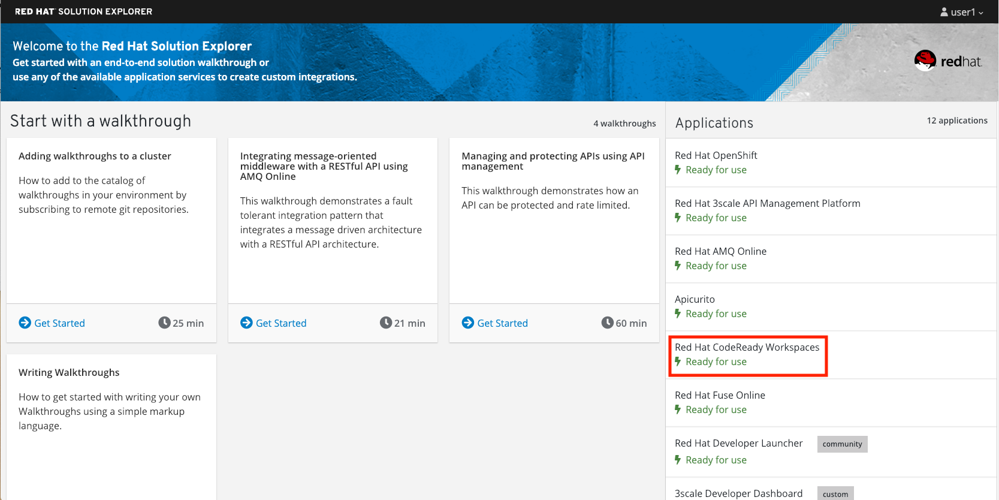

= Developer Lab 4 - SOAP to REST
:walkthrough: Contract-first API development wrapping an existing SOAP service, implemented using Eclipse Che

[time=20]
== SOAP to REST

=== Contract-first API development wrapping an existing SOAP service, implemented using Eclipse Che

* Duration: 20 mins
* Audience: Developers and Architects

== Overview

Another important use case in developing API's is to take an existing legacy SOAP service and wrap it with a new RESTful endpoint.  This SOAP to REST transformation is implemented in the API service layer (Fuse).  This lab will walk you through taking an existing SOAP contract (WSDL), converting it to Java POJO's and exposing it using Camel REST DSL.

=== Why Red Hat?

Eclipse Che, our online IDE, provides important functionality for implementing API services. In this lab you can see how our Eclipse Che and Fuse can help with SOAP to REST transformation on OpenShift.

=== Skipping The Lab

If you are planning to follow to the next lab or are having trouble with this lab, you can reference the working project https://github.com/RedHatWorkshops/dayinthelife-integration/tree/master/projects/location-soap2rest[here]

=== Environment

Login to the Red Hat Solution Explorer, here you will find the link to Che.

*Credentials:*

Your username is your assigned user number. For example, if you are assigned user number *1*, your username is:

[source,bash]
----
user1
----

Please ask your instructor for your password.

== Lab Instructions

=== Step 1: Import the sample SOAP project into your Openshift project

. Navigate back to your Eclipse Che workspace and open the terminal window.
+
image::images/00-open-terminal.png[00-open-terminal.png, role="integr8ly-img-responsive"]

. In Openshift console (https://{openshift-app-host}).
+
image::images/00-openshift-loginpage.png[00-openshift-loginpage.png, role="integr8ly-img-responsive"]

. Obtain your user login command by clicking on your username on the top right hand corner and select *Copy Login Command*
+
image::images/00-commend-login.png[00-commend-login.png, role="integr8ly-img-responsive"]

. Login to Openshift via the Terminal window and paste the commend to the terminal:
+
[source,bash]
----
 oc login https://{openshift-app-host} --token=XXXXX
----

. Build and deploy the SOAP application using source to image(S2i) template. Paste the commend to the terminal.
+
[source,bash]
----

 oc new-app s2i-fuse71-spring-boot-camel -p GIT_REPO=https://github.com/RedHatWorkshops/dayinthelife-integration -p CONTEXT_DIR=/projects/location-soap -p APP_NAME=location-soap -p GIT_REF=master -n OCPPROJECT
----
+
_Remember to replace the OCPPROJECT with the OpenShift project(NameSpace) you created in last lab.  OCPPROJECT should be your username_

. Once the build and deploy is complete, navigate back to your Openshift web console and verify the project is running.
+
image::images/00-verify-location-soap.png[00-verify-location-soap.png, role="integr8ly-img-responsive"]

=== Step 2: Modify the skeleton location-soap2rest project

. In the OpenShift console, click on the route associated with the `location-soap` deployment.  A pop-up will appear.  Append the `/ws/location?wsdl` path to the URI and verify the WSDL appears. Copy the link to the clipboard.
+
image::images/00-verify-wsdl.png[00-verify-wsdl.png, role="integr8ly-img-responsive"]

. Return to your Eclipse Che workspace and open the `dayintelife-import/location-soap2rest` project.  Open the `pom.xml` file and scroll to the bottom.  Uncomment out the `cxf-codegen-plugin` entry at the bottom.  Update the `<wsdl>` entry with your fully qualified WSDL URL e.g. `+http://location-soap-userX.{openshift-app-host}/ws/location?wsdl+`. _Be sure to replace userX with your username._
+
image::images/00-uncomment-codegen.png[00-uncomment-codegen.png, role="integr8ly-img-responsive"]

. We now need to generate the POJO objects from the WSDL contract.  To do this, change to the *Manage commands* view and double-click the `run generate-sources` script.  Click *Run* to execute the script.
+
image::images/00-generate-sources.png[00-generate-sources.png, role="integr8ly-img-responsive"]

. Once the script has completed, navigate back to the *Workspace* view and open the `src/main/java/com/redhat` folder.  Notice that there are a bunch of new POJO classes that were created by the Maven script.

Common gotcha: If build fails due to used port, check if you are running with many instances of `run spring-boot`. You should only have 1 instance of `run-spring-boot`.

image::images/00-verify-pojos.png[00-verify-pojos.png, role="integr8ly-img-responsive"]

. Open up the `CamelRoutes.java` file.  Notice that the existing implementation is barebones. First of all, we need to enter the SOAP service address and WSDL location for our CXF client to call.  Secondly, we need to create our Camel route implementation and create the RESTful endpoint.  To do this, include the following code (making sure to update the *\{YOUR_NAME_SPACE}*,  *\{OPENSHIFT_APP_URL}* and username values in the `to("cxf://` URL):
+
In this case *YOUR_NAME_SPACE* should be _userX_ and *\{OPENSHIFT_APP_URL}* would be _{openshift-app-host}_. Check with your instructor if you are not sure.
+
[source,java]
----
 ...

 @Autowired
 private CamelContext camelContext;
	
 private static final String SERVICE_ADDRESS = "http://localhost:8080/ws/location";
 private static final String WSDL_URL = "http://localhost:8080/ws/location?wsdl";

 @Override
 public void configure() throws Exception {
	
 ...	
	
     rest("/location").description("Location information")
         .produces("application/json")
         .get("/contact/{id}").description("Location Contact Info")
             .responseMessage().code(200).message("Data successfully returned").endResponseMessage()
             .to("direct:getalllocationphone")
			
     ;
		
     from("direct:getalllocationphone")
         .setBody().simple("${headers.id}")
         .unmarshal().json(JsonLibrary.Jackson)
         .to("cxf://http://location-soap-{YOUR_NAME_SPACE}.{OPENSHIFT_APP_URL}/ws/location?serviceClass=com.redhat.LocationDetailServicePortType&defaultOperationName=contact")
			
         .process(
                 new Processor(){

                     @Override
                     public void process(Exchange exchange) throws Exception {
                         //LocationDetail locationDetail = new LocationDetail();
                         //locationDetail.setId(Integer.valueOf((String)exchange.getIn().getHeader("id")));
							
                         MessageContentsList list = (MessageContentsList)exchange.getIn().getBody();
							
                         exchange.getOut().setBody((ContactInfo)list.get(0));
                     }
                 }
         )
			
     ;
	
     }
 }
----

. Now that we have our API service implementation, we can try to test this locally.  Navigate back to the *Manage commands* view and execute the `run spring-boot` script.  Click the *Run* button.
+
image::images/00-local-testing.png[00-local-testing.png, role="integr8ly-img-responsive"]

. Once the application starts, navigate to the Servers window and click on the URL corresponding to port 8080.  A new tab should appear:
+
image::images/00-select-servers.png[00-select-servers.png, role="integr8ly-img-responsive"]

. In the new tab, append the URL with the following URI: `/location/contact/2`.  A contact should be returned:
+
image::images/00-hit-contact-local.png[00-hit-contact-local.png, role="integr8ly-img-responsive"]

. Now that we've successfully tested our new SOAP to REST service locally, we can deploy it to OpenShift.  Stop the running application by clicking *Cancel*.
. Open the `fabic8:deploy` script and hit the *Run* button to deploy it to OpenShift.
+
image::images/00-mvn-f8-deploy.png[00-mvn-f8-deploy.png, role="integr8ly-img-responsive"]

. If the deployment script completes successfully, navigate back to your OCPPROJECT web console and verify the pod is running
+
image::images/00-verify-pod.png[00-verify-pod.png, role="integr8ly-img-responsive"]

. Click on the route link above the location-soap2rest pod and append `/location/contact/2` to the URI.  As a result, you should get a contact back.

_Congratulations!_ You have created a SOAP to REST transformation API.

== Summary

You have now successfully created a contract-first API using a SOAP WSDL contract together with generated Camel RESTdsl.

You can now proceed to link:../lab05/#lab-5[Lab 5]
