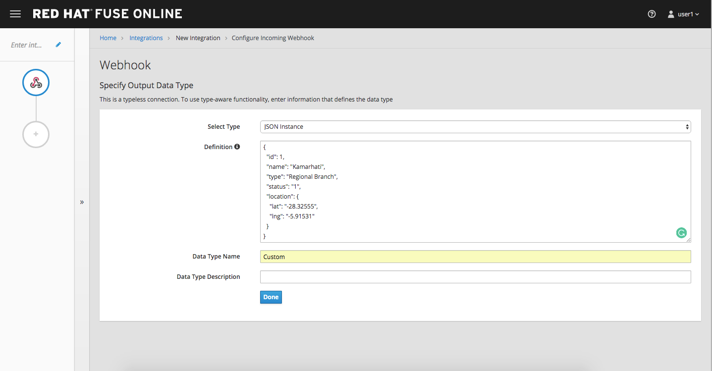

# Lab 5

## Fuse Online

* Duration: 20 mins
* Audience: Developers and Architects

## Overview

When it comes to quick API development, you need both the integration experts as well as application developers to easily develop, deploy the APIs. Here is how to create a simple API with Fuse online. 

### Why Red Hat?

Red Hat Fuse integration solution empowers integration experts, application developers, and business users to engage in enterprise-wide collaboration and high-productivity self-service. 


### Environment

**Credentials:**

Your username is your assigned user number. For example, if you are assigned user number **1**, your username is: 

```bash
user1
```

Please ask your instructor for your password.

**URLs:**

If you haven't done so already, you need to login to the **Red Hat Solution Explorer** webpage so that a unique lab environment can be provisioned on-demand for your exclusive use.  You should open a web browser and navigate to: 

```bash
https://tutorial-web-app-webapp.dil.opentry.me
```

You will be presented with a login page where you can enter your unique credentials:


Enter your credentials and click **Log in**.  You'll notice a web-page appear which explains that a *unique environment* is being provisioned.


Once the environment is provisioned, you will be presented with a page that presents all the available applications which you'll need in order to complete the labs:


## Lab Instructions

### Step 1: Create database connection

1. Via the **Red Hat Solution Explorer** webpage, click the **Red Hat Fuse** link:

   

1. The first time that you hit the Fuse Online URL, you will be presented with an *Authorize Access* page.  Click the **Allow selected permissions** button to accept the defaults.

   

1. Click on **Connections > Create Connection**

   

1. Select **Database**

   

1. Enter below values for Database Configuration

    ```
    Connection URL: jdbc:postgresql://postgresql.OCPPROJECT.svc:5432/sampledb
    Username      : dbuser
    Password      : password
    Schema        : <blank>
    ```
*Remember to replace the OCPPROJECT with the OpenShift project(NameSpace) you created in last lab.*

1. Click **Validate** and verify if the connection is successful. Click **Next** to proceed.

  

6. Add `Connection details`. `Connection Name: LocationDB` and `Description: Location Database`. Click **Create**.
   
   

7. Verify that the `Location Database` is successfully created.

### Step 2: Create webhook integration

Description goes here

1. Click on **Integrations > Create Integration** 

  

2. Choose **Webhook**

  

3. Click on `Incoming webhook` 

  

4. It navigates to the `Webhook Token` screen. Click **Next**

  

5. Define the Output Data Type. `Select type` from the dropdown as `JSON instance`. Enter `Data type Name: Custom`. `Definition: `, copy below JSON data. Click **Done**.

    ```
		{
		  "id": 1,
		  "name": "Kamarhati",
		  "type": "Regional Branch",
		  "status": "1",
		  "location": {
		    "lat": "-28.32555",
		    "lng": "-5.91531"
		  }
		}
    ```

  **Screenshot**

 

6. Click on `LocationDB` from the catalog and then select `Invoke SQL`

 

7. Enter the SQL statement and click **Done**.

 ```
   INSERT INTO locations (id,name,lat,lng,location_type,status) VALUES (:#id,:#name,:#lat,:#lng,:#location_type,:#status )
 ```

 **Screenshot**

 

8. Click on `Add step` and select `Data mapper`

 

9. Drag and drop the matching **Source** Data types to all their corresponding **Targets** as per the following screenshot. When finished, click **Done**.

 

10. Click **Publish** on the next screen and add `Integration Name: addLocation`. Again Click **Publish**.

 

*Congratulations*. You successfully published the integration. (Wait for few minutes to build and publish the integration)

### Step 3: Create a POST request

We will use an online cURL tool to create the `101th` record field in database.

1. Copy the `External URL` per the below screenshot

   

1. Open a browser window and navigate to:

   ```
     https://onlinecurl.com/
   ```

1. Below are the values for the request. Note: `id:101` in the payload as we are creating `101th` record in the database.

   ```
     URL: https://i-addlocation-fuse-18308937-d7b6-11e8-96c6-0a580a810006.dil.opentry.me/webhook/4dTcVchE8evWz3dVvtHFK3wvfFbFzpVLPEMq1TkcF0MGIbJmu4

     --header (-H):  Content-Type: application/json

     --data (-d): {"id": 101, "name": "Kamarhati", "type": "Regional Branch", "status": "1", "location": { "lat": "-28.32555", "lng": "-5.91531" }}

     --request (-X): POST
   ```

   

1. The page will load the `204` response information from the service which means the request was successfully fulfilled.

   


1. Click on **Activity > Refresh** and verify if the newly record is created.

   

1. _(Optional)_ Visit the application URL in browser and verify if the record can be fetched.

  **REQUEST**
  ```
   http://location-service-international.dil.opentry.me/locations/101
  
  ```

  **RESPONSE**
  ```
    {
      "id" : 101,
      "name" : "Kamarhati",
      "type" : "Regional Branch",
      "status" : "1",
      "location" : {
        "lat" : "-28.32555",
        "lng" : "-5.91531"
      }
    }
  ```

## Summary

In this lab you discovered how to create an adhoc API service using Fuse Online. 

You can now proceed to [Lab 6](../lab06/#lab-6)


## Notes and Further Reading

* Fuse Online
  * [Webpage](https://www.redhat.com/en/technologies/jboss-middleware/fuse-online)
  * [Sample tutorials](https://access.redhat.com/documentation/en-us/red_hat_fuse/7.1/html-single/fuse_online_sample_integration_tutorials/index)
  * [Blog](https://developers.redhat.com/blog/2017/11/02/work-done-less-code-fuse-online-tech-preview-today/)


