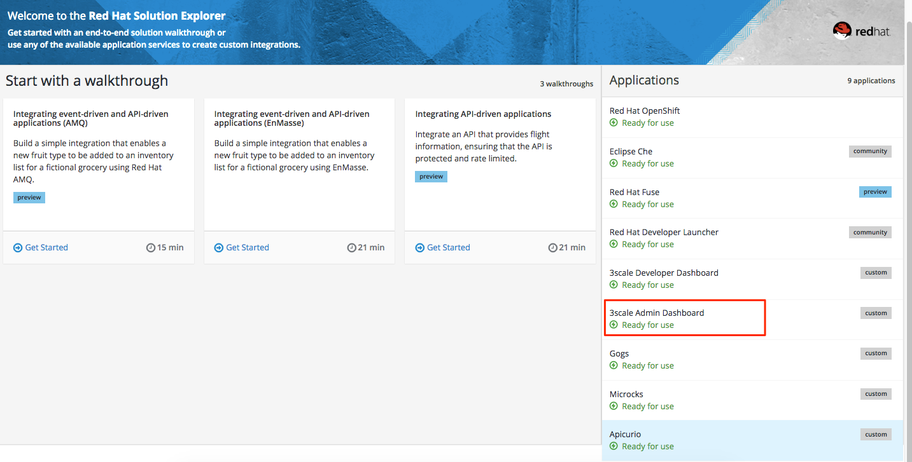

# Lab 5

## Fuse Online

* Duration: 20 mins
* Audience: Developers and Architects

## Overview

When it comes to quick API development, you need both the integration experts as well as application developers to easily develop, deploy the APIs. Here is how to create a simple API with Fuse online. 

### Why Red Hat?

Red Hat Fuse integration solution empowers integration experts, application developers, and business users to engage in enterprise-wide collaboration and high-productivity self-service. 


### Environment

**Credentials:**

Your username is your assigned user number. For example, if you are assigned user number **1**, your username is: 

```bash
user1
```

Please ask your instructor for your password.

**URLs:**

If you haven't done so already, you need to login to the **Red Hat Solution Explorer** webpage so that a unique lab environment can be provisioned on-demand for your exclusive use.  You should open a web browser and navigate to: 

```bash
https://tutorial-web-app-webapp.dil.opentry.me
```

You will be presented with a login page where you can enter your unique credentials:


Enter your credentials and click **Log in**.  You'll notice a web-page appear which explains that a *unique environment* is being provisioned.


Once the environment is provisioned, you will be presented with a page that presents all the available applications which you'll need in order to complete the labs:



## Lab Instructions

### Step 1: Create database connection

1. Via the **Red Hat Solution Explorer** webpage, click the **Red Hat Fuse** link:

   

1. The first time that you hit the Fuse Online URL, you will be presented with an *Authorize Access* page.  Click the **Allow selected permissions** button to accept the defaults.

   

1. Click on **Connections > Create Connection**

   

1. Select **Database**

   

1. Enter below values for Database Configuration

    ```
    Connection URL: jdbc:postgresql://postgresql.OCPPROJECT.svc:5432/sampledb
    Username      : dbuser
    Password      : password
    Schema        : <blank>
    ```
*Remember to replace the OCPPROJECT with the OpenShift project(NameSpace) you created in last lab.*

1. Click **Validate** and verify if the connection is successful. Click **Next** to proceed.

  

6. Add `Connection details`. `Connection Name: LocationDB` and `Description: Location Database`. Click **Create**.
   
   

7. Verify that the `Location Database` is successfully created.

### Step 2: No CODE API developement 

Description goes here

1. Click on **Integrations > Create Integration** 

  

2. Choose **API Provider**

   

3. Select **Create from scratch**

  
  
4. Change the name of the API to `Location` and click on the Add a path link under the Paths section.


5. Fill in the new resource path with the following information:
 - Path: /locations 	


6. Click on the Add a datatype link under the Data Types.


7. Fill in the Name field with the value location. Expand the Enter the JSON Example to paste the following example, then click Save:
 - Name: locationinput
 - JSON Example:
 
 ``
 {
	  "id": 1,
	  "name": "Kamarhati",
	  "type": "Regional Branch",
	  "status": "1",
	  "location": {
	    "lat": "-28.32555",
	    "lng": "-5.91531"
	  }
	}
 ``
 
 
 


8. Create another datatype, this time with the following config and click save.
 - Name: location
 - JSON Example:
 
 ``
 {
    "id": 1,
    "name": "International Inc Corporate Office",
    "location": {
        "lat": 51.5013673,
        "lng": -0.1440787
    },
    "type": "headquarter",
    "status": "1"
 }
 ``
 

9. You will be able to see the two datatypes created. 

 
10. Click on the Create Operation link under POST to create a new POST operation.


11. Edit the description of the post method to *Add Location* and click the orange POST button to edit the operation


12. Click on **Add a request Body**


13. Choose **locationinput** as the *Request Body Type*


14. Click the Add a response link.


15. Set the Response Status Code value to 201. Click Add.


16. Click on **No Description* and place *Location added* in Description box. Click on the tick to save the changes


17. Click on the Type dropdown and select location.
!

18. On the top section, under operation id, name it **addLocation** and click on tick to save the changes. On the very top of the page, click on Save button to return to Fuse Online in order for us to start the API implementation.


19. Click Next.


20. Set `Integration Name: addLocation` and `Description: add Location`

  

21. Click on Add Location operation. 

  


22. Since we are adding incoming data into the database, click on the plus sign in between API entry point and return endpoint, select `Add connection` 

 

23. Click on `LocationDB` from the catalog and then select `Invoke SQL`

 

24. Enter the SQL statement and click **Done**.

 ```
   INSERT INTO locations (id,name,lat,lng,location_type,status) VALUES (:#id,:#name,:#lat,:#lng,:#location_type,:#status )
 ```

 

25. In between top API endpoint and the Database connection, click on the plus sign and select `Add step` and select `Data mapper`

 
 


26. Drag and drop the matching **Source** Data types to all their corresponding **Targets** as per the following screenshot. When finished, click **Done**.

 

27. In between the Database connection and the endpoint, click on the plus sign and select `Add step` and select `Data mapper`

 
 


26. Drag and drop the matching **Source** Data types to all their corresponding **Targets** as per the following screenshot. When finished, click **Done**.

 

27. Click **Publish** on the next screen.

 

*Congratulations*. You successfully published the integration. (Wait for few minutes to build and publish the integration)

### Step 3: Create a POST request

We will use an online cURL tool to create the `101th` record field in database.

1. Copy the `External URL` per the below screenshot

   

1. Open a browser window and navigate to:

   ```
     https://onlinecurl.com/
   ```

1. Below are the values for the request. Note: `id:101` in the payload as we are creating `101th` record in the database.

   ```
     URL: http://i-addlocation-demo.apps.55b9.openshift.opentlc.com/locations

     --header (-H):  Content-Type: application/json

     --data (-d): {"id": 101, "name": "Kamarhati", "type": "Regional Branch", "status": "1", "location": { "lat": "-28.32555", "lng": "-5.91531" }}

     --request (-X): POST
   ```

   

1. The page will load the `204` response information from the service which means the request was successfully fulfilled.

   


1. Click on **Activity > Refresh** and verify if the newly record is created.

   

1. _(Optional)_ Visit the application URL in browser and verify if the record can be fetched.

  **REQUEST**
  ```
   http://location-service-international.dil.opentry.me/locations/101
  
  ```

  **RESPONSE**
  ```
    {
      "id" : 101,
      "name" : "Kamarhati",
      "type" : "Regional Branch",
      "status" : "1",
      "location" : {
        "lat" : "-28.32555",
        "lng" : "-5.91531"
      }
    }
  ```

## Summary

In this lab you discovered how to create an adhoc API service using Fuse Online. 

You can now proceed to [Lab 6](../lab06/#lab-6)


## Notes and Further Reading

* Fuse Online
  * [Webpage](https://www.redhat.com/en/technologies/jboss-middleware/fuse-online)
  * [Sample tutorials](https://access.redhat.com/documentation/en-us/red_hat_fuse/7.1/html-single/fuse_online_sample_integration_tutorials/index)
  * [Blog](https://developers.redhat.com/blog/2017/11/02/work-done-less-code-fuse-online-tech-preview-today/)


