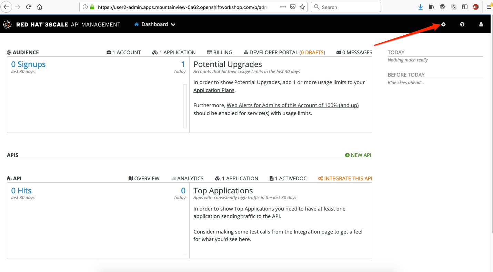
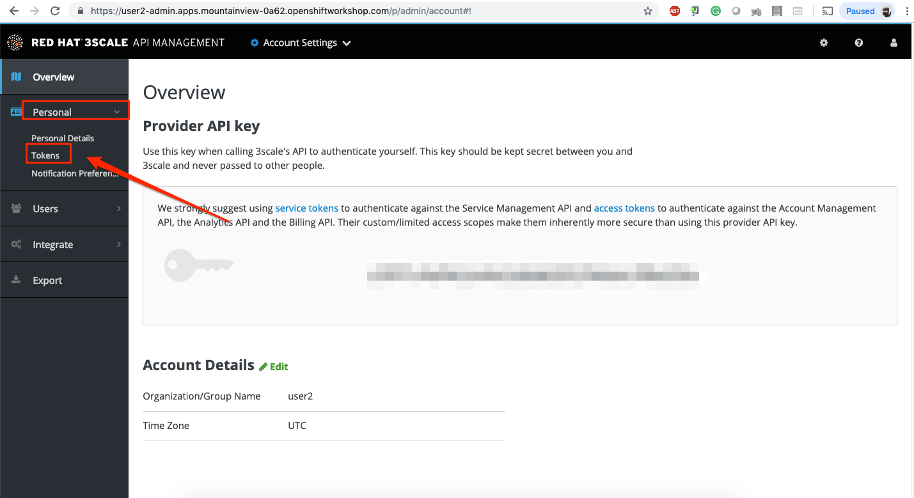
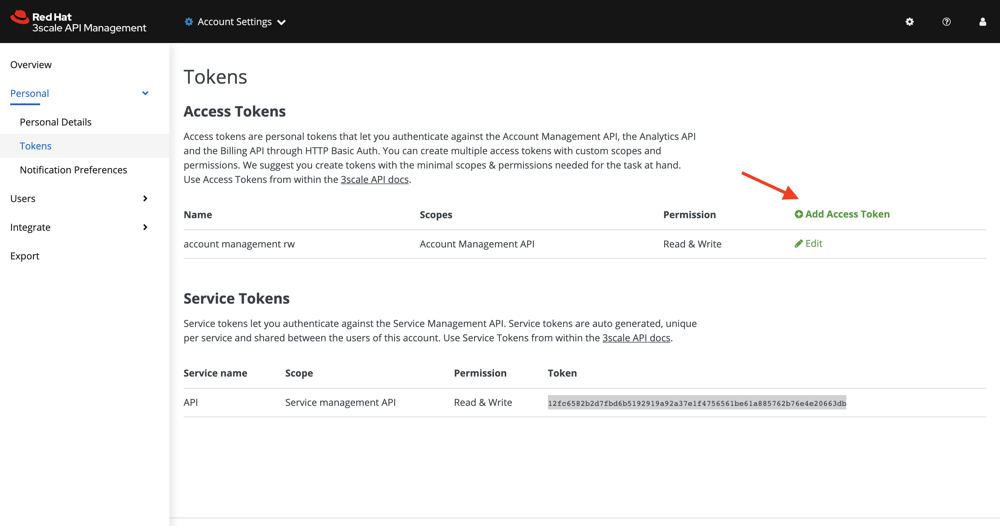
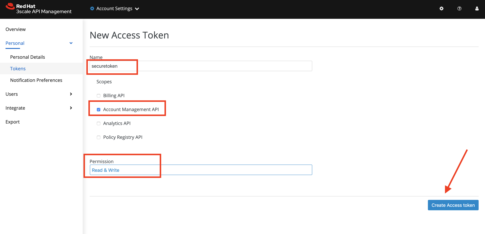
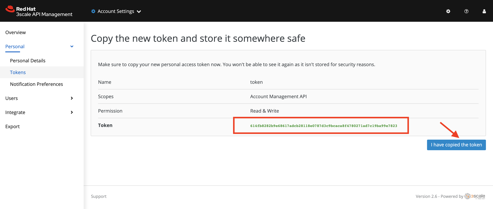

:walkthrough: Managed API using 3scale API Management tools
:3scale-admin-url: http://{user-username}-admin.{openshift-app-host}
:user-password: openshift
:next-lab-url: https://tutorial-web-app-webapp.{openshift-app-host}/tutorial/dayinthelife-integration.git-developer-track-lab06/

ifdef::env-github[]
:next-lab-url: ../lab06/walkthrough.adoc
endif::[]

[id='manage-endpoint']
= Developer Lab 5 - Managed API Endpoints

In this lab, you will protect the Restful endpoints using Red Hat 3scale API Management

Audience: API Owners, Product Managers, Developers, Architects

*Overview*

Once you have APIs deployed in your environment, it becomes critically important to manage who may use them and for what purpose. You also need to begin to track usage of these different users to know who is/is not succeeding in their usage. For this reason in this lab you will be adding management capabilities to the API to give you control and visibility of it's usage.

*Why Red Hat?*

Red Hat provides one the leading API Management tools which provide management services. The 3scale API Management solution enables you to quickly and easy protect and manage your APIs.

*Skipping The Lab*

If you are planning to follow to the next lab, there is an already running API proxy for the Location API Service in this endpoint:

*Credentials:*

Your username is: `{user-username}` +
Your password is: `{user-password}`

[type=walkthroughResource]
.3scale
****
* link:{3scale-admin-url}[3scale Admin Console, window="_blank"]
****

[time=10]
[id="lab-instructions"]
== Get API Token for Automation

Your 3scale Admin Portal provides access to a number of configuration features. An administration token is needed when automating setups for your API. This step will let you create a new token for setup.

. Log in to link:{3scale-admin-url}[3scale Admin, window="_blank"] web console using `{user-username}` and password: `{user-password}`. Click on *Sign in*.
+
image::images/01-login.png[01-login.png, role="integr8ly-img-responsive"]

. The first page you will land is the _API Management Dashboard_. Click on the *Gear Icon* on the top.
+

. Click onto  *Personal*. On the dropdown, Click on *Tokens*.
+

. Click  *Add Access Token* link to create a new management token.
+

. Create a new token that has the `Read & Write` rights to your management platform. Enter Name as *securetoken*, check the *Account management API* checkbox and *READ & WRITE* for Permission.
+

. Please make sure you copy the *Token* to somewhere safe, and don't forget it. Click on *I have copied the token* to finish off.
+

[time=10]
[id="lab-instructions"]
== Start managing your APIs

By running the command lines, it will automatically setup the 3scale API configuration and start managing the API you have exposed.

. In you command line terminal or in your Che terminal enter the following CURL command: *`curl -X POST http://threescale-automate-international.{openshift-app-host}/threescale/automate/{YOUR_API_TOKEN}/{user-username}/{openshift-app-host}`*
+
_Remember to replace *YOUR_API_TOKEN* with your generated *token*_.
+
. The *API automated, DONE!* string should be returned as the result.
+
_Congratulations!_ You have configured 3scale access control layer as a proxy to only allow authenticated calls to your backend API. 3scale is also now:
** Authenticating: (If you test with an incorrect API key it will fail)
** Recording calls (Visit the Analytics tab to check who is calling your API).

*Common Gotcha*

If you encountered the following error:
`+org.apache.camel.http.common.HttpOperationFailedException: HTTP operation failed invoking https://{user-username}-admin.{openshift-app-host}/admin/api/services.xml with statusCode: 422+`

This may be due to a failed build. Troubleshoot by deleting SSO Location API.
SSO Location API can be located here:

* In your browser, `https://{user-username}-admin.{openshift-app-host}`
* Click SSO Location API - *Definition*
* Click *edit*
* Click *I understand the consequences, proceed to delete 'SSO Location API' service.*
+
Try running this command again in the terminal:
+
`curl -X POST http://threescale-automate-international.{openshift-app-host}/threescale/automate/{YOUR_API_TOKEN}/{user-username}/{openshift-app-host}`

[time=2]
[id="Steps-beyond"]
== Steps Beyond

In this lab we just covered the basic creating of a proxy for our API service. Red Hat 3scale API Management also allows us to get a track of the security (as you can see in the next lab) as well as the usage of our API. If getting value from APIs is also important to you, 3scale allows you to monetize your APIs with it's embedded billing system.

Try to navigate through the rest of the tabs of your Administration Portal. Did you notice that there are application plans associated to your API? Application Plans allow you to take actions based on the usage of your API, like doing rate limiting or charging by hit or monthly usage.

[time=2]
[id="Summary"]
== Summary

You set up an API management service and API proxies to control traffic into your API. From now on you will be able to issue keys and rights to users wishing to access the API.

You can now proceed to link:{next-lab-url}[Lab 6].

[time=2]
[id="lab-instructions"]
== Notes and Further Reading

* https://www.3scale.net/[Red Hat 3scale API Management]
* https://developers.redhat.com/blog/2017/05/22/how-to-setup-a-3scale-amp-on-premise-all-in-one-install/[Developers All-in-one 3scale install]
* https://www.thoughtworks.com/radar/platforms/overambitious-api-gateways[ThoughtWorks Technology Radar - Overambitious API gateways]
