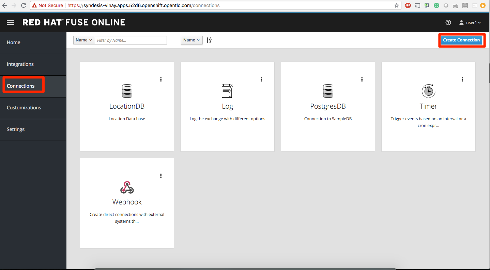

# Lab 6

## Fuse Online

## todo

* Duration: 20 mins
* Audience: Developers and Architects

## Overview

TBD

### Why Red Hat?

TBD

### Skipping the lab

TBD

### Environment

**URLs:**

Check with your instruction the *GUID* number of your current workshop environment. Replace the actual number on all the URLs where you find **GUID**. 

Example in case of *GUID* = **1234**: 

```bash
https://master.GUID.openshiftworkshop.com
```

becomes =>

```bash
https://master.1234.openshiftworkshop.com
```

**Credentials:**

Your username is your asigned user number. For example, if you are assigned user number **1**, your username is: 

```bash
user1
```

The password to login is always the same:

```bash
openshift
```

## Lab Instructions

### Step 1: Create database connection

1. Open a browser window and navigate to:

    ```bash
    http://https://syndesis-user1.apps.GUID.openshift.opentlc.com/
    ```

    *Remember to replace the GUID with your [environment](#environment) value and your user number.*

1. Click on **Connection > Create Connection**

   

1. Select **Database**

   

1. Enter below values for Database Configuration

    ```
    Connection URL: jdbc:postgresql://postgresql.user1.svc:5432/sampledb
    Username      : dbuser
    Password      : password
    Schema        : keep it empty
    ```

1. Click **Validate** and verify if the connection is successful. Click **Next** to proceed.

  

6. Add `Connection details`. `Connection Name: LocationDB` and `Description: Location Database`. Click **Create**.
   
   

7. Verify that the `Location Database` is successfully created.

### Step 2: Create webhook integration

Description goes here

1. Click on **Integration > Create Integration** 

  

2. Choose **Webhook**

  

3. Click on `Incoming webhook` 

  

4. It navigates to the `Webhook Token` screen. Click **Next**

  

5. Define the Output Data Type. `Select type` from the dropdown as `JSON instance`. Enter `Data type Name: Custom`. `Defination: `, copy below JSON data.

    ```
		{
		  "id": 1,
		  "name": "Kamarhati",
		  "type": "Regional Branch",
		  "status": "1",
		  "location": {
		    "lat": "-28.32555",
		    "lng": "-5.91531"
		  }
		}
    ```

  **Screenshot**

 

6. Click on `LocationDB` from the catalog and then select `Invoke SQL`

 

7. Enter the SQL statement and click **Done**.

 ```
   INSERT INTO locations (id,name,lat,lng,location_type,status) VALUES (:#id,:#name,:#lat,:#lng,:#location_type,:#status )
 ```

 **Screenshot**

 

8. Click on `Add step` and select `Data mapper`

 

9. Drag and drop the matching `Source` Data type to the `Target`. Click **Done**

 

10. Click **Publish** on the next screen and add `Integration Name: addLocation`. Again Click **Publish**.

 

*Congratulations*. You sucessfully published the integration.


