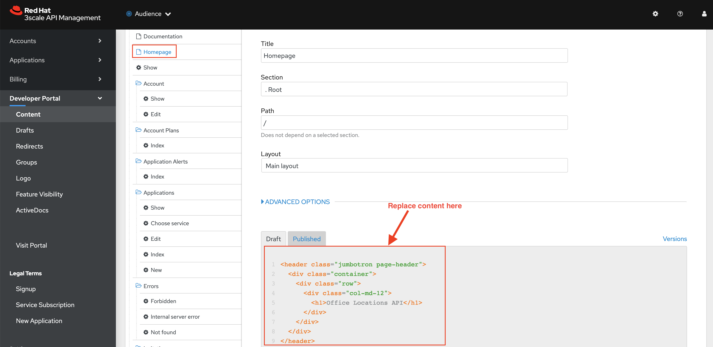
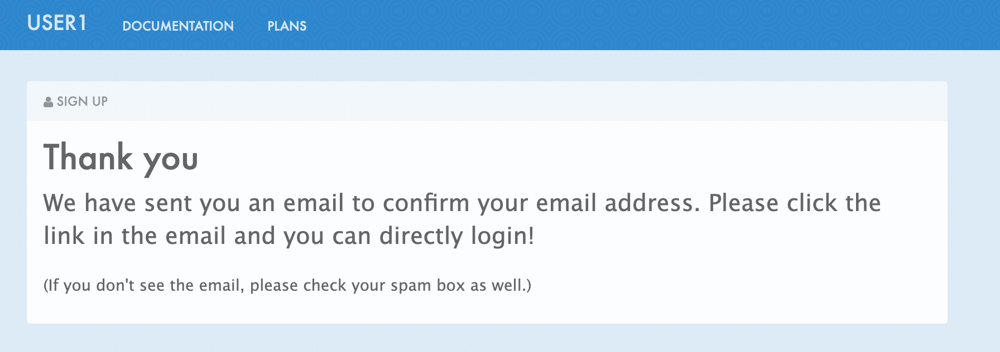
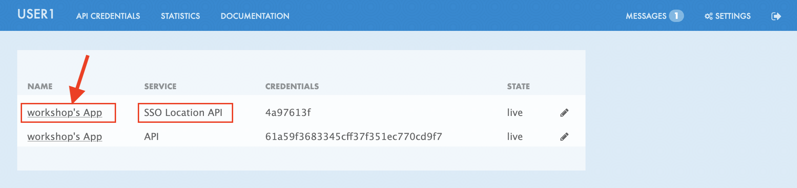

:walkthrough: Create and customize the API Developer Portal
:3scale-admin-url: http://{user-username}-admin.{openshift-app-host}
:3scale-dev-portal-url: http://{user-username}.{openshift-app-host}
:user-password: openshift
:next-lab-url: https://tutorial-web-app-webapp.{openshift-app-host}/tutorial/dayinthelife-integration.git-developer-track-lab07/

ifdef::env-github[]
:next-lab-url: ../lab07/walkthrough.adoc
endif::[]

[id='dev-portal']
= Developer Lab 6 - API Developer Portal

In this lab, you will customize the API developer portal

Audience: API Owners, Product Managers, Developers, Architects

*Overview*

The focal point of your developers`' experience is the API developer portal, and the level of effort you put into it will determine the level of decreased support costs and increased developer engagement.

*Why Red Hat?*

3scale provides a built-in, state-of-the-art CMS portal, making it very easy to create your own branded hub with a custom domain to manage developer interactions and increase API adoption.

You can customize the look and feel of the entire Developer Portal to match your own branding. You have complete control over every element of the portal, so you can make it as easy as possible for developers to learn how to use your API.

*Credentials:*

Your username is: `{user-username}` +
Your password is: `{user-password}`

[type=walkthroughResource]
.3scale
****
* link:{3scale-admin-url}[3scale Admin Console, window="_blank"]
****

[type=walkthroughResource]
.3scale
****
* link:{3scale-dev-portal-url}[3scale Developer Portal, window="_blank"]
****

[time=10]
[id="customize-dev-portal"]
== Customizing Developer Portal

. Switch to the web browser window, displaying the console for the *Red Hat 3scale API Management Platform*.

. Log in to link:{3scale-admin-url}[3scale Admin, window="_blank"] web console using `{user-username}` and password: `{user-password}`. Click on *Sign in*.
+
image::images/01-login.png[01-login.png, role="integr8ly-img-responsive"]

. Select the *SSO Location API* from the dropdown to edit the application plan settings.
+

. Click on the *Applications* on the left menu. Select *Application plans* from the listed dropdown. 

. Publish your application plan by clicking in on the *Publish* option on the page.
+

. Click on the *Developer Portal* tab to access the developer portal settings.
+

. On the left menu select *Home Page*, and replace the entire content with what's in the example link: https://raw.githubusercontent.com/RedHat-Middleware-Workshops/dayinthelife-integration/master/docs/labs/developer-track/lab06/support/homepage.example[example]
+

. Click the _Publish_ button at the bottom of the editor to save the changes and made them available in the site.

. Go back to your *Audience*. Click on the *Visit Developer Portal* to take a look of how your developer portal looks like.
+

. The Developer Portal should show the _Location API_ and the _Secure_ plan with a sign up button.
+

[type=verification]
Were you able to customize the developer portal?

[type=verificationFail]
Try to redo this section, if any problem persists have your instructor check the Kubernetes pod that contains the 3scale API Management application.

[time=10]
[id="register-dev-portal"]
== Register New Accounts Using Developer Portal

. Take the place of one of your developers and signup for the *Secure* plan.
+

. Fill in your information and an email to register as a developer. Click on the *Sign up* button.
+

. The system will try to send a message with an activation link.
+

+
_Currently the lab environment doesn't have a configured email server, so we won't be able to receive the email_.

. Go back to your _Admin Portal_ tab and navigate to *Audience* to activate the new account.

. Find your user under the _Accounts_ and click the *Activate* link.
+

+
_Your user is now active and can log into the portal_.

. Now we need to make sure the the application will redirect the user to the correct page after successful login. Go to the Developer tab and login as the user you have created in the previous step.
+

. Click on *See you Applications & their credentials* link.
+

. Select the application for the `SSO Location API` service
+

. Update redirect link to `http://www-{user-username}.{openshift-app-host}/*`
+

+
_Copy down the client id and client secret credentials as it you will use them to authenticate yourself to the managed API_.

[type=verification]
Were you able to activate your user account?

[type=verificationFail]
Try to redo this section, if any problem persists have your instructor check the Kubernetes pod that contains the 3scale API Management application.

_Congratulations!_ You have successfully customized your Developer Portal and completed a Sign Up process.

[time=1]
[id="step-beyond"]
== Steps Beyond

So, you want more? Click the *Documentation* link. Where does it takes you? _API Docs_ is where you can add your interactive documentation for your APIs. Is based on the known _Swagger UI_ interface.

You can add from the Admin Portal under _API Docs_ the API definition to generate the live testing.

[time=1]
[id="summary"]
== Summary

In this lab you discovered how to add a developer facing experience to your APIs. Developers in your organization or outside of it can now register, gain access to API keys and develop sample applications.

You can now proceed to link:{next-lab-url}[Lab 7].

[time=1]
[id="further-reading"]
== Notes and Further Reading

Red Hat 3scale Developer Portal's CMS consists of a few elements:

* Horizontal menu in the Admin Portal with access to content, redirects, and changes
* The main area containing details of the sections above
* CMS mode, accessible through the preview option

https://github.com/Shopify/liquid[Liquid] is a simple programming language used for displaying and processing most of the data from the 3scale system available for API providers. In 3scale, it is used to expose server-side data to your API developers, greatly extending the usefulness of the CMS while maintaining a high level of security.

=== Links

* https://access.redhat.com/documentation/en-us/red_hat_3scale/2.2/html/developer_portal/[Developer Portal Documentation]
* https://github.com/Shopify/liquid[Liquid markup language]
* https://www.shopify.com/partners/blog/115244038-an-overview-of-liquid-shopifys-templating-language[And Overview of Liquid]
