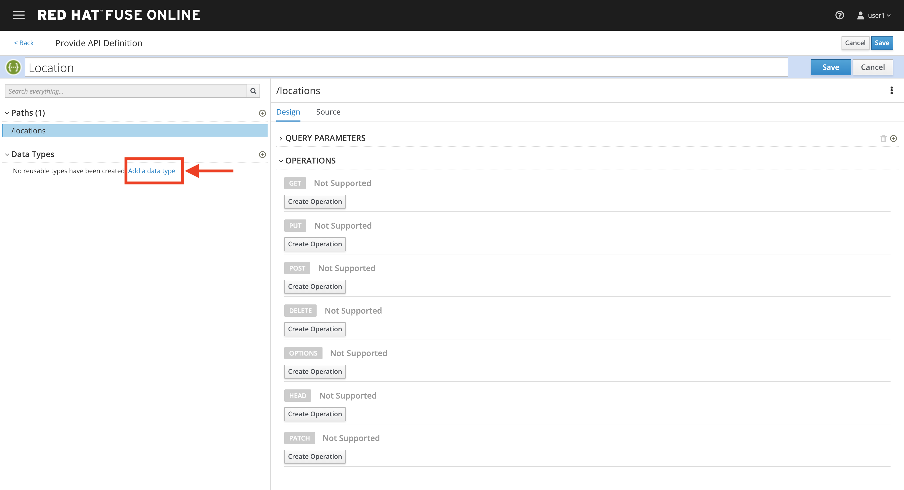
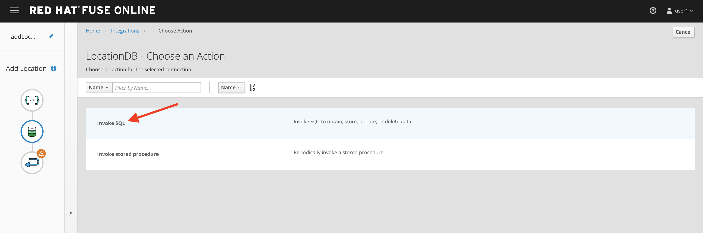
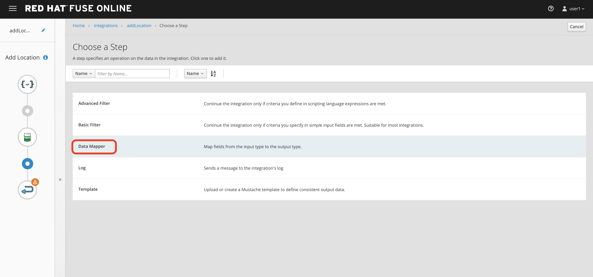

# Lab 8

## Fuse Online & 3Scale Smart Discovery Bonus Lab

* Duration: 20 mins
* Audience: Developers and Architects

## Overview

When it comes to quick API development, you need both the integration experts as well as application developers to easily develop and deploy the APIs. This lab demonstrates how to implement a simple API with Fuse Online.  Instead of using APICurio to create the API contract, we use Apicurito (an embedded version of Apicurio) to define our contract directly in Fuse Online.  We then implement our API with Fuse, then manage and secure it using 3scale.  This flow gives us an easy end-to-end walkthrough of defining, implementing, managing and securing an API.

### Why Red Hat?

Red Hat Fuse integration solution empowers integration experts, application developers, and business users to engage in enterprise-wide collaboration and high-productivity self-service.


### Environment

**Credentials:**

Your username is your assigned user number. For example, if you are assigned user number **1**, your username is:

```bash
user1
```

Please ask your instructor for your password.

**URLs:**

If you haven't done so already, you need to login to the **Red Hat Solution Explorer** webpage so that a unique lab environment can be provisioned on-demand for your exclusive use.  You should open a web browser and navigate to:

```bash
https://tutorial-web-app-webapp.apps.newton-46c9.openshiftworkshop.com
```

You will be presented with a login page where you can enter your unique credentials:


Enter your credentials and click **Log in**.  You'll notice a web-page appear which explains that a *unique environment* is being provisioned.


Once the environment is provisioned, you will be presented with a page that presents all the available applications which you'll need in order to complete the labs:


## Lab Instructions

### Step 1: Create database connection

1. Via the **Red Hat Solution Explorer** webpage, click the **Red Hat Fuse** link:

   

1. The first time that you hit the Fuse Online URL, you will be presented with an *Authorize Access* page.  Click the **Allow selected permissions** button to accept the defaults.

   

1. Click on **Connections > Create Connection**

   

1. Select **Database**

   

1. Enter below values for Database Configuration

    ```
    Connection URL: jdbc:postgresql://postgresql.international.svc:5432/sampledb
    Username      : dbuser
    Password      : password
    Schema        : <leave blank>
    ```

1. Click **Validate** and verify if the connection is successful. Click **Next** to proceed.

   

1. Add `Connection details`. `Connection Name: LocationDB` and `Description: Location Database`. Click **Create**.

   

1. Verify that the `Location Database` is successfully created.

### Step 2: No CODE API developement

1. Click on **Integrations > Create Integration**

  

2. Choose **API Provider**

   

3. Select **Create from scratch**

  

4. Change the name of the API to `Location` and click on the Add a path link under the Paths section.
   

5. Fill in the new resource path with the following information:
 - Path: /locations 	
   

6. Click on the Add a datatype link under the Data Types.
   

7. Fill in the Name field with the value location. Expand the Enter the JSON Example to paste the following example, then click Save:
 - Name: locationinput
 - JSON Example:

 ``
 {
	  "id": 1,
	  "name": "Kamarhati",
	  "type": "Regional Branch",
	  "status": "1",
	  "location": {
	    "lat": "-28.32555",
	    "lng": "-5.91531"
	  }
	}
 ``

   
    


8. Create another datatype, this time with the following config and click save.
 - Name: location
 - JSON Example:

 ``
 {
    "id": 1,
    "name": "International Inc Corporate Office",
    "location": {
        "lat": 51.5013673,
        "lng": -0.1440787
    },
    "type": "headquarter",
    "status": "1"
 }
 ``
 

9. You will be able to see the two datatypes created.


10. Click on the Create Operation link under POST to create a new POST operation.


11. Edit the description of the post method to *Add Location* and click the orange POST button to edit the operation


12. Click on **Add a request Body**


13. Choose **locationinput** as the *Request Body Type*


14. Click the Add a response link.


15. Set the Response Status Code value to 201. Click Add.


16. Click on *No Description* and place *Location added* in Description box. Click on the tick to save the changes


17. Click on the Type dropdown and select location.
!

18. On the top section, under operation id, name it **addLocation** and click on tick to save the changes. On the very top of the page, click on Save button to return to Fuse Online in order for us to start the API implementation.


19. Click Next.


20. Set `Integration Name: addLocation` and `Description: add Location`

  

21. Click on Add Location operation.

  


22. Since we are adding incoming data into the database, click on the plus sign in between API entry point and return endpoint, select `Add connection`

 

23. Click on `LocationDB` from the catalog and then select `Invoke SQL`

 

24. Enter the SQL statement and click **Done**.

 ```
   INSERT INTO locations (id,name,lat,lng,location_type,status) VALUES (:#id,:#name,:#lat,:#lng,:#location_type,:#status )
 ```

 

25. In between top API endpoint and the Database connection, click on the plus sign and select `Add step` and select `Data mapper`

 
 


26. Drag and drop the matching **Source** Data types to all their corresponding **Targets** as per the following screenshot. When finished, click **Done**.

 

27. In between the Database connection and the endpoint, click on the plus sign and select `Add step` and select `Data mapper`

 
 


26. Drag and drop the matching **Source** Data types to all their corresponding **Targets** as per the following screenshot. When finished, click **Done**.

 

27. Click **Publish** on the next screen.

 

*Congratulations*. You successfully published the integration. (Wait for few minutes to build and publish the integration)

### Step 3: Secure the API in 3scale using Smart Discovery

We will use 3scale to secure our newly deployed Fuse Online integration.  We introduce a new feature, Smart Discovery, which detects that a new API was deployed to OpenShift.

1. Click on the `3scale Admin Dashboard` from the Red Hat Solution Explorer. The URL should look like

    ```bash
    https://userX-admin.apps.newton-46c9.openshiftworkshop.com/p/login
    ```

    *Remember the `X` variable in the URL with your assigned user number.*

1. Accept the self-signed certificate if you haven't.

1. Log into 3scale using your designated [user and password](#environment). Click on **Sign In**.

    

1. The first page you will land is the *API Management Dashboard*. Click on the **API** menu link.

1. Click on the **New API**.

    

1. Click on **Authenticate to enable this option** so we can import our new API from OpenShift.

    

1.  Click on **Allow selected permissions** to Authorize access.

    

1.  Select the **Import from OpenShift**.  If all goes well, you should see your fuse namespace appear and a default **Name**.  Click the ** Create Service** button.

    

1.  The page should return to the dashboard.  Refresh the page.  Notice that the *I-ADDLOCATION API* has been added to the list.  Click **Integrate this API**.

    

1. Click on the **edit integration settings** to edit the API settings for the gateway.

    

1. Keep select the **APIcast** deployment option in the *Gateway* section.

    

1. Scroll down and keep the **API Key (user_key)** Authentication.

    

1. Click on **Update Service**.

1. Click on the **edit APIcast configuration** link.

    

1. Leave the settings for `Private Base URL`as it is. Update the `Staging Public Base URL` and `Production Public Base URL` fields to the following:

    * Staging Public Base: `https://i-addlocation-userX-apicast-staging.amp.apps.newton-46c9.openshiftworkshop.com:443`
    * Production Public Base URL: `https://i-addlocation-user5-apicast-production.amp.apps.newton-46c9.openshiftworkshop.com:443`

    

1. Scroll down and expand the **MAPPING RULES** section to define the allowed methods on our exposed API.

    *The default mapping is the root ("/") of our API resources, and this example application will not use that mapping. The following actions will redefine that default root ("/") mapping.*

    

1. Click on the **Metric or Method (Define)**  link.

    

1. Click on the **New Method** link in the *Methods* section.

    

1. Fill in the information for your Fuse Method.

    * Friendly name: **Add Locations**

    * System name: **add_location**

    * Description: **Method to add a new location**

    

1. Click on **Create Method**.

1. Click on the **Add mapping rule** link.

    

1. Click on the **Add Mapping Rule** link.

    

1. Select **POST** as the Verb.  Type in the *Pattern* text box the following:

    ```bash
    /locations
    ```

1. Select **add_location** as Method from the combo box.

    

1. Scroll down to the **API Test GET request**.

1. Type in the textbox:

    ```bash
    /openapi.json
    ```

1. Click on the **Update the Staging Environment** to save the changes and check the connection between client, gateway and API.

    

    *You should expect to get an error message*.

1.  Our integration update is in error because we haven't yet created an application plan.  To do this, click on the link inside of the the error message

    

1.  Click **Create Application Plan** link again.

    

1.  Enter the Application Plan details, then click **Create Application Plan**.

    * Name: **basic-integration**

    * System name: **basic-integration**

    

1. Click on *Publish** to publish your newly minted plan.

    

1.  Click on the **API: i-addlocation** dropdown menu, then select **Audience**.  Next click **Listing** on the side menu.  A listing of *Accounts* should appear.  Next click the **Developer** Account.

    

1. An Account configuration page should appear.  Click on the *1 Application* link at the top of the page.

    

1. Click on **Create Application**

    

1. Select *basic-integration* as the **Application Plan**.  Select *Default* as the **Service Plan**.  Enter **i-integration** as the Name.  Click *Create Application*.  An Application page should appear.  It will contain a newly created API User Key for use with your new `i-integration` application.

    

1.  Next, click on the Integration > Configuration side-menu.

    

1. Next, click on *edit APIcast configuration*.

    

1. Scroll down to the *Client* section.  Copy the full *curl* URL in the box.  Paste it into a text editor as will need it shortly.

    

1. Click on the **Update the Staging Environment** to save the changes and check the connection between client, gateway and API.

    

    *If everything works, you will get a green message on the left.*

1. Click on **Back to Integration &amp; Configuration** link to return to your API overview.

    

1. Click on the **Promote v.1 to Production** button to promote your configuration from staging to production.

    

### Step 4: Create a POST request

We will use an API Tester tool to create a record field in database.

1. Open a browser window and navigate to:

   ```
     https://apitester.com/
   ```

1. Below are the values for the request. Note: `id:101` in the payload as we are creating `101th` record in the database.  You will change this record number based on your user number shortly.

* Method: **POST**

* URL: **`https://i-addlocation-userX-apicast-staging.amp.apps.newton-46c9.openshiftworkshop.com:443/locations?user_key=XXX` [copy the information you need from the 3scale curl command you copied earlier]**

* Request Header: **Content-Type** and **application/json**

* Post Data:

  ```
  {"id": 102, "name": "Kamarhati", "type": "Regional Branch", "status": "1", "location": { "lat": "-28.32555", "lng": "-5.91531" }}
  ```

  *Don't forget to update the id field to end with your user number e.g. 102 if you are user2.*

   

1. The page will load the `201` response information from the service which means the request was successfully fulfilled.

   


1. Click on **Activity > Refresh** and verify if the newly record is created.

   

1. _(Optional)_ Visit the application URL in browser and verify if the record can be fetched.  **Don't forget to append your username to the record ID e.g user6 = 106**

  **REQUEST**
  ```
   http://location-service-international.apps.newton-46c9.openshiftworkshop.com/locations/101
  ```

  **RESPONSE**
  ```
    {
      "id" : 101,
      "name" : "Kamarhati",
      "type" : "Regional Branch",
      "status" : "1",
      "location" : {
        "lat" : "-28.32555",
        "lng" : "-5.91531"
      }
    }
  ```

## Summary

In this lab you discovered how to create an adhoc API service using Fuse Online, then managing it with 3scale using the new *Smart Discovery* feature.

This is the last lab of this workshop.

## Notes and Further Reading

* Fuse Online
  * [Webpage](https://www.redhat.com/en/technologies/jboss-middleware/fuse-online)
  * [Sample tutorials](https://access.redhat.com/documentation/en-us/red_hat_fuse/7.1/html-single/fuse_online_sample_integration_tutorials/index)
  * [Blog](https://developers.redhat.com/blog/2017/11/02/work-done-less-code-fuse-online-tech-preview-today/)
