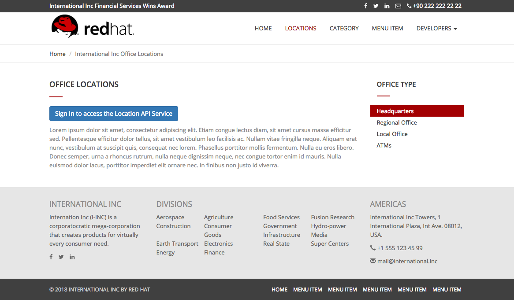

= Developer Lab 8 - API Consumption
:walkthrough: Create a simple web application which consumes the API you built earlier in the exercises

[time=15]
== API Consumption

=== Connect Applications and APIs

* Duration: 15 mins
* Audience: API Consumers, Developers, Architects

=== Overview

APIs provide the building blocks for applications, but it is applications which deliver functionality to the end users. hence to see APIs in action it helps to see how applications can call APIs to provide new functionality. In this lab you'll be able to create a simple web application which consumes the API you built earlier in the exercises.

=== Why Red Hat?

Applications can be built from many technologies. In this case we use a simple web application, but a wide range of Red Hat and non-Red Hat technologies could be used.

=== Skipping The Lab

If you decide to skip the lab you can check how a SSO enabled web applications looks like:

[source,bash]
----
http://www-international.{openshift-app-host}/
----

=== Environment

*Credentials:*

Your username is your assigned user number. For example, if you are assigned user number *1*, your username is:

[source,bash]
----
user1
----

Please ask your instructor for your password.

*URLs:*

If you haven't done so already, you need to login to the *Red Hat Solution Explorer* webpage so that a unique lab environment can be provisioned on-demand for your exclusive use.  You should open a web browser and navigate to:

[source,bash]
----
https://tutorial-web-app-webapp.{openshift-app-host}
----

You will be presented with a login page where you can enter your unique credentials:

image::images/design-50.png[design-login, role="integr8ly-img-responsive"]

Enter your credentials and click *Log in*.  You'll notice a web-page appear which explains that a _unique environment_ is being provisioned.

image::images/design-51.png[design-login, role="integr8ly-img-responsive"]

Once the environment is provisioned, you will be presented with a page that presents all the available applications which you'll need in order to complete the labs:

image::images/design-52.png[design-login, role="integr8ly-img-responsive"]

== Lab Instructions

=== Step 1: Update OpenShift Deployment

OpenShift let you automatically redeploy your changes when you setup a Continuous Integration / Continuous Deployment (CI/CD) pipeline through the use of webhook. For this lab we will trigger the new build and deployment manually through the OpenShift Console.

. Go back to your OpenShift web console. Navigate to your project's overview page.
. Scroll down and click in the www link in the BUILDS section.
+
image::images/deploy-10.png[01-scroll-down, role="integr8ly-img-responsive"]

. In the build configuration page, replace the `CLIENT_ID` from ``CHANGE_ME``to the one generated from https://github.com/RedHatWorkshops/dayinthelife-integration/tree/master/docs/labs/citizen-integrator-track/lab06#step-3-login-to-developer-portal[Lab 06 Step 3.5]
+
image::images/deploy-11.png[02-client-id, role="integr8ly-img-responsive"]

. Click Save button to persist the changes. A green pop up will show you that the changes were saved.
. Click the Start Build button to trigger a new build using the new environment variables pointing to your service.
+
image::images/deploy-12.png[03-start-build, role="integr8ly-img-responsive"]

. A new build will be triggered. Expand the row by clicking the Builds Icon.
+
image::images/deploy-13.png[04-view-build, role="integr8ly-img-responsive"]

_The build process checks out the code from the git repo, runs a source-to-image container image build, and redeploys the container with the new image using a rolling upgrade strategy._

. Wait for until the new Build to complete and the rolling upgrade to finish to test your new deployment.
+

=== Step 2: Update Secured Service with Red Hat Single Sign On Application Callback

Redirect URLs are a critical part of the OAuth flow. After a user successfully authorizes an application, the authorization server will redirect the user back to the application with either an authorization code or access token in the URL. Because the redirect URL will contain sensitive information, it is critical that the service doesn't redirect the user to arbitrary locations.

. Open a browser window and navigate to:
+
[source,bash]
----
 http://sso-sso.{openshift-app-host}/auth/admin/userX/console/
----
+
_Remember to replace the X with your user number._

. Log into Red Hat Single Sign On using your designated <<environment,user and password>>. Click on *Sign In*.
+
image::images/00-login-sso.png[00-login-sso.png, role="integr8ly-img-responsive"]

. Select *Clients* from the left menu.
+
image::images/00-clients.png[00-clients.png, role="integr8ly-img-responsive"]
+
_3scale, through it's https://github.com/3scale/zync/[zync] component, already synchronized the application information into the Red Hat SSO security realm_.

. Click on the *CLIENT_ID* link to view the details.
+
_Remember to select correct CLIENT_ID with the one you got in the link:../lab07[API Security Lab]. It will easily identifiable as its and hexadecimal name_.
+
image::images/consume-24.png[24-client-application, role="integr8ly-img-responsive"]

. Scroll down, type in and select the following options in the application configuration:
+
|===
| Field | Value

| Access Type
| Public

| Standard Flow Enabled
| ON

| Implicit Flow Enabled
| OFF

| Valid Redirect URIs
| http://www-userX.{openshift-app-host}/*

| Web Origins
| *
|===
+
_Remember to replace the X with your user number._
+
image::images/consume-25.png[25-client-config, role="integr8ly-img-responsive"]

. Finally, click *Save* button to persist the changes.

=== Step 5: Test the Single Sign On Integration

. Open a browser tab and navigate to `+http://www-userX.{openshift-app-host}+`.

_Remember to replace the X your user number._

. Click the *Sign In* button.
. You are being redirected to Red Hat Single Sign On *Login Page*. Login using the user credentials you created in the link:../lab04/#step-2-add-user-to-realm[API Security Lab]
 ** Username: *userX*
 ** Password: *password you received from instructor*

+
image::images/consume-23.png[23-realm-login, role="integr8ly-img-responsive"]
. You will be redirected again to the *LOCATIONS* page where now you will be able to see the map with the International Inc Offices.
+
image::images/consume-14.png[11-locations-page, role="integr8ly-img-responsive"]

_Congratulations!_ You have successfully used the Keycloak Javascript Adapter to protect International Inc's Locations Service with Single Sign On.

== Steps Beyond

So, you want more? You can explore in detail the documentation on the Javascript Adapter to check what other things can you get from your authenticated user.

== Summary

In total you should now have been able to follow all the steps from designing and API, deploying it's code, issuing keys, connecting OpenID connect and calling it from an application. This gives you a brief overview of the creation and deployment of an API. There are many variations and extensions of these general principles to explore!

== Notes and Further Reading

* http://microcks.github.io/[Red Hat 3scale API Management]
* https://developers.redhat.com/blog/2017/11/21/setup-3scale-openid-connect-oidc-integration-rh-sso/[Setup OIDC with 3scale]
