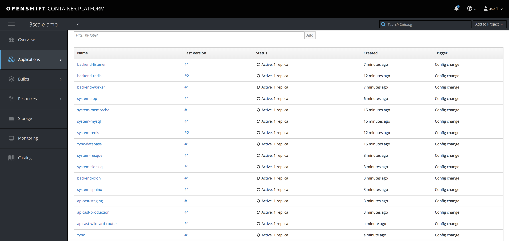

= Installing 3scale AMP 2.x On Premise on OpenShift

The following lab exercise walks through the procedure to install and setup a single tenant 3scale AMP instance on OpenShift.

[discrete]
=== Prerequisites

. You have access to a running OpenShift instance
. You have `oc` tools installed locally and can connect to your OpenShift instance.  If not, follow the documentation https://docs.openshift.com/container-platform/3.10/cli_reference/get_started_cli.html#installing-the-cli[here]

[discrete]
=== Login as developer and start AMP with template

. Obtain the public IP for your OpenShift environment, as you'll need it to run the below commands
. Run the below commands, and replace the associated +++<PUBLIC_DNS>+++with the public DNS for your OpenShift lab environment. Do the same by replacing +++<USERNAME>+++with your assigned lab username.+++</USERNAME>++++++</PUBLIC_DNS>+++

----
oc login https://master.<PUBLIC_DNS>:8443 --insecure-skip-tls-verify

oc new-project 3scale-amp-<USERNAME>

oc new-app --file https://raw.githubusercontent.com/RedHatWorkshops/dayinthelife-integration/master/labs/operations-track/artifacts/amp.yml --param TENANT_NAME=3scale-<USERNAME> --param WILDCARD_DOMAIN=apps.<PUBLIC_DNS> >> /tmp/3scale_amp_provision_details.txt
----

. Verify the script ran correctly by verifying the output log.  Notice the admin login credentials underneath the `system` section.  You'll need these credentials later.

----

cat /tmp/3scale_amp_provision_details.txt

--> Deploying template "3scale-amp-user1/3scale-api-management" for "https://raw.githubusercontent.com/RedHatWorkshops/dayinthelife-integration/master/labs/operations-track/artifacts/amp.yml" to project 3scale-amp-user1

     3scale API Management
     ---------
     3scale API Management main system

     Login on https://3scale-user1-admin.apps.boston.openshiftworkshop.com as admin/pnxw6h76

     * With parameters:
        * PostgreSQL Connection Password=nfr8GSShoKQmke60 # generated
        * ZYNC_SECRET_KEY_BASE=pYwfDdc7lFVFmHcE # generated
        * ZYNC_AUTHENTICATION_TOKEN=qHGtOaIUMc2GeEje # generated
        * AMP_RELEASE=2.2.0
        * ADMIN_PASSWORD=pnxw6h76 # generated
        * ADMIN_USERNAME=admin
        * APICAST_ACCESS_TOKEN=tlmvxmj7 # generated
        * ADMIN_ACCESS_TOKEN=ax3s1h46kywsjhbg # generated
        * WILDCARD_DOMAIN=apps.boston.openshiftworkshop.com
        * WILDCARD_POLICY=None
        * TENANT_NAME=3scale-user1
        * MySQL User=mysql
        * MySQL Password=a1x6j0c1 # generated
        * MySQL Database Name=system
        * MySQL Root password.=d2ttu7c5 # generated
        * SYSTEM_BACKEND_USERNAME=3scale_api_user
        * SYSTEM_BACKEND_PASSWORD=bda7lqc3 # generated
        * REDIS_IMAGE=registry.access.redhat.com/rhscl/redis-32-rhel7:3.2
        * MYSQL_IMAGE=registry.access.redhat.com/rhscl/mysql-57-rhel7:5.7-5
        * SYSTEM_BACKEND_SHARED_SECRET=hc21sw03 # generated
        * SYSTEM_APP_SECRET_KEY_BASE=8d7eaaa455b4a5cbe64a476d33e71e33cae1c5845b2844884056b8d3cd72c51506433601050ed56b58182716de8362782bc4d030103d828e77b57025d26e55eb # generated
        * APICAST_MANAGEMENT_API=status
        * APICAST_OPENSSL_VERIFY=false
        * APICAST_RESPONSE_CODES=true
        * MASTER_NAME=master
        * MASTER_USER=master
        * MASTER_PASSWORD=7twglug7 # generated
        * MASTER_ACCESS_TOKEN=l3xbnhtj # generated
        * APICAST_REGISTRY_URL=http://apicast-staging:8090/policies
----

. Via the CLI, resume the database tier pods by running the following commands:

----
for x in backend-redis system-memcache system-mysql system-redis zync-database; do echo Resuming dc:  $x; sleep 2; oc rollout resume dc/$x; done
----

. Via the OpenShift Web Console or CLI, verify the Database pods are running:

----
oc get pods
NAME                      READY     STATUS    RESTARTS   AGE
backend-redis-1-q2hnc     1/1       Running   0          53s
system-memcache-1-ggjgm   1/1       Running   0          49s
system-mysql-1-pg7rm      1/1       Running   0          1m
system-redis-1-klthg      1/1       Running   0          44s
zync-database-1-w66qf     1/1       Running   0          52s
----

. Via the OpenShift Web Console, navigate to Applications > Deployments.  If after roughly 2 minutes there are deployment pods stuck in a "Running" state, this could be because of a Resource Limit issue.  Click on the deployment config for that pod and modify the resource limits by selecting Actions > Edit Resource Limits.  If there is an issue, it should be highlighted in red.  Update the value to the maximum allowed limit for your system e.g. 6 GiB.  The pod should redeploy once you've saved the change.
. Resume backend listener and worker deployments:

----
for x in backend-listener backend-worker; do echo Resuming dc:  $x; sleep 2; oc rollout resume dc/$x; done
----

. Resume the system-app and its two containers:

----
oc rollout resume dc/system-app
----

. Resume additional system and backend application utilities:

----
for x in system-resque system-sidekiq backend-cron system-sphinx; do echo Resuming dc:  $x; sleep 2; oc rollout resume dc/$x; done
----

. Resume apicast gateway deployments:

----
for x in apicast-staging apicast-production; do echo Resuming dc:  $x; sleep 2; oc rollout resume dc/$x; done
----

. Resume remaining deployments:

----
for x in apicast-wildcard-router zync; do echo Resuming dc:  $x; sleep 2; oc rollout resume dc/$x; done
----

. If you have completed this task correctly, you should see all 16 pods in an "Active" state like below:

. You can also verify the installation by logging into the 3scale admin page following the link and credentials specified by the output log file in Step 3.  If you successfully login, you should see the following screen:

image::images/01-Step-13.png[Type Project Name]
