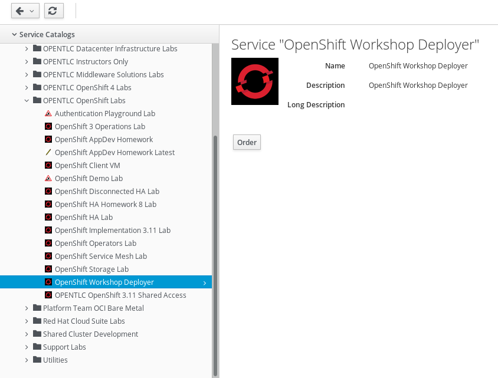
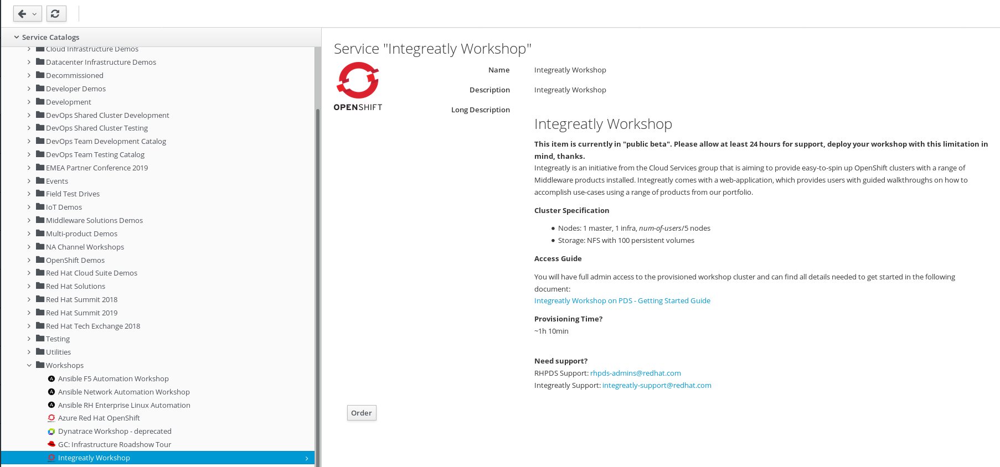
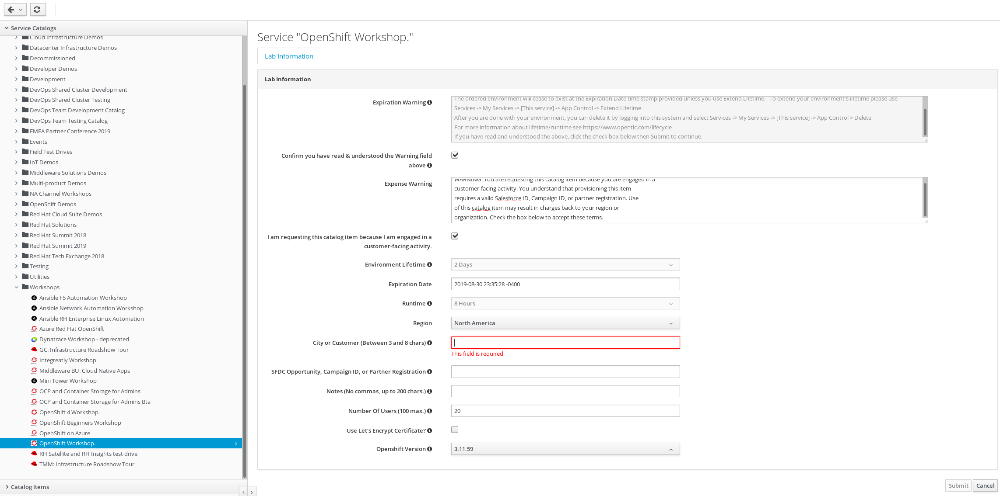

# Day In The Life Workshop Installation Guide

## How to Install the Workshop Content

This page describes the installation of the Day In Life Workshop Content from the latest tagged release on GitHub.

### Pre-requisites

* You will need an OpenShift Container Platform environment, that will host the Integreatly (RHMI) system, to install this workshop on. You can order a vanilla provisioning from the Red Hat Product Demo System (RHPDS) following this [instructions](https://mojo.redhat.com/docs/DOC-1175640).

* To install the Day In Life Workshop, you need to a personal workstation (PC) with the latest stable release version of the OpenShift client tools.

* You can download the OpenShift Client Tools from [Red Hat Developers Portal Site](https://developers.redhat.com/products/openshift/download/) or follow the instructions on how to [Install the CLI](https://docs.openshift.com/container-platform/3.9/cli_reference/get_started_cli.html#installing-the-cli) from the openshift.com webpage.

* You'll want to know how to [fork](https://help.github.com/articles/fork-a-repo/) and [clone](https://help.github.com/articles/cloning-a-repository/) a Git repository, and how to [check out a branch](https://git-scm.com/docs/git-checkout#git-checkout-emgitcheckoutemltbranchgt).

* Day In Life Workshop has to be installed using Ansible playbooks.

### Installing Integreatly

There are two options to installing Integreatly, you may choose only one.

#### OPTION 1 (FOR RED HAT STAFF)

1. Login to [OPENTLC LABS](https://labs.opentlc.com) and provision an OpenShift Container Platform cluster using the *OpenShift Workshop Deployer* catalog item:


2. Populate the required fields on the order form, with the latest OpenShift version selected.

3. Follow the instructions on this [installation guide](https://github.com/integr8ly/installation) to complete the Integreatly installation.


#### OPTION 2 (FOR RED HAT STAFF, PARTNERS AND IBM STAFF)

1. Optionally, login to [RHPDS](https://rhpds.redhat.com) and provision an Integreatly cluster:


2. Login and validate that the Integreatly Environment is functional, using user login information sent to you in an email, upon completion of the provisioning.


#### OPTION 3 (FOR RED HAT STAFF, PARTNERS AND IBM STAFF)

1. Login to [RHPDS](https://rhpds.redhat.com) and provision an OpenShift Container Platform cluster using the *OpenShift Workshop* catalog item:


2. Follow the instructions on this [installation guide](https://github.com/integr8ly/installation) to complete the Integreatly installation.


### Preparing for an Ansible playbook execution

You are provided with an Ansible playbook to install all the required components and software for this workshop.

Installing with Ansible requires creating an inventory file with the variables for configuring the system. Example inventory files can be found in the ansible/inventory folder. The following options are supported:

Name | Description | Default | Required
--- | --- | --- | ---
namespace | Namespace where Day In Life Management will be installed. | threescale | Yes, if *threescale* is enabled
sso_project | Namespace where Red Hat Single Sign On will be installed. | rh-sso | Yes, if *sso* is enabled
apicurio_project | Namespace where Apicurio will be installed. | apicurio | Yes, if *apicurio* is enabled
gogs_project | Namespace where Gogs will be installed. | gogs | Yes, if *gogs* is enabled
microcks_project | Namespace where Microcks will be installed | microcks | Yes, if *microcks* is enabled
backend_project | Namespace where Backend will be installed | international | Yes, if *backend* is enabled
sso_version | The version tag used for getting the RH SSO templates. | ose-v1.4.9 | No
ocp_domain | Root domain of the OpenShift cluster. For example: `GUID.open.redhat..com` | | Yes
ocp\_apps\_domain | Root domain fpr the applications. For example: `apps.GUID.open.redhat.com`  | | Yes
usersno | Number of user tenants that will be created. | | Yes
threescale | Enable Red Hat Day In Life Management. | true | No
apicurio | Enable Apicurio Studio. | true | No
gogs | Enable Gogs Git Service. |  true | No
microcks | Enable Microcks. | true | No
sso | Enable Red Hat Single Sign On. | true | No
che | Eclipse Che IDE. | true | No
backend | Enable App Backend Service | true | No
user_projects | | true | No
configure_only | Do not install the software, just configure existing installations. The software should be running in the same namespaces defined in the above vars. | false | No
create_tenants | Whether the workshop  should be installed in a multitenant mode or not. 3scale admin domains and developer portals for each of the users created during installation will be created. | true | Yes, if *threescale* is enabled
create_realms | If installing in multitenant mode, this will enable the creation of a RH SSO security realm for each one of the users created during installation. | true | No
create_ides | If installing in multitenant mode, this will enable the creation of a Eclipse Che IDE in each of the user projects. | true | No

An [example inventory](../support/ansible/inventory/workshop.inventory.example) that installs all the components in multitenant mode from the *bastion* machine looks like this:

```
[workshop]
localhost ansible_connection=local

[workshop:vars]
ocp_domain=GUID.open.redhat.com
ocp_apps_domain=apps.GUID.open.redhat.com
usersno=20
threescale=true
apicurio=true
gogs=true
microcks=true
sso=true
backend=true
user_projects=true
configure_only=false
create_tenants=true
create_realms=true
```

### Installation Instructions

This section describes how to install this workshop on the OpenShift Container Platform cluster hosting Integreatly, which you have setup previously.

The installation is performed using an Ansible playbook, executed from within the Bastion node of the OCP cluster running Integreatly.

This is the fastest way to install, as the playbook runs in the cluster closest to the Master node.

1. Login to the bastion machine following the email instructions.

2. SSH into the Bastion server:
```
bash
ssh -i ~/.ssh/<your_opentlc_private_key> <your_opentlc_id>@bastion.GUID.open.redhat.com
```
*Remember to update the GUID with your cluster environment variable (documented in the RHPDS environment system generated email) and the path to your private key.*
* Refer to the [OPENTLC Account Management webpage](https://www.opentlc.com/account/) for instructions on creating your OPENTLC ID, private and public keys

3. Switch to root user:
```
sudo -i
```

4. Clone the installer repo:
```
git clone https://github.com/RedHatWorkshops/dayinthelife-integration.git
```

5. Set the master node URL and number of users.  Be sure to replace *XX* with the number of users provisioned for your cluster:
```
echo "export MASTER_INTERNAL=`oc get nodes -o jsonpath='{.items[?(@.metadata.labels.node-role\.kubernetes\.io/master == "true")].metadata.name}'`" >> ~/.bashrc
echo "export WORKSHOP_ROOT_DOMAIN=`oc whoami --show-server | cut -d'.' -f 3,4,5 | cut -d':' -f 1`" >> ~/.bashrc
echo "export NUM_USERS=50" >> ~/.bashrc
source ~/.bashrc
```
*Assign the number of attendees in the workshop - as the value for NUM_USERS*

6. Change to the local git directory: `cd dayinthelife-integration/support/install/ansible/inventory/`

7. Run the following command to update the `master`, `ocp_domain`, `ocp_apps_domain`, and `usersno` parameters in the `backend.inventory`, `gogs.inventory`, `userproject.inventory`, `workshop.inventory` and `integreatly.inventory` files:
```
echo "export INTERNAL_DOMAIN=`echo $MASTER_INTERNAL | sed -r 's/master1\.|\.internal//g'`" >> ~/.bashrc
source ~/.bashrc
sed -i -e "s/master1.CITY-GUID.internal.*$/${MASTER_INTERNAL}/g" integreatly.inventory
sed -i -e "s/ocp_domain=.*$/ocp_domain=${INTERNAL_DOMAIN}.${WORKSHOP_ROOT_DOMAIN}/g" *.inventory
sed -i -e "s/ocp_apps_domain=.*$/ocp_apps_domain=apps.${INTERNAL_DOMAIN}.${WORKSHOP_ROOT_DOMAIN}/g" *.inventory
sed -i -e "s/usersno=.*/usersno=${NUM_USERS}/g" *.inventory
```

8. Run the Ansible playbook script:
```
ansible-playbook -i /root/dayinthelife-integration/support/install/ansible/inventory/integreatly.inventory /root/dayinthelife-integration/support/install/ansible/playbooks/openshift/integreatly.yml
```
*NOTE*: This Ansible playbook is idempotent, meaning you can run it as many times as you like.  If there are any failures the first time around, just run the script again and it should resolve the issue. Since the key environment variables are now set in the root user profile on the bastion node, you can logon on to the bastion node anytime to (re)install the Day-In-The-Life workshop assets.

9. Once the similar log entries appear, the installation process concludes successfully.
```
PLAY RECAP ****************************************************************
localhost                  : ok=1480 changed=329  unreachable=0    failed=1   
master1.demo-k5io.internal : ok=18   changed=10   unreachable=0    failed=0   
```

10. Update the Customer Resource *webapp* with the URLs for the Day-In-The-Life walkthroughs:
```
oc patch webapp tutorial-web-app-operator -n webapp --type=merge -p '{ "spec": { "template": { "parameters": { "WALKTHROUGH_LOCATIONS": "https://github.com/RedHatWorkshops/dayinthelife-integration.git?walkthroughsFolder=/docs/labs/citizen-integrator-track&walkthroughsFolder=/docs/labs/developer-track&walkthroughsFolder=/docs/labs/operations-track" }}}}'
```

11. Access the tutorial web app. You can locate the URL using this command:
```
oc get routes -n webapp
```

12. Login to the tutorial web app as a new user, using these credentials:
```
Username or email: userXY
Password: openshift
```

*Remember to update the variable XY, seen in the example above, with the numeric digits for your assigned Username*

### INSTALLATION IS COMPLETE!

[Click to return to Landing Page](https://agileintegration.ga)
